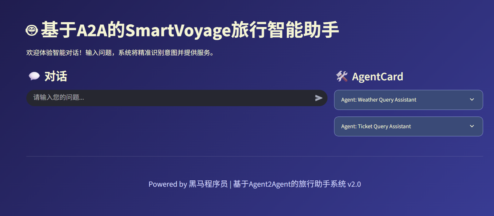
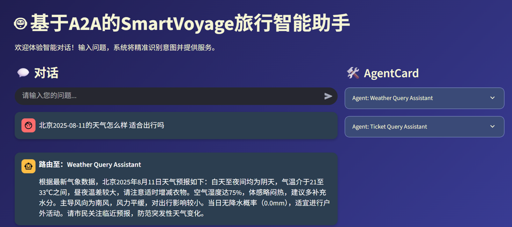
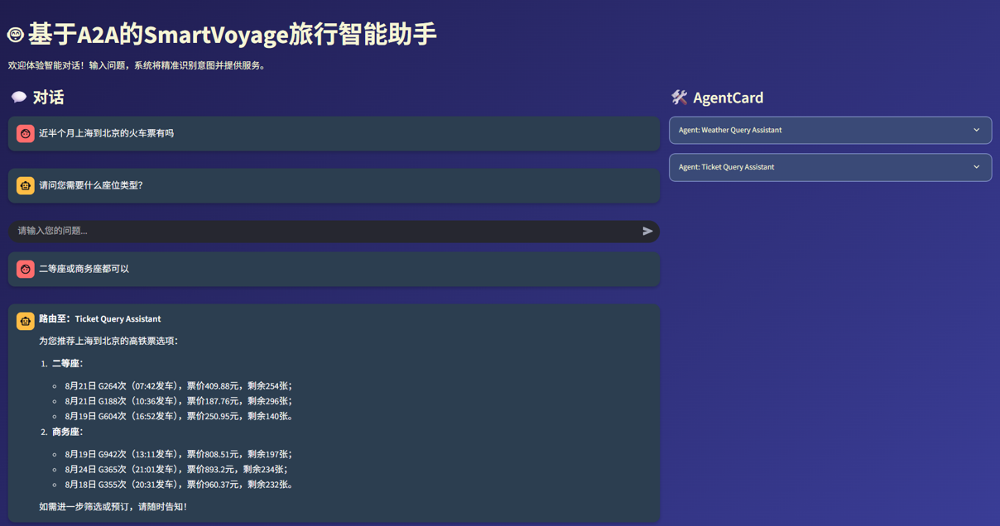
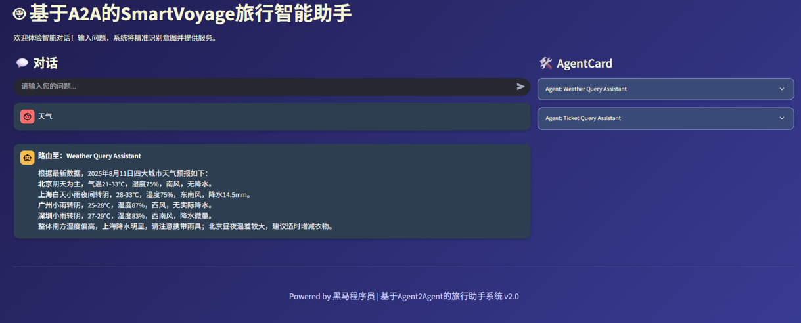

# SmartVoyage项目介绍

## 学习目标

- 了解项目开发背景
- 了解SmartVoyage系统实现过程


## 一、项目介绍

### 1 项目背景

SmartVoyage 是一个 **智能旅行助手系统** ，旨在 **解决旅行规划中的信息整合难题** ，如天气查询、票务搜索（火车、飞机、演唱会）。传统旅行工具往往要求用户手动切换多个应用或网站，导致信息碎片化和时间浪费。本项目基于分布式 AI 架构，利用 **大语言模型** （LLM）、 **MCP** （Model Context Protocol，模型上下文协议，由 Anthropic 开源，用于模型与外部工具的集成）和  **A2A** （Agent-to-Agent 协议，代理间通信协议）实现无缝查询处理。例如，用户输入“北京 2025-08-11 天气”，系统通过 LLM 生成 SQL 查询数据库，并返回格式化结果。该项目结合数据库、爬虫和微服务，实现实时、准确的响应。




### 2 项目目标及优势

**目标：**

构建一个基于MCP与A2A协议的 AI旅行助手 系统，覆盖天气和票务功能，支持追问机制和异常处理，确保查询鲁棒性。同时，实现模块化设计，便于扩展。

**优势**：

**MCP** **和** **A2A** **协议的结合**：核心优势之一，MCP 提供安全、双向的模型与外部数据源/工具的链接（如 SQL 查询），A2A 实现代理间协作（如意图解析、任务路由和异步执行），共同构建分布式架构，提高系统模块化、安全性和扩展性。

**智能** **SQL** **生成**：使用 LLM 解析用户输入生成 SQL，支持动态日期和默认值，提高查询灵活性。

**实时数据更新**：天气爬虫定时刷新数据库，确保信息准确。

**用户友好响应**：返回总结文本而非原始数据，支持追问以处理模糊输入。

**异常鲁棒性**：集成日志、JSON 格式化和错误捕获，减少系统崩溃。


### 3 项目使用示例

**示例一**

**用户查询：** 北京2025-08-11的天气怎么样 适合出行吗 

**系统响应**：系统生成 SQL 如 "SELECT * FROM weather_data WHERE city = '北京' AND fx_date = '2025-08-11'"，调用工具进行查询，并将查询结果进行总结回复。




**示例二**

**用户查询：** 近半个月上海到北京的火车票有吗 

**系统响应**：根据用户的提问进行意图识别，针对核心槽位信息确实的进行追问，并生成sql进行查询，基于查询结构进行总结回复。



**示例三**

**用户查询**：天气

**系统响应**：根据用户天气意图，默认返回四大热门城市的天气情况。




## 二、项目环境

### 1  项目技术框架

**LangChain**：集成 ChatOpenAI，用于 SQL 生成和意图识别，实现自然语言到结构化查询的转换。

**python-a2a**：实现 MCP 和 A2A 协议，用于工具调用和 Agent 通信，支持数据库查询和任务处理。

**MySQL Connector**：处理数据库连接和查询，确保数据格式化。

**Uvicorn**：部署 FastAPI 服务器，支持 MCP 和 A2A 端点。

**Streamlit**：构建交互式前端，显示聊天历史和 Agent 信息。


### 2 项目依赖

以下是项目涉及的主要依赖及版本：

| 依赖名称               | 作用                        |
| ---------------------- | --------------------------- |
| mysql-connector-python | 数据库连接和执行 SQL 查询   |
| langchain-openai       | LLM  初始化和提示模板处理   |
| python-a2a             | A2A/MCP  服务器和客户端实现 |
| streamlit              | 前端界面构建                |
| requests               | 天气  API 请求              |
| schedule               | 定时数据更新                |
| uvicorn                | 服务器运行                  |
| pytz                   | 时区管理                    |
| colorlog               | 彩色日志输出                |
| json, datetime 等      | 数据序列化和时间处理        |


### 3 项目环境构建

为防止代码运行时因模块版本不同带来报错或异常，需要创建新的虚拟环境并安装相应的包。

```shell
# 创建虚拟环境，python版本:
conda create -n lang_env python==3.12.11
conda activate lang_env

#安装项目依赖
pip install -r requirements.txt
```

requirements.txt中的内容如下。

```properties
aiohappyeyeballs==2.6.1
aiohttp==3.12.15
aiosignal==1.4.0
altair==5.5.0
annotated-types==0.7.0
anthropic==0.60.0
anyio==4.9.0
attrs==25.3.0
beautifulsoup4==4.13.4
blinker==1.9.0
boto3==1.39.16
botocore==1.39.16
bs4==0.0.2
cachetools==6.1.0
certifi==2025.7.14
cffi==1.17.1
charset-normalizer==3.4.2
click==8.2.1
colorama==0.4.6
colorlog==6.9.0
cryptography==45.0.5
dashscope==1.24.0
dataclasses-json==0.6.7
distro==1.9.0
fastapi==0.116.1
filelock==3.18.0
Flask==3.1.1
frozenlist==1.7.0
fsspec==2025.7.0
gitdb==4.0.12
GitPython==3.1.45
greenlet==3.2.3
h11==0.16.0
hf-xet==1.1.5
httpcore==1.0.9
httpx==0.28.1
httpx-sse==0.4.1
huggingface-hub==0.34.3
idna==3.10
itsdangerous==2.2.0
Jinja2==3.1.6
jiter==0.10.0
jmespath==1.0.1
jsonpatch==1.33
jsonpointer==3.0.0
jsonschema==4.25.0
jsonschema-specifications==2025.4.1
langchain==0.3.26
langchain-community==0.3.27
langchain-core==0.3.72
langchain-deepseek==0.1.4
langchain-openai==0.3.28
langchain-text-splitters==0.3.9
langsmith==0.3.45
lxml==6.0.0
MarkupSafe==3.0.2
marshmallow==3.26.1
mcp==1.18.0
mcp-server==0.1.4
mpmath==1.3.0
multidict==6.6.3
mypy_extensions==1.1.0
mysql-connector-python==9.4.0
mysqlclient==2.2.7
narwhals==2.0.1
networkx==3.5
numpy==2.3.2
openai==1.97.1
orjson==3.11.1
packaging==25.0
pandas==2.3.1
pillow==11.3.0
propcache==0.3.2
protobuf==6.31.1
pyarrow==21.0.0
pycparser==2.22
pydantic==2.11.7
pydantic-settings==2.10.1
pydantic_core==2.33.2
pydeck==0.9.1
PyMySQL==1.1.1
python-a2a==0.5.4
python-dateutil==2.9.0.post0
python-dotenv==1.1.1
python-multipart==0.0.20
pytz==2025.2
pywin32==311
PyYAML==6.0.2
referencing==0.36.2
regex==2025.7.31
requests==2.32.4
requests-toolbelt==1.0.0
rpds-py==0.26.0
s3transfer==0.13.1
safetensors==0.5.3
setuptools==78.1.1
six==1.17.0
smmap==5.0.2
sniffio==1.3.1
soupsieve==2.7
SQLAlchemy==2.0.42
sse-starlette==3.0.2
starlette==0.47.2
streamlit==1.47.1
sympy==1.14.0
tenacity==9.1.2
tiktoken==0.9.0
tokenizers==0.21.4
toml==0.10.2
torch==2.7.1
tornado==6.5.1
tqdm==4.67.1
transformers==4.54.1
typing-inspect==0.9.0
typing-inspection==0.4.1
typing_extensions==4.14.1
tzdata==2025.2
urllib3==2.5.0
uvicorn==0.35.0
watchdog==6.0.0
websocket-client==1.8.0
Werkzeug==3.1.3
wheel==0.45.1
yarl==1.20.1
zstandard==0.23.0
schedule==1.2.2
langchain-mcp-adapters==0.1.11

```


## 本节小结

本部分主要介绍了项目背景及痛点、项目目标及优势、项目使用示例以及项目相关技术框架和项目依赖。