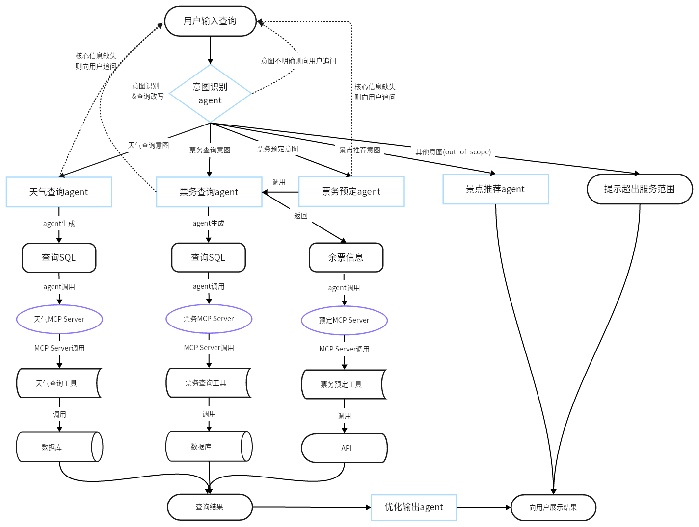
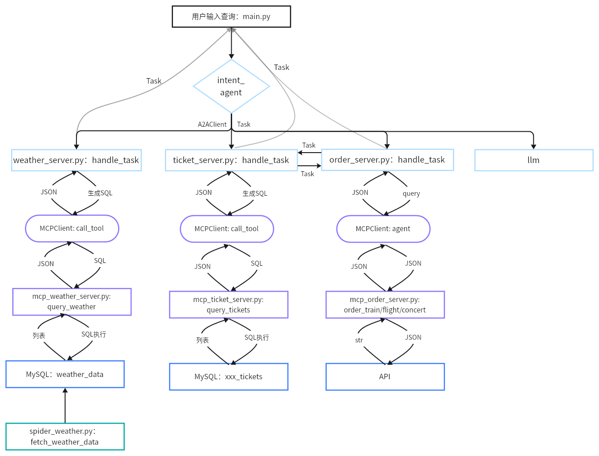
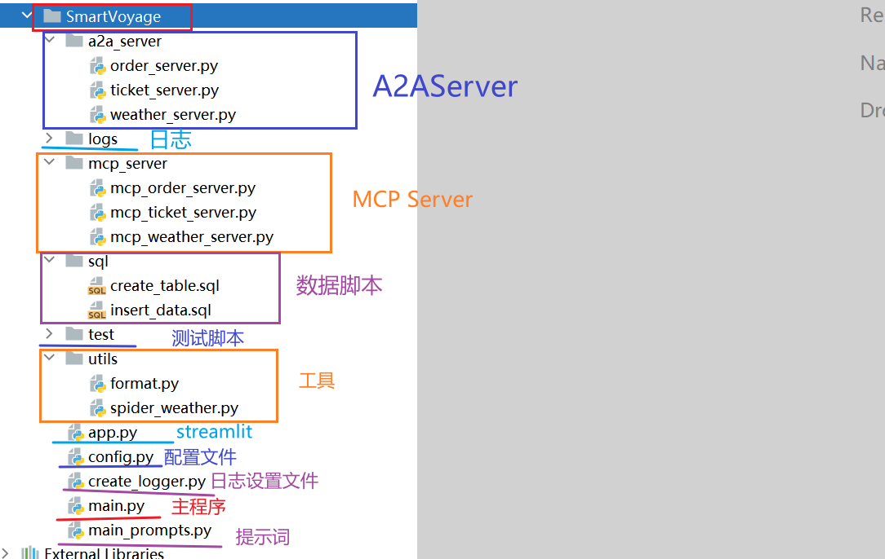

# 项目架构与代码架构图

## 学习目标

- 熟悉项目业务架构图
- 熟悉项目代码架构图

## 1 项目架构图

SmartVoyage 是一个 **智能旅行助手系统** ，旨在 **解决旅行规划中的信息整合难题** ，如天气查询、票务搜索（火车、飞机、演唱会）、票务预定。

SmartVoyage 是基于A2A与MCP协议实现是一个多agent系统。系统包括 LLM 路由服务器（意图识别）、天气代理服务器（查询天气数据库）、票务代理服务器（查询票务数据库）、票务预定服务器（API接口）、MCP 工具服务器（数据库接口）、数据采集脚本和 Streamlit 前端客户端。用户输入查询（如“北京天气”或“北京到上海火车票”），系统通过 LLM 路由到合适代理，代理生成 SQL 查询 MCP 数据库工具，返回结果显示在界面。

以下是业务层面的架构图。

## 2 代码架构图

以下是代码层面的架构图。

**代码结构如下：**

## 本节小结

本部分主要介绍了项目相关的架构图。