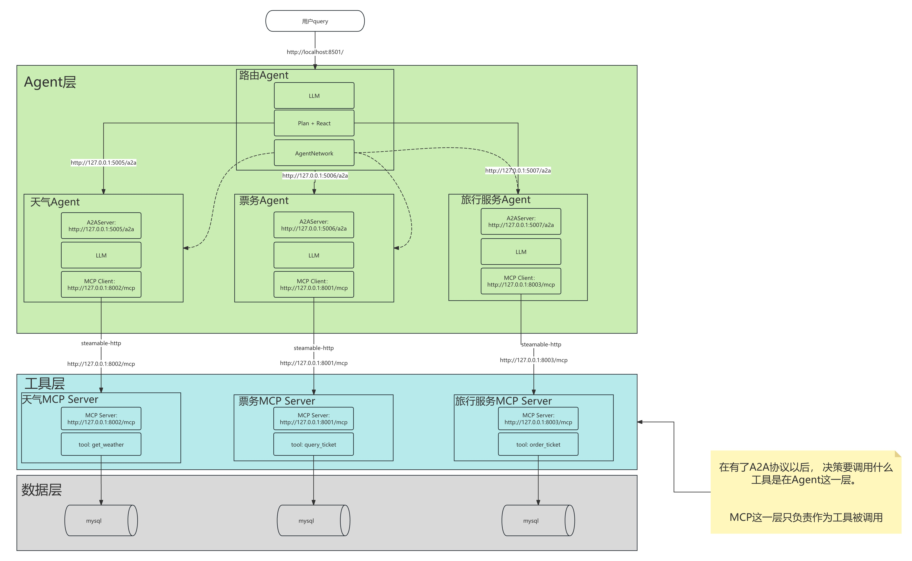
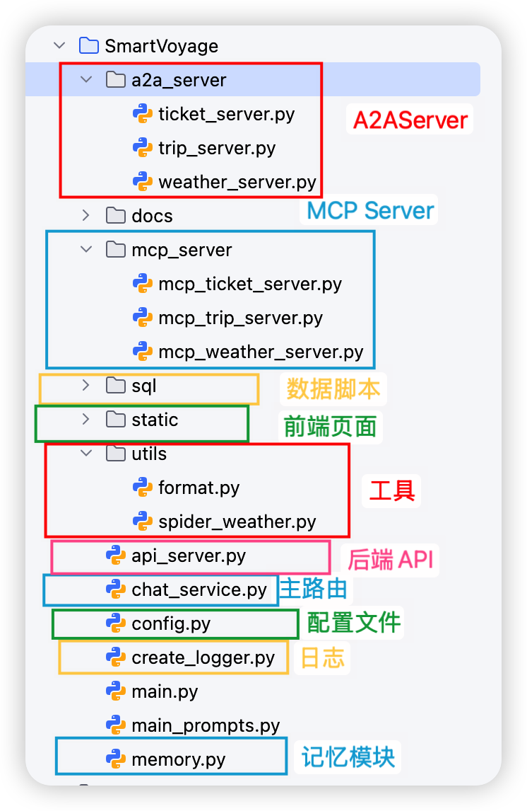

# 项目架构与代码架构图

## 学习目标

- 熟悉项目业务架构图
- 熟悉项目代码架构图


## 一、项目架构图

SmartVoyage 是一个 **智能旅行助手系统** ，旨在 **解决旅行规划中的信息整合难题** ，如天气查询、票务搜索（火车、飞机、演唱会）、租车、旅行保险、跟团游等场景。

SmartVoyage 是基于 **A2A（Agent-to-Agent）** 与 **MCP（Model Context Protocol）** 协议实现的多 Agent 协作系统。用户通过命令行客户端（main.py）或 Web 客户端（api\_server.py + index.html）输入自然语言请求（如”五一去成都，帮我查下天气和火车票”），系统由 `chat_service.py` 作为核心协调器，调用 LLM 进行意图识别与任务拆分，将子任务路由给对应的 A2A 代理：

| 代理 | 文件 | 功能 |
|------|------|------|
| 天气代理 | `a2a_server/weather_server.py` | 查询天气数据，支持从数据库或和风天气 API 获取 |
| 票务代理 | `a2a_server/ticket_server.py` | 查询火车票、航班机票、演唱会门票信息 |
| 旅行代理 | `a2a_server/trip_server.py` | 查询租车、旅行保险、跟团游等信息 |

每个 A2A 代理背后由对应的 MCP 工具服务器提供数据访问能力（位于 `mcp_server/` 目录），MCP 服务器直接与 MySQL 数据库交互。天气数据通过 `spider_weather.py` 定时从和风天气 API 采集入库。`memory.py` 模块负责管理用户偏好、查询历史、短期对话等记忆数据。

以下是业务层面的架构图。




## 二、代码架构图

以下是代码层面的架构图。


```
                                    ┌─────────────┐
                                    │   用户客户端   │
                                    │ main.py /   │
                                    │ Web 前端     │
                                    └──────┬──────┘
                                           │
                           ┌───────────────▼──────────┐
                           │      chat_service        │ ◄──────┐
                           │    (共享服务/路由)         │        │
                           └──┬───┬───┬───┬───────────┘        │
                              │   │   │                        │
                        ┌─────┘   │   └─────┐                  │
                        │         │         │                  │
                  ┌─────▼─────┐┌──▼──────┐┌─▼────────┐ ┌───────▼───────┐
                  │ weather   ││ ticket  ││    trip  │ │   memory.py   │
                  │ _server   ││ _server ││ _server  │ │  (记忆模块)    │
                  │(A2A代理)   ││(A2A代理)││(A2A代理)  │ │               │
                  └─────┬─────┘└───┬───┘  └─────┬────┘ │  用户偏好      │
                  ┌─────▼─────┐┌───▼────┐┌───▼───┐     │  查询历史      │
                  │mcp_weather││mcp_    ││mcp_   │     │  短期对话      │
                  │_server    ││ticket  ││trip   │     └───────────────┘
                  └─────┬─────┘└───┬────┘└───┬───┘
                  ┌─────▼─────┐┌───▼────┐┌───▼────┐
                  │weather_data││trn/   ││car/    │
                  │            ││flt/   ││ins/    │
                  └───────────┘│con_tkt ││        │
                      │        └────────┘└────────┘
            ┌─────────▼─────┐
            │ 和风天气API    │◄── spider_weather.py (定时采集)
            │(qweather.com) │
            └───────────────┘

  注: 票务/租车/保险数据通过数据库模拟，实际项目需对接第三方 API
```


**代码结构如下：**




## 本节小结

本部分主要介绍了项目相关的架构图。