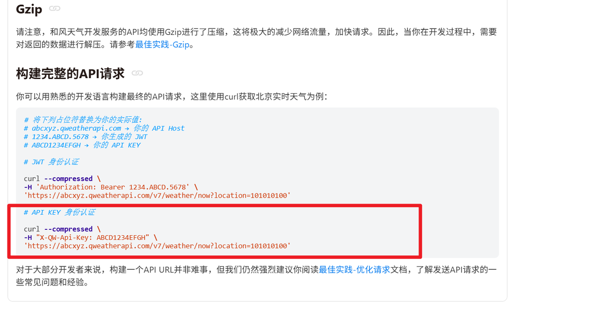

# 项目实现

## 学习目标

* 理解 A2A 协议的多代理协作

* 理解LLM 意图识别

* 理解SQL 生成和数据库交互的流程

* 理解整个项目交互与架构


## 一、整体流程

1. 配置基础环境（config.py 和 create_logger.py）
2. 初始化数据库（SQL 脚本）
3. 采集数据（spider\_weather.py）
4. 完成 MCP 服务器（mcp\_weather\_server.py、mcp\_ticket\_server.py 和 mcp\_trip\_server.py）
5. 完成 A2A 代理服务器（weather\_server.py、ticket\_server.py 和 trip\_server.py）
6. 完成记忆模块（memory.py）和共享服务（chat\_service.py）
7. 完成客户端（main.py 命令行客户端 和 api\_server.py + static/index.html Web客户端）
8. 启动服务进行联调
    - 启动 MCP 服务器（mcp\_weather\_server.py、mcp\_ticket\_server.py、mcp\_trip\_server.py）
    - 启动代理服务器（weather\_server.py、ticket\_server.py、trip\_server.py）
    - 启动客户端（main.py 或 api\_server.py）

**特殊说明**：

> 为了教学方便，本项目将部分第三方 API 对接工作使用数据库进行了模拟。具体来说：
>
> - **票务数据**（火车票、机票、演唱会票）：实际项目中需要对接 12306、航司接口、票务平台等 API，开发工作量大且涉及复杂的认证和数据处理。本项目通过预先插入模拟数据到 MySQL 数据库，由 MCP 服务器直接查询数据库来模拟真实 API 的返回结果。
> - **租车和保险数据**：实际项目中需要对接租车平台和保险公司的 API。本项目同样通过数据库模拟。
> - **天气数据**：保留了真实 API 对接（和风天气），通过 spider\_weather.py 定时从第三方 API 拉取数据写入数据库，以演示完整的数据采集流程。
>
> 实际工作中，第三方 API 对接通常涉及：申请开发者账号、API 密钥管理、请求签名、数据格式适配、异常重试、限流处理等繁琐工作。本项目聚焦于 A2A 多代理协作的核心架构，将外围数据源用数据库替代，便于学生快速理解核心逻辑。

**项目架构图**：

```
                                    ┌─────────────┐
                                    │   用户客户端   │
                                    │ main.py /   │
                                    │ Web 前端     │
                                    └──────┬──────┘
                                           │
                           ┌───────────────▼──────────┐
                           │      chat_service        │ ◄──────┐
                           │    (共享服务/路由)         │        │
                           └──┬───┬───┬───┬───────────┘        │
                              │   │   │                        │
                        ┌─────┘   │   └─────┐                  │
                        │         │         │                  │
                  ┌─────▼─────┐┌──▼──────┐┌─▼────────┐ ┌───────▼───────┐
                  │ weather   ││ ticket  ││    trip  │ │   memory.py   │
                  │ _server   ││ _server ││ _server  │ │  (记忆模块)    │
                  │(A2A代理)   ││(A2A代理)││(A2A代理)  │ │               │
                  └─────┬─────┘└───┬───┘  └─────┬────┘ │  用户偏好      │
                  ┌─────▼─────┐┌───▼────┐┌───▼───┐     │  查询历史      │
                  │mcp_weather││mcp_    ││mcp_   │     │  短期对话      │
                  │_server    ││ticket  ││trip   │     └───────────────┘
                  └─────┬─────┘└───┬────┘└───┬───┘
                  ┌─────▼─────┐┌───▼────┐┌───▼────┐
                  │weather_data││trn/   ││car/    │
                  │            ││flt/   ││ins/    │
                  └───────────┘│con_tkt ││        │
                      │        └────────┘└────────┘
            ┌─────────▼─────┐
            │ 和风天气API    │◄── spider_weather.py (定时采集)
            │(qweather.com) │
            └───────────────┘

  注: 票务/租车/保险数据通过数据库模拟，实际项目需对接第三方 API
```


## 二、配置模块

### 1 config.py

config.py配置文件，主要是LLM 和数据库信息。统一管理配置，避免硬编码，便于修改。

**项目中的定位**：基础模块，提供全局参数（如 API 密钥、模型名称），所有脚本依赖它。

**核心功能**：定义 Config 类

**位置**：SmartVoyage/config.py

```python
import os

# 项目根目录
project_root = os.path.join(os.path.dirname(os.path.abspath(__file__)), '..')

# 生产环境
# env = "prod"
# 测试环境
env = "test"
# 开发环境
# env = "dev"
# 预生产环境
# env = "pre_prod"


#定义配置文件
class Config:

    def __init__(self):
        # 大模型配置
        self.base_url = 'https://dashscope.aliyuncs.com/compatible-mode/v1'
        self.api_key = os.getenv("DASHSCOPE_API_KEY")
        self.model_name = 'qwen3.6-plus'

        # 数据库配置
        self.host = 'localhost'
        self.user = 'smart_yoyage'
        self.password = '123456'  # 不是root
        self.database = 'travel_rag'

        # 日志配置
        self.log_file = os.path.join(project_root, 'SmartVoyage4', 'logs/app.log')

        # 票务查询的12306接口地址
        self.url_123 = ""

        self.intent = {
            "weather": "WeatherQueryAssistant",
            "flight": "TicketAssistant",
            "train": "TicketAssistant",
            "concert": "TicketAssistant",
            "order": "TicketAssistant",
            "car_rental": "TripAssistant",
            "tour_group": "TripAssistant",
            "insurance": "TripAssistant",
            "trip_order": "TripAssistant",
        }

        self.temperature = 0.1

        # 天气数据源配置
        # 可选值："database"（从数据库获取） / "api"（直接从和风API获取）
        self.weather_source = "api"


    def get_mysql_config(self, env):
        """
        通过不同的环境获取不同的数据库配置
        :return:
        """
        if env == 'prod':
            self.host = 'localhost'
            self.user = 'root'
            self.password = 'root'
            self.database = 'travel_rag'
        elif env == 'dev':
            self.host = 'localhost1'
            self.user = 'root1'
            self.password = 'root1'
            self.database = 'travel_rag'
        elif env == 'test':
            self.host = 'localhost2'
            self.user = 'root2'
            self.password = 'root2'
            self.database = 'travel_rag'
        else:
            self.host = 'localhost3'
            self.user = 'root3'
            self.password = 'root3'
            self.database = 'travel_rag'

        return self.host, self.user, self.password, self.database


if __name__ == '__main__':
    print(Config().log_file)
    print(Config().get_mysql_config(env))
```

**说明**：

* 使用 `os.getenv("DASHSCOPE_API_KEY")` 读取环境变量中的 API Key，避免密钥硬编码泄露。
* `env` 变量用于切换运行环境（生产/测试/开发/预生产），通过 `get_mysql_config` 方法返回对应环境的数据库配置。
* `intent` 字典用于意图识别，将用户意图映射到对应的代理名称（如 `weather` → `WeatherQueryAssistant`）。
* `weather_source` 控制天气数据来源，`"database"` 从本地数据库查询，`"api"` 直接从和风天气 API 获取。


### 2 create_logger.py

create_logger.py主要是配置日志，设置整个项目的logger对象。

**项目中的定位**：管理logger，全局统一使用这一个。

**核心功能**：通过setup_logger方法设置，然后调用setup_logger方法返回logger对象。

**位置**：SmartVoyage/create_logger.py

```python
import logging
import os

from SmartVoyage.config import Config


def setup_logger(name, log_file='logs/app.log'):
    # 创建日志文件夹
    os.makedirs(os.path.dirname(log_file), exist_ok=True)

    # 获取日志记录器
    logger = logging.getLogger(name)
    logger.setLevel(logging.DEBUG)
    # 防止重复输出的关键！
    logger.propagate = False

    # 定义日志格式
    formatter = logging.Formatter('%(name)s - %(asctime)s - %(levelname)s - %(message)s')

    # 创建控制台处理器
    console_handler = logging.StreamHandler()
    console_handler.setFormatter(formatter)
    console_handler.setLevel(logging.INFO)  # 每个日志处理器可以单独设置日志级别，但是这个日志级别必须高于或等于处理器级别

    # 创建文件处理器
    file_handler = logging.FileHandler(filename=log_file, encoding="utf-8", mode="a")
    file_handler.setFormatter(formatter)
    file_handler.setLevel(logging.DEBUG)

    # 将处理器添加到日志记录器中
    if not logger.handlers:  # 先进行判断，再进行添加。避免重复添加处理器
        logger.addHandler(console_handler)
        logger.addHandler(file_handler)

    return logger

logger = setup_logger('SmartVoage', Config().log_file)
```

**注意**：需要设置 logger.propagate = False 防止日志重复输出。因为某些包中，如create_fastapi_app也有日志对象，可能会重复。为了避免日志重复输出，需要设置 logger.propagate = False。


## 三、数据库初始化

SQL 脚本，创建票务和天气数据库表。定义数据结构，确保 MCP 服务器能查询存储的数据。

**项目中的定位**：数据基础，存储天气和票务信息。

**核心功能**：创建表、设置唯一键和注释。

**数据库概述：**

* **数据库名称**：travel\_rag

* **字符集**：utf8mb4（支持中文等复杂字符）

* **校对规则**：utf8mb4\_unicode\_ci（大小写不敏感，适合多语言）

* **作用**：存储票务数据（火车票、机票、演唱会票），供 mcp\_ticket\_server.py 查询，支持 ticket\_server.py 的票务查询功能。存储天气数据，供 mcp\_weather\_server.py 查询，支持 weather\_server.py 天气查询功能。存储租车、保险数据，支持 TripAssistant 的租车和保险查询。存储用户偏好、查询历史、短期对话等数据，支持记忆模块。


### 1 建库及建表

**代码路径**：SmartVoyage/sql/create_all_tables.sql

该脚本是统一的建表脚本，包含所有业务表的 CREATE TABLE 语句。执行后会先删除旧库再重建，因此**包含所有需要的表结构**。

```sql
-- 建库
DROP DATABASE IF EXISTS travel_rag;
CREATE DATABASE travel_rag CHARACTER SET utf8mb4 COLLATE utf8mb4_unicode_ci;
USE travel_rag;
```

脚本中依次创建以下表（每张表前都有 `DROP TABLE IF EXISTS` 确保幂等）：

* **train_tickets**（火车票表）
* **flight_tickets**（航班机票表）
* **concert_tickets**（演唱会门票表）
* **weather_data**（天气数据表）
* **car_rentals**（租车信息表）
* **insurances**（旅行保险信息表）
* **user_profiles**（用户偏好表）
* **query_history**（查询历史表）
* **short_term_messages**（短期对话表）

### 2 train\_tickets（火车票表）

**作用：**存储火车票信息，记录出发地、目的地、时间、车次、座位类型等。

```sql
DROP TABLE IF EXISTS train_tickets;
CREATE TABLE train_tickets (
    id INT AUTO_INCREMENT PRIMARY KEY COMMENT '主键，自增，唯一标识每条记录',
    departure_city VARCHAR(50) CHARACTER SET utf8mb4 COLLATE utf8mb4_unicode_ci NOT NULL COMMENT '出发城市',
    arrival_city VARCHAR(50) CHARACTER SET utf8mb4 COLLATE utf8mb4_unicode_ci NOT NULL COMMENT '到达城市',
    departure_time DATETIME NOT NULL COMMENT '出发时间',
    arrival_time DATETIME NOT NULL COMMENT '到达时间',
    train_number VARCHAR(20) NOT NULL COMMENT '火车车次',
    seat_type VARCHAR(20) CHARACTER SET utf8mb4 COLLATE utf8mb4_unicode_ci NOT NULL COMMENT '座位类型',
    total_seats INT NOT NULL COMMENT '总座位数',
    remaining_seats INT NOT NULL COMMENT '剩余座位数',
    price DECIMAL(10, 2) NOT NULL COMMENT '票价',
    created_at TIMESTAMP DEFAULT CURRENT_TIMESTAMP COMMENT '创建时间，自动记录插入时间',
    UNIQUE KEY unique_train (departure_time, train_number, seat_type)
) ENGINE=InnoDB DEFAULT CHARSET=utf8mb4 COLLATE=utf8mb4_unicode_ci COMMENT='火车票信息表';
```

**说明**：唯一约束 `unique_train` 包含 `(departure_time, train_number, seat_type)` 三个字段，因为同一车次的不同座位类型是独立的记录。

### 3 flight\_tickets（航班机票表）

**作用：**存储机票信息，记录航班、舱位、时间等。

```sql
DROP TABLE IF EXISTS flight_tickets;
CREATE TABLE flight_tickets (
    id INT AUTO_INCREMENT PRIMARY KEY COMMENT '主键，自增，唯一标识每条记录',
    departure_city VARCHAR(50) CHARACTER SET utf8mb4 COLLATE utf8mb4_unicode_ci NOT NULL COMMENT '出发城市',
    arrival_city VARCHAR(50) CHARACTER SET utf8mb4 COLLATE utf8mb4_unicode_ci NOT NULL COMMENT '到达城市',
    departure_time DATETIME NOT NULL COMMENT '出发时间',
    arrival_time DATETIME NOT NULL COMMENT '到达时间',
    flight_number VARCHAR(20) NOT NULL COMMENT '航班号',
    cabin_type VARCHAR(20) CHARACTER SET utf8mb4 COLLATE utf8mb4_unicode_ci NOT NULL COMMENT '舱位类型',
    total_seats INT NOT NULL COMMENT '总座位数',
    remaining_seats INT NOT NULL COMMENT '剩余座位数',
    price DECIMAL(10, 2) NOT NULL COMMENT '票价',
    created_at TIMESTAMP DEFAULT CURRENT_TIMESTAMP COMMENT '创建时间，自动记录插入时间',
    UNIQUE KEY unique_flight (departure_time, flight_number, cabin_type)
) ENGINE=InnoDB DEFAULT CHARSET=utf8mb4 COLLATE=utf8mb4_unicode_ci COMMENT='航班机票信息表';
```

### 4 concert\_tickets（演唱会票表）

**作用：**存储演唱会票信息，记录艺人、场地、时间等。

```sql
DROP TABLE IF EXISTS concert_tickets;
CREATE TABLE concert_tickets (
    id INT AUTO_INCREMENT PRIMARY KEY COMMENT '主键，自增',
    artist VARCHAR(100) CHARACTER SET utf8mb4 COLLATE utf8mb4_unicode_ci NOT NULL COMMENT '艺人名称',
    city VARCHAR(50) CHARACTER SET utf8mb4 COLLATE utf8mb4_unicode_ci NOT NULL COMMENT '举办城市',
    venue VARCHAR(100) CHARACTER SET utf8mb4 COLLATE utf8mb4_unicode_ci NOT NULL COMMENT '场馆',
    start_time DATETIME NOT NULL COMMENT '开始时间',
    end_time DATETIME NOT NULL COMMENT '结束时间',
    ticket_type VARCHAR(20) CHARACTER SET utf8mb4 COLLATE utf8mb4_unicode_ci NOT NULL COMMENT '票类型',
    total_seats INT NOT NULL COMMENT '总座位数',
    remaining_seats INT NOT NULL COMMENT '剩余座位数',
    price DECIMAL(10, 2) NOT NULL COMMENT '票价',
    created_at TIMESTAMP DEFAULT CURRENT_TIMESTAMP COMMENT '创建时间',
    UNIQUE KEY unique_concert (start_time, artist, ticket_type)
) ENGINE=InnoDB DEFAULT CHARSET=utf8mb4 COLLATE=utf8mb4_unicode_ci COMMENT='演唱会门票信息表';
```

### 5 weather\_data（天气数据表）

**作用：**存储城市天气信息，城市名称、预报日期、温度、风力等。

```sql
DROP TABLE IF EXISTS weather_data;
CREATE TABLE IF NOT EXISTS weather_data (
    id INT AUTO_INCREMENT PRIMARY KEY,
    city VARCHAR(50) NOT NULL COMMENT '城市名称',
    fx_date DATE NOT NULL COMMENT '预报日期',
    sunrise TIME COMMENT '日出时间',
    sunset TIME COMMENT '日落时间',
    moonrise TIME COMMENT '月升时间',
    moonset TIME COMMENT '月落时间',
    moon_phase VARCHAR(20) COMMENT '月相名称',
    moon_phase_icon VARCHAR(10) COMMENT '月相图标代码',
    temp_max INT COMMENT '最高温度',
    temp_min INT COMMENT '最低温度',
    icon_day VARCHAR(10) COMMENT '白天天气图标代码',
    text_day VARCHAR(20) COMMENT '白天天气描述',
    icon_night VARCHAR(10) COMMENT '夜间天气图标代码',
    text_night VARCHAR(20) COMMENT '夜间天气描述',
    wind360_day INT COMMENT '白天风向360角度',
    wind_dir_day VARCHAR(20) COMMENT '白天风向',
    wind_scale_day VARCHAR(10) COMMENT '白天风力等级',
    wind_speed_day INT COMMENT '白天风速 (km/h)',
    wind360_night INT COMMENT '夜间风向360角度',
    wind_dir_night VARCHAR(20) COMMENT '夜间风向',
    wind_scale_night VARCHAR(10) COMMENT '夜间风力等级',
    wind_speed_night INT COMMENT '夜间风速 (km/h)',
    precip DECIMAL(5,1) COMMENT '降水量 (mm)',
    uv_index INT COMMENT '紫外线指数',
    humidity INT COMMENT '相对湿度 (%)',
    pressure INT COMMENT '大气压强 (hPa)',
    vis INT COMMENT '能见度 (km)',
    cloud INT COMMENT '云量 (%)',
    update_time DATETIME COMMENT '数据更新时间',
    UNIQUE KEY unique_city_date (city, fx_date)
) ENGINE=InnoDB DEFAULT CHARSET=utf8mb4 COLLATE=utf8mb4_unicode_ci COMMENT='天气数据表';
```

### 6 其他业务表

除以上核心表外，项目中还包含以下业务表：

**car\_rentals（租车信息表）**：存储租车公司、车型、价格等信息，支持 TripAssistant 的租车查询。

```sql
DROP TABLE IF EXISTS car_rentals;
CREATE TABLE car_rentals (
    id INT AUTO_INCREMENT PRIMARY KEY COMMENT '主键，自增',
    company VARCHAR(50) NOT NULL COMMENT '租车公司名称',
    pickup_city VARCHAR(50) NOT NULL COMMENT '取车城市',
    return_city VARCHAR(50) NOT NULL COMMENT '还车城市',
    pickup_date DATE NOT NULL COMMENT '取车日期',
    car_type VARCHAR(20) NOT NULL COMMENT '车型分类：经济型/SUV/豪华型/MPV',
    car_model VARCHAR(50) NOT NULL COMMENT '具体车型',
    price_per_day DECIMAL(8,2) NOT NULL COMMENT '每日租金（元）',
    total_available INT NOT NULL DEFAULT 0 COMMENT '可租车辆数',
    transmission VARCHAR(20) NOT NULL COMMENT '变速箱：自动挡/手动挡',
    seats INT NOT NULL COMMENT '座位数',
    deposit DECIMAL(8,2) NOT NULL DEFAULT 0 COMMENT '押金（元）',
    created_at TIMESTAMP DEFAULT CURRENT_TIMESTAMP COMMENT '创建时间',
    UNIQUE KEY unique_car (company, car_model, pickup_date)
) ENGINE=InnoDB DEFAULT CHARSET=utf8mb4 COLLATE=utf8mb4_unicode_ci COMMENT='租车信息表';
```

**insurances（旅行保险信息表）**：存储保险产品，包含综合型、意外型、医疗型、境外型等，支持 TripAssistant 的保险查询。

```sql
DROP TABLE IF EXISTS insurances;
CREATE TABLE insurances (
    id INT AUTO_INCREMENT PRIMARY KEY COMMENT '主键，自增',
    insurance_type VARCHAR(20) NOT NULL COMMENT '保险类型：综合型/意外型/医疗型/境外型',
    name VARCHAR(100) NOT NULL COMMENT '保险产品名称',
    company VARCHAR(50) NOT NULL COMMENT '保险公司',
    coverage TEXT NOT NULL COMMENT '保障范围说明',
    price DECIMAL(8,2) NOT NULL COMMENT '价格（元/份）',
    duration_days INT NOT NULL COMMENT '保障天数',
    max_coverage DECIMAL(10,2) NOT NULL COMMENT '最高赔付金额（元）',
    medical_coverage DECIMAL(10,2) DEFAULT 0 COMMENT '医疗保障额度（元）',
    baggage_coverage DECIMAL(10,2) DEFAULT 0 COMMENT '行李保障额度（元）',
    flight_delay BOOLEAN DEFAULT FALSE COMMENT '是否包含航班延误',
    created_at TIMESTAMP DEFAULT CURRENT_TIMESTAMP COMMENT '创建时间',
    UNIQUE KEY unique_insurance (name)
) ENGINE=InnoDB DEFAULT CHARSET=utf8mb4 COLLATE=utf8mb4_unicode_ci COMMENT='旅行保险信息表';
```

**user\_profiles（用户偏好表）**：存储用户偏好键值对，用于记忆模块。

```sql
CREATE TABLE IF NOT EXISTS user_profiles (
    profile_key VARCHAR(50) NOT NULL COMMENT '偏好键名',
    profile_value VARCHAR(200) NOT NULL COMMENT '偏好值',
    updated_at TIMESTAMP DEFAULT CURRENT_TIMESTAMP ON UPDATE CURRENT_TIMESTAMP COMMENT '更新时间',
    PRIMARY KEY (profile_key)
) ENGINE=InnoDB DEFAULT CHARSET=utf8mb4 COLLATE=utf8mb4_unicode_ci COMMENT='用户偏好';
```

**query\_history（查询历史表）**：记录用户的查询意图和内容，用于短期记忆。

```sql
CREATE TABLE IF NOT EXISTS query_history (
    id INT AUTO_INCREMENT PRIMARY KEY COMMENT '主键',
    intent_type VARCHAR(30) NOT NULL COMMENT '意图类型：weather/flight/train等',
    query_content TEXT NOT NULL COMMENT '查询内容JSON',
    query_time DATETIME NOT NULL COMMENT '查询时间',
    INDEX idx_time (query_time)
) ENGINE=InnoDB DEFAULT CHARSET=utf8mb4 COLLATE=utf8mb4_unicode_ci COMMENT='查询历史';
```

**short\_term\_messages（短期对话表）**：存储短期对话消息，支持多轮对话上下文。

```sql
CREATE TABLE IF NOT EXISTS short_term_messages (
    id INT AUTO_INCREMENT PRIMARY KEY COMMENT '主键',
    role VARCHAR(10) NOT NULL COMMENT '消息角色：user 或 assistant',
    content TEXT NOT NULL COMMENT '消息内容',
    message_time VARCHAR(10) NOT NULL COMMENT '时间戳 HH:MM:SS',
    message_order INT NOT NULL COMMENT '消息顺序号',
    updated_at TIMESTAMP DEFAULT CURRENT_TIMESTAMP ON UPDATE CURRENT_TIMESTAMP COMMENT '更新时间'
) ENGINE=InnoDB DEFAULT CHARSET=utf8mb4 COLLATE=utf8mb4_unicode_ci COMMENT='短期对话';
```


### 7 数据插入

运行 `SmartVoyage/sql/insert_may01_data.sql` 插入测试数据。该脚本以 2026 年 5 月 1 日假期为背景，插入了北京→成都的火车票、航班机票、成都演唱会门票、成都租车、旅行保险以及成都及周边天气数据，覆盖了项目所有核心业务表。


## 四、数据采集

spider\_weather天气数据采集脚本，从 API 获取数据，写入 MySQL。保持数据库实时更新，支持代理查询。数据采集地址：https://dev.qweather.com/docs/api/weather/weather-daily-forecast/

**项目中的定位**：后台数据源，定时执行。

**核心功能**：API 请求、数据解析、写入/更新数据库、调度。

### 1 API Host申请

| API host介绍 | https://dev.qweather.com/docs/configuration/api-config/ |
| ------------ | ------------------------------------------------------- |
| API host查看 | https://console.qweather.com/setting?lang=zh            |


### 2 API Key申请

| API Key介绍 | https://dev.qweather.com/docs/configuration/authentication/#api-key |
| ----------- | ------------------------------------------------------------ |
| API Key查看 | https://console.qweather.com/project?lang=zh                 |


### 3 测试验证

ubuntu系统：

```bash
curl --compressed \
  -H "X-QW-Api-Key: 9ef68fe55401485180dd968fac902300" \
  "https://m7487r6ych.re.qweatherapi.com/v7/weather/3d?location=101010100"
```
windows系统：

```bash
curl --compressed -H "X-QW-Api-Key: 9ef68fe55401485180dd968fac902300" "https://m7487r6ych.re.qweatherapi.com/v7/weather/30d?location=101010100"
```
python代码：

```python
import requests
import gzip
import json

# 配置（使用自己的密钥）
API_KEY = "9ef68fe55401485180dd968fac902300"
url = "https://m7487r6ych.re.qweatherapi.com/v7/weather/30d?location=101010100"  # 北京30天预报
headers = {
    "X-QW-Api-Key": API_KEY,
    "Accept-Encoding": "gzip"  # 请求gzip，但不强制
}
try:
    print("正在请求API...")
    response = requests.get(url, headers=headers, timeout=10)
    data = response.text
    parsed_data = json.loads(data)
    print("直接解析成功！")
    print(parsed_data)
except requests.RequestException as e:
    print(f"直接解析失败哦: {e}")
```

**TIPS:**

数据传输格式：gzip

适用条件：数据是可压缩的（如 JSON、HTML、文本），网络带宽有限，或高并发场景。默认情况下，如果不设置 Accept-Encoding，服务器通常不压缩。

好处：降低延迟、节省带宽、提升用户体验。

官网介绍：https://dev.qweather.com/docs/best-practices/gzip/



## 五、数据导入

### 1 导包及配置

以下配置是关于天气API配置以及数据库配置，通过爬虫爬取天气信息网站存储到数据库用于作为A2A检索数据库。

**位置**：SmartVoyage/utils/spider_weather.py

```python
import requests
import mysql.connector
from datetime import datetime
import schedule
import time
import json
import gzip
import pytz

# 配置
API_KEY = "5ef0a47e161a4ea997227322317eae83"
city_codes = {
    "北京": "101010100",
    "上海": "101020100",
    "杭州": "101280101",
    "南京": "101190101",
}
BASE_URL = "https://m7487r6ych.re.qweatherapi.com/v7/weather/30d"
TZ = pytz.timezone('Asia/Shanghai')  # 使用上海时区


# MySQL 配置
db_config = {
    "host": "localhost",
    "user": "smart_yoyage",
    "password": "123456",
    "database": "travel_rag",
    "charset": "utf8mb4"
}
```


### 2 连接数据库

connect\_db函数

**目标**：建立 MySQL 数据库连接。

**功能**：使用 db\_config 配置连接 MySQL，返回连接对象

**输入输出**：&#x20;

> 输入：无。
>
> 输出：mysql.connector.connection.MySQLConnection 对象。

```python
def connect_db():
    return mysql.connector.connect(**db_config)
```

测试：

```python
if __name__ == '__main__':
    conn = connect_db()
    print(conn.is_connected())
    print("数据库连接成功！")
    conn.close()
```


### 3 爬取数据

fetch\_weather\_data函数用于天气数据的爬取与解析。

**目标**：从和风天气 API 获取 30 天天气预报数据。

**功能**：发送 GET 请求，处理 gzip 压缩，解析 JSON 返回数据。

**输入输出**：&#x20;

> 输入：city（字符串，如“北京”），location（字符串，如“101010100”）。
>
> 输出：JSON 字典（包含 daily 预报列表）或 None。

```python
def fetch_weather_data(city, location):
    headers = {
        "X-QW-Api-Key": API_KEY,
        "Accept-Encoding": "gzip"
    }
    url = f"{BASE_URL}?location={location}"
    try:
        response = requests.get(url, headers=headers, timeout=10)
        response.raise_for_status()
        if response.headers.get('Content-Encoding') == 'gzip':
            data = gzip.decompress(response.content).decode('utf-8')
        else:
            data = response.text
        return json.loads(data)
    except requests.RequestException as e:
        print(f"请求 {city} 天气数据失败: {e}")
        return None
    except json.JSONDecodeError as e:
        print(f"{city} JSON 解析错误: {e}, 响应内容: {response.text[:500]}...")
        return None
    except gzip.BadGzipFile:
        print(f"{city} 数据未正确解压，尝试直接解析: {response.text[:500]}...")
        return json.loads(response.text) if response.text else None
```

测试：

```python
if __name__ == "__main__":
    weather_data = fetch_weather_data("北京", city_codes["北京"])
    print(weather_data)
    print("解析成功！")
```


### 4 查询数据更新时间

get_latest_update_time函数

**目标**：查询数据库中指定城市的最新更新时间。

**功能**：执行 SQL 查询，返回 weather\_data 表中 city 的最新 update\_time。

**输入输出**：&#x20;

> 输入：cursor（MySQL 游标），city（字符串，如“北京”）。
>
> 输出：datetime 对象或 None。

```python
def get_latest_update_time(cursor, city):
    cursor.execute("SELECT MAX(update_time) FROM weather_data WHERE city = %s", (city,))
    result = cursor.fetchone()
    return result[0] if result[0] else None
```

测试：

```python
if __name__ == "__main__":
    # 建立数据库连接
    conn = connect_db()
    cursor = conn.cursor()

    # 获取北京城市的最新更新的时间日期
    print(get_latest_update_time(cursor, '北京'))

    # 关闭数据库连接
    cursor.close()
    conn.close()
```

### 5 是否需要更新

should\_update\_data函数

**目标**：判断是否需要更新城市天气数据。

**功能**：检查最新更新时间是否超过 24 小时，或强制更新。

**输入输出**：

> 输入：latest\_time（datetime 或 None），force\_update（布尔值）。
>
> 输出：布尔值（True/False）。

```python
def should_update_data(latest_time, force_update=False):
    """
    如果没有更新时间 或者 更新时间大于24小时 或者 force_update=True，就返回True，就去更新数据库中的这个城市的天气数据。
    其他情况返回False，表示不更新数据库中的数据。
    :param latest_time: 某个城市最新的更新时间
    :param force_update: 默认否
    :return: 是 或者 否 true or false
    """
    if force_update:
        return True
    if not latest_time:
        return True
    current_time = datetime.now(TZ)
    latest_time = latest_time.replace(tzinfo=TZ)
    return (current_time - latest_time).total_seconds() / 3600 >= 24
```

### 6 存储数据

store\_weather\_data函数

**目标**：写入或更新天气预报数据到数据库。

**功能**：循环预报数据，使用 INSERT ON DUPLICATE KEY UPDATE 插入/更新 weather\_data 表。

**输入输出**：&#x20;

> 输入：数据库连接、mysql游标，城市、数据。
>
> 输出：无，数据库更新。

```python
def store_weather_data(conn, cursor, city, data):
    if not data or data.get("code") != "200":
        print(f"{city} 数据无效，跳过存储。")
        return

    daily_data = data.get("daily", [])
    update_time = datetime.fromisoformat(data.get("updateTime").replace("+08:00", "+08:00")).replace(tzinfo=TZ)

    for day in daily_data:
        fx_date = datetime.strptime(day["fxDate"], "%Y-%m-%d").date()
        values = (
            city, fx_date,
            day.get("sunrise"), day.get("sunset"),
            day.get("moonrise"), day.get("moonset"),
            day.get("moonPhase"), day.get("moonPhaseIcon"),
            day.get("tempMax"), day.get("tempMin"),
            day.get("iconDay"), day.get("textDay"),
            day.get("iconNight"), day.get("textNight"),
            day.get("wind360Day"), day.get("windDirDay"), day.get("windScaleDay"), day.get("windSpeedDay"),
            day.get("wind360Night"), day.get("windDirNight"), day.get("windScaleNight"), day.get("windSpeedNight"),
            day.get("precip"), day.get("uvIndex"),
            day.get("humidity"), day.get("pressure"),
            day.get("vis"), day.get("cloud"),
            update_time
        )
        insert_query = """
        INSERT INTO weather_data (
            city, fx_date, sunrise, sunset, moonrise, moonset, moon_phase, moon_phase_icon,
            temp_max, temp_min, icon_day, text_day, icon_night, text_night,
            wind360_day, wind_dir_day, wind_scale_day, wind_speed_day,
            wind360_night, wind_dir_night, wind_scale_night, wind_speed_night,
            precip, uv_index, humidity, pressure, vis, cloud, update_time
        ) VALUES (%s, %s, %s, %s, %s, %s, %s, %s, %s, %s, %s, %s, %s, %s, %s, %s, %s, %s, %s, %s, %s, %s, %s, %s, %s, %s, %s, %s, %s)
        ON DUPLICATE KEY UPDATE
            sunrise = VALUES(sunrise), sunset = VALUES(sunset), moonrise = VALUES(moonrise),
            moonset = VALUES(moonset), moon_phase = VALUES(moon_phase), moon_phase_icon = VALUES(moon_phase_icon),
            temp_max = VALUES(temp_max), temp_min = VALUES(temp_min), icon_day = VALUES(icon_day),
            text_day = VALUES(text_day), icon_night = VALUES(icon_night), text_night = VALUES(text_night),
            wind360_day = VALUES(wind360_day), wind_dir_day = VALUES(wind_dir_day), wind_scale_day = VALUES(wind_scale_day),
            wind_speed_day = VALUES(wind_speed_day), wind360_night = VALUES(wind360_night),
            wind_dir_night = VALUES(wind_dir_night), wind_scale_night = VALUES(wind_scale_night),
            wind_speed_night = VALUES(wind_speed_night), precip = VALUES(precip), uv_index = VALUES(uv_index),
            humidity = VALUES(humidity), pressure = VALUES(pressure), vis = VALUES(vis),
            cloud = VALUES(cloud), update_time = VALUES(update_time)
        """
        try:
            cursor.execute(insert_query, values)
            print(f"{city} {fx_date} 数据写入/更新成功: {day.get('textDay')}, 影响行数: {cursor.rowcount}")
            conn.commit()
            print(f"{city} 事务提交完成。")
        except mysql.connector.Error as e:
            print(f"{city} {fx_date} 数据库错误: {e}")
            conn.rollback()
            print(f"{city} 事务回滚。")
```

测试：

```sql
if __name__ == "__main__":
    conn = connect_db()
    cursor = conn.cursor()
    data = fetch_weather_data("北京", "101010100")
    store_weather_data(conn, cursor, "北京", data)
    print("数据存储完成。")
```


### 7 更新数据

update\_weather函数

**目标：**&#x66F4;新所有城市数据。

**功能：**&#x67E5;看是否满足更新条件，调用数据存储与数据爬取。

**输入输出：**

> 输入：更新条件
>
> 输出：无，数据库更新。

```python
def update_weather(force_update=False):
    conn = connect_db()
    cursor = conn.cursor()

    for city, location in city_codes.items():
        latest_time = get_latest_update_time(cursor, city)
        if should_update_data(latest_time, force_update):
            print(f"开始更新 {city} 天气数据...")
            data = fetch_weather_data(city, location)
            if data:
                store_weather_data(conn, cursor, city, data)
        else:
            print(f"{city} 数据已为最新，无需更新。最新更新时间: {latest_time}")

    cursor.close()
    conn.close()
```

测试：

```python
if __name__ == "__main__":
    update_weather(force_update=True)
```


### 8 定时更新

setup\_scheduler函数

**目标：**&#x8BBE;置定时任务，每天在 PDT 16:00（北京时间 01:00）调用 update\_weather 函数。保证数据的实时性。

**功能**：&#x20;

> 使用 schedule 库注册每日任务。
>
> 进入无限循环，检查并运行待执行任务，每 60 秒检查一次。

**项目中的定位**：确保天气数据定时更新，保持 weather\_data 表的数据新鲜，支持 weather\_server.py 和 mcp\_weather\_server.py 查询。

```python
def setup_scheduler():
    # 北京时间 1:00 对应 PDT 前一天的 16:00（夏令时）
    schedule.every().day.at("16:00").do(update_weather)
    while True:
        schedule.run_pending()
        time.sleep(60)
```

原理测试：

```python
from datetime import datetime, timedelta
import time
import schedule

now = datetime.now()
trigger_time = (now + timedelta(seconds=20)).strftime("%H:%M:%S")

print(f"[测试日志] 当前时间: {now}")
print(f"[测试日志] 设置任务在 {trigger_time} 触发 update_weather")

# 使用 lambda 延迟执行
schedule.every().day.at(trigger_time).do(lambda: print("任务已触发!"))

# 运行 30 秒以观察任务触发
end_time = now + timedelta(seconds=60)
while datetime.now() < end_time:
    schedule.run_pending()
    print(f"[测试日志] 检查待执行任务: {datetime.now()}")
    time.sleep(1)
```

### 9 完整代码

**位置**：SmartVoyage/utils/spider_weather.py

```python
import requests
import mysql.connector
from datetime import datetime
import schedule
import time
import json
import gzip
import pytz

# 配置
API_KEY = "5ef0a47e161a4ea997227322317eae83"
city_codes = {
    "北京": "101010100",
    "上海": "101020100",
    "杭州": "101280101",
    "南京": "101190101",
}
BASE_URL = "https://m7487r6ych.re.qweatherapi.com/v7/weather/30d"
TZ = pytz.timezone('Asia/Shanghai')  # 使用上海时区


# MySQL 配置
db_config = {
    "host": "localhost",
    "user": "smart_yoyage",
    "password": "123456",
    "database": "travel_rag",
    "charset": "utf8mb4"
}

def connect_db():
    return mysql.connector.connect(**db_config)

def fetch_weather_data(city, location):
    headers = {
        "X-QW-Api-Key": API_KEY,
        "Accept-Encoding": "gzip"
    }
    url = f"{BASE_URL}?location={location}"
    try:
        response = requests.get(url, headers=headers, timeout=10)
        response.raise_for_status()
        if response.headers.get('Content-Encoding') == 'gzip':
            data = gzip.decompress(response.content).decode('utf-8')
        else:
            data = response.text
        return json.loads(data)
    except requests.RequestException as e:
        print(f"请求 {city} 天气数据失败: {e}")
        return None
    except json.JSONDecodeError as e:
        print(f"{city} JSON 解析错误: {e}, 响应内容: {response.text[:500]}...")
        return None
    except gzip.BadGzipFile:
        print(f"{city} 数据未正确解压，尝试直接解析: {response.text[:500]}...")
        return json.loads(response.text) if response.text else None

def get_latest_update_time(cursor, city):
    cursor.execute("SELECT MAX(update_time) FROM weather_data WHERE city = %s", (city,))
    result = cursor.fetchone()
    return result[0] if result[0] else None

def should_update_data(latest_time, force_update=False):
    if force_update:
        return True
    if not latest_time:
        return True
    current_time = datetime.now(TZ)
    latest_time = latest_time.replace(tzinfo=TZ)
    return (current_time - latest_time).total_seconds() / 3600 >= 24

def store_weather_data(conn, cursor, city, data):
    if not data or data.get("code") != "200":
        print(f"{city} 数据无效，跳过存储。")
        return

    daily_data = data.get("daily", [])
    update_time = datetime.fromisoformat(data.get("updateTime").replace("+08:00", "+08:00")).replace(tzinfo=TZ)

    for day in daily_data:
        fx_date = datetime.strptime(day["fxDate"], "%Y-%m-%d").date()
        values = (
            city, fx_date,
            day.get("sunrise"), day.get("sunset"),
            day.get("moonrise"), day.get("moonset"),
            day.get("moonPhase"), day.get("moonPhaseIcon"),
            day.get("tempMax"), day.get("tempMin"),
            day.get("iconDay"), day.get("textDay"),
            day.get("iconNight"), day.get("textNight"),
            day.get("wind360Day"), day.get("windDirDay"), day.get("windScaleDay"), day.get("windSpeedDay"),
            day.get("wind360Night"), day.get("windDirNight"), day.get("windScaleNight"), day.get("windSpeedNight"),
            day.get("precip"), day.get("uvIndex"),
            day.get("humidity"), day.get("pressure"),
            day.get("vis"), day.get("cloud"),
            update_time
        )
        insert_query = """
        INSERT INTO weather_data (
            city, fx_date, sunrise, sunset, moonrise, moonset, moon_phase, moon_phase_icon,
            temp_max, temp_min, icon_day, text_day, icon_night, text_night,
            wind360_day, wind_dir_day, wind_scale_day, wind_speed_day,
            wind360_night, wind_dir_night, wind_scale_night, wind_speed_night,
            precip, uv_index, humidity, pressure, vis, cloud, update_time
        ) VALUES (%s, %s, %s, %s, %s, %s, %s, %s, %s, %s, %s, %s, %s, %s, %s, %s, %s, %s, %s, %s, %s, %s, %s, %s, %s, %s, %s, %s, %s)
        ON DUPLICATE KEY UPDATE
            sunrise = VALUES(sunrise), sunset = VALUES(sunset), moonrise = VALUES(moonrise),
            moonset = VALUES(moonset), moon_phase = VALUES(moon_phase), moon_phase_icon = VALUES(moon_phase_icon),
            temp_max = VALUES(temp_max), temp_min = VALUES(temp_min), icon_day = VALUES(icon_day),
            text_day = VALUES(text_day), icon_night = VALUES(icon_night), text_night = VALUES(text_night),
            wind360_day = VALUES(wind360_day), wind_dir_day = VALUES(wind_dir_day), wind_scale_day = VALUES(wind_scale_day),
            wind_speed_day = VALUES(wind_speed_day), wind360_night = VALUES(wind360_night),
            wind_dir_night = VALUES(wind_dir_night), wind_scale_night = VALUES(wind_scale_night),
            wind_speed_night = VALUES(wind_speed_night), precip = VALUES(precip), uv_index = VALUES(uv_index),
            humidity = VALUES(humidity), pressure = VALUES(pressure), vis = VALUES(vis),
            cloud = VALUES(cloud), update_time = VALUES(update_time)
        """
        try:
            cursor.execute(insert_query, values)
            print(f"{city} {fx_date} 数据写入/更新成功: {day.get('textDay')}, 影响行数: {cursor.rowcount}")
            conn.commit()
            print(f"{city} 事务提交完成。")
        except mysql.connector.Error as e:
            print(f"{city} {fx_date} 数据库错误: {e}")
            conn.rollback()
            print(f"{city} 事务回滚。")

def update_weather(force_update=False):
    conn = connect_db()
    cursor = conn.cursor()

    for city, location in city_codes.items():
        latest_time = get_latest_update_time(cursor, city)
        if should_update_data(latest_time, force_update):
            print(f"开始更新 {city} 天气数据...")
            data = fetch_weather_data(city, location)
            if data:
                store_weather_data(conn, cursor, city, data)
        else:
            print(f"{city} 数据已为最新，无需更新。最新更新时间: {latest_time}")

    cursor.close()
    conn.close()

def setup_scheduler():
    # 北京时间 1:00 对应 PDT 前一天的 16:00（夏令时）
    schedule.every().day.at("16:00").do(update_weather)
    while True:
        schedule.run_pending()
        time.sleep(60)

if __name__ == "__main__":
    # 初始检查和更新
    with mysql.connector.connect(**db_config) as conn:
        cursor = conn.cursor()
        cursor.execute("""
        CREATE TABLE IF NOT EXISTS weather_data (
            id INT AUTO_INCREMENT PRIMARY KEY,
            city VARCHAR(50) NOT NULL COMMENT '城市名称',
            fx_date DATE NOT NULL COMMENT '预报日期',
            sunrise TIME COMMENT '日出时间',
            sunset TIME COMMENT '日落时间',
            moonrise TIME COMMENT '月升时间',
            moonset TIME COMMENT '月落时间',
            moon_phase VARCHAR(20) COMMENT '月相名称',
            moon_phase_icon VARCHAR(10) COMMENT '月相图标代码',
            temp_max INT COMMENT '最高温度',
            temp_min INT COMMENT '最低温度',
            icon_day VARCHAR(10) COMMENT '白天天气图标代码',
            text_day VARCHAR(20) COMMENT '白天天气描述',
            icon_night VARCHAR(10) COMMENT '夜间天气图标代码',
            text_night VARCHAR(20) COMMENT '夜间天气描述',
            wind360_day INT COMMENT '白天风向360角度',
            wind_dir_day VARCHAR(20) COMMENT '白天风向',
            wind_scale_day VARCHAR(10) COMMENT '白天风力等级',
            wind_speed_day INT COMMENT '白天风速 (km/h)',
            wind360_night INT COMMENT '夜间风向360角度',
            wind_dir_night VARCHAR(20) COMMENT '夜间风向',
            wind_scale_night VARCHAR(10) COMMENT '夜间风力等级',
            wind_speed_night INT COMMENT '夜间风速 (km/h)',
            precip DECIMAL(5,1) COMMENT '降水量 (mm)',
            uv_index INT COMMENT '紫外线指数',
            humidity INT COMMENT '相对湿度 (%)',
            pressure INT COMMENT '大气压强 (hPa)',
            vis INT COMMENT '能见度 (km)',
            cloud INT COMMENT '云量 (%)',
            update_time DATETIME COMMENT '数据更新时间',
            UNIQUE KEY unique_city_date (city, fx_date)
        ) ENGINE=InnoDB DEFAULT CHARSET=utf8mb4 COLLATE=utf8mb4_unicode_ci COMMENT='天气数据表'
        """)
        conn.commit()

    # 立即执行一次更新
    update_weather()

    # 启动定时任务
    setup_scheduler()
```


## 本节小结

本节主要围绕SmartVoyage项目的数据准备工作展开，涵盖了以下核心内容：

* **配置模块**：通过 `config.py` 统一管理LLM、数据库、日志等配置，支持多环境切换；通过 `create_logger.py` 提供全局日志记录器。
* **数据库初始化**：使用 `create_all_tables.sql` 统一建表脚本，创建火车票、机票、演唱会票、天气、租车、保险等核心业务表，以及用户偏好、查询历史、短期对话等辅助表。
* **数据采集**：通过 `spider_weather.py` 从和风天气 API 爬取 30 天天气预报数据，支持 gzip 压缩解析、增量更新判断（超过 24 小时触发更新）、以及定时调度（每天北京时间 01:00 执行）。
* **数据插入**：通过 `insert_may01_data.sql` 插入 5 月 1 日假期的测试数据，覆盖所有核心业务场景。

