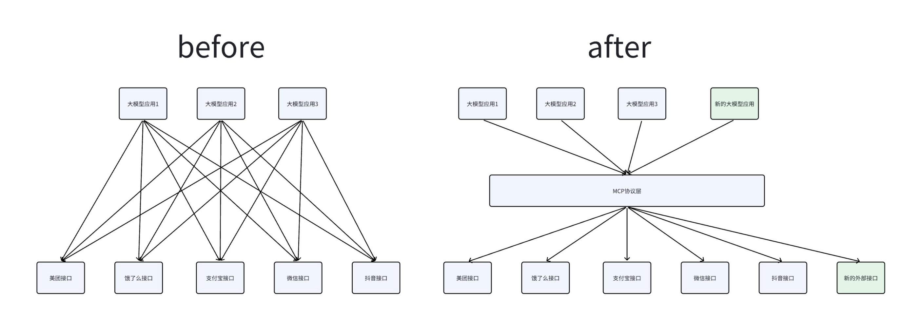
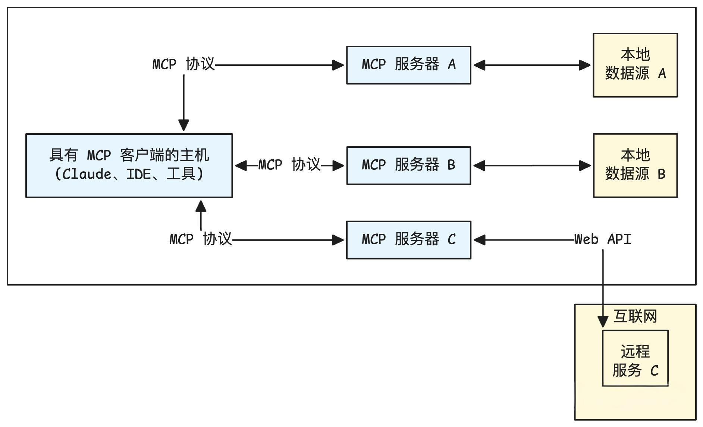
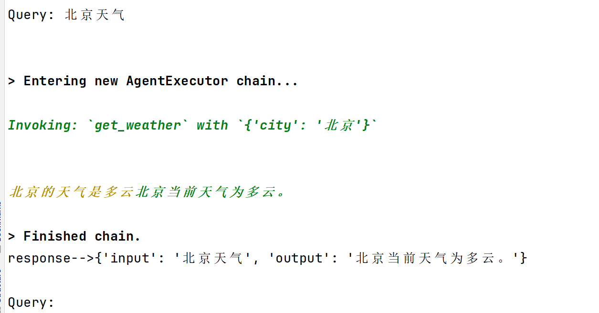
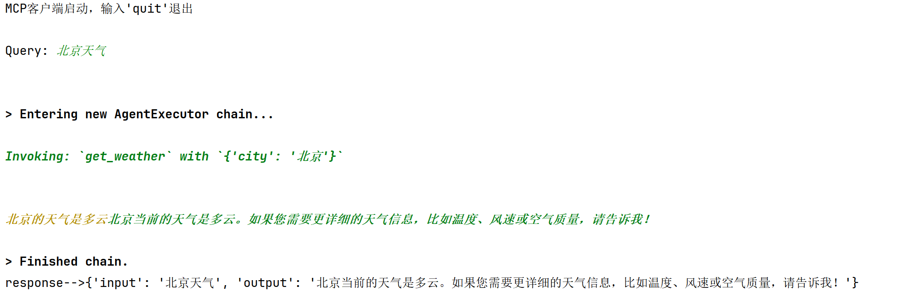
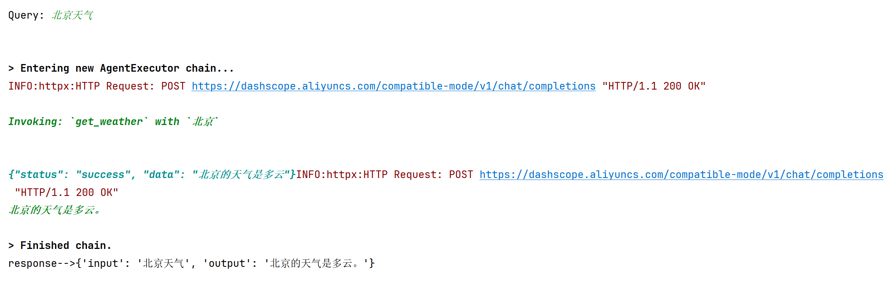

# MCP协议

## 学习目标

- 理解协议在AI中的作用。
- 掌握MCP的核心概念及应用。
- 熟悉mcp的基本使用。

------

## 一、背景 

在前面的所有工具调用例子中，工具描述都是由大模型应用的开发者来负责的。这里引入两个问题：

- 每个人都由自己对工具的理解，每个人的描述方式不一致，怎样保证工具调用的质量是稳定的？

- 每次开发新应用，都要重新写一遍工具描述，引入了太多重复的工作。



核心原因在于：对工具的描述是一个繁琐而复杂的过程，这项工作只有工具的开发者能够清晰准确地完成，而不应该由工具调用者负责。如果工具能清晰地描述自己的功能，就能够实现“一次编写，到处调用”，上述问题就迎刃而解了。


## 二、什么是MCP协议

MCP（Model Context Protocol，模型上下文协议）是由 Anthropic 在2024年1月提出的一套开放协议，旨在实现大型语言模型（LLM）与外部数据源和工具的无缝集成，用来在大模型和数据源之间建立安全双向的链接。

Anthropic的愿景，希望把MCP协议打造成AI世界的“Type-C”接口，可以通过MCP协议工具、数据链接起来，达类似HTTP协议的那种通用程度。

> 协议（Protocol）是一种约定或标准，用于定义不同系统、设备或软件之间如何通信和交换数据。它确保各方使用相同的“语言”和规则，避免混乱。例如，HTTP协议定义了浏览器与服务器的交互方式，USB协议标准化了设备连接。


### 1 MCP 核心架构

MCP协议有两个核心角色：客户端与服务端。

**MCP服务端 (Tool Provider)：**

- **角色**：工具的提供者。
- **职责**：将一个或多个本地函数（例如，Python函数）包装起来，通过一个标准的MCP接口暴露出去。它监听来自客户端的请求，执行对应的函数，并返回结果。
- **例子**：一个天气查询服务、一个数学计算服务、一个数据库访问服务。

**MCP客户端 (Tool Consumer)**：

- **角色**：工具的调用者或消费者。
- **职责**：连接到MCP服务端，查询可用的工具列表（自发现），并根据需要调用这些工具。
- **例子**：大模型Agent、自动化脚本、任何需要远程执行功能的应用程序。



> MCP 主机（MCP Hosts）指的是发起请求的 LLM 应用程序。MCP 客户端（MCP Clients）指的是在主机程序内部的一个对象。

### 2 MCP 工具调用流程

**步骤 1：客户端注册并连接 MCP Server**

- MCP Client 启动后，根据配置文件或命令参数连接多个 MCP Server。

- 每个 Server 都会返回一份工具描述列表（Tool Manifest），包括：

    ```json
    [
      {
        "name": "query_mysql",
        "description": "执行 SQL 查询",
        "input_schema": {...},
        "output_schema": {...}
      }
    ]
    ```

- Client 将这些工具的元信息缓存并上报给 LLM，使大模型“知道”有哪些可用工具。

**步骤 2：LLM 接收用户输入并决定调用工具**

- 用户输入请求（如：“帮我查一下 users 表中有多少行数据”）。

- LLM 分析语义后，判断需要使用 `query_mysql` 工具。

- LLM 生成 function calling 格式的调用指令：

    ```json
    {
      "name": "query_mysql",
      "arguments": {
        "sql": "SELECT COUNT(*) FROM users;"
      }
    }
    ```

**步骤 3：MCP Client 执行工具调用**

- MCP Client 收到该调用后，匹配到对应的 Server。

- 按协议通过 stdio 或 WebSocket 将请求发送给 MCP Server，例如：

    ```json
    {
      "type": "tool_call",
      "tool": "query_mysql",
      "args": {"sql": "SELECT COUNT(*) FROM users;"}
    }
    ```

**步骤 4：MCP Server 执行工具逻辑**

- MCP Server 内部执行工具逻辑（例如运行 SQL 查询）。

- 生成结果：

    ```json
    {
      "result": [{"count": 520}]
    }
    ```

- 将结果通过相同的通信通道返回给 MCP Client。

**步骤 5：结果回传给 LLM**

- MCP Client 接收结果，并包装为 ToolMessage 发送回 LLM。

- LLM 读取结果上下文，再生成最终自然语言回答：

    > “数据库中共有 520 条用户记录。”


### 3 MCP的通信传输方式

MCP传输方式与MCP协议本身无关，目前主要有三种通信传输方式：stdio、基于HTTP的SSE和Streamable。

**（1）stdio (标准输入/输出)**

- 类型：stdio一种非常经典和简单的进程间通信（IPC）方式。客户端启动服务端作为一个子进程。

- 工作原理: 客户端通过写入子进程的 **标准输入 (stdin)**  来发送请求，并通过读取子进程的 **标准输出 (stdout)**  来获取响应。这种方式简单高效，无需网络开销。

- 适用场景：非常适合在**本地环境**中，将一个命令行工具或脚本快速封装成一个 MCP 服务。

**（2）SSE (Server-Sent Events)**

- 类型：SSE 是一种 **基于 HTTP 的单向推送协议** ，它允许服务器在保持连接开放的情况下，持续向客户端发送事件流。

- 工作原理：客户端发起一个 HTTP 请求，服务器接收请求并保持连接，然后以 text/event-stream 格式将响应数据流式传输给客户端。这在 MCP 中被用来实现请求与响应的通信。

- 适用场景： 适用于 **分布式或网络环境** ，当服务需要部署在远端，并通过网络供多个客户端访问时。

**（3）Streamable**

- 类型：Streamable-HTTP 是 MCP 提供的另一种基于 HTTP 的传输方式，它同样用于网络通信。

- 工作原理：客户端通过 HTTP 请求与服务器通信。与 SSE 的主要区别在于其传输格式和机制可能有所不同，比如Streamble的传输格式可以为任意格式，而SSE为特定格式；Streamble的通信方向可以为双向，而SSE只能是单向。

- 适用场景：与 SSE 类似，适用于需要**通过网络进行通信的分布式应用**。

**对比：**

| 传输方式         | stdio                          | SSE (Server-Sent Events)                   | Streamable-HTTP                                    |
| ---------------- | ------------------------------ | ------------------------------------------ | -------------------------------------------------- |
| 通信方向         | 双向（请求-响应）              | 单向（服务器推送到客户端）                 | 双向（双向流）                                     |
| 通信模式         | 本地进程间通信（IPC）          | 网络通信（长连接流）                       | 网络通信（双向流）                                 |
| 主要用途         | 封装本地命令行工具             | 仅需接收服务器更新的场景                   | 复杂的、需要实时双向流的场景                       |
| 是否容易丢失数据 | 由操作系统保证可靠性           | 由 TCP 协议保证可靠性                      | 由 TCP 协议保证可靠性                              |
| 关键优势         | 简单、高效、安全，无需网络开销 | 适用于简单、单向的数据推送，浏览器兼容性好 | 灵活性高，支持双向流式传输，提升大型任务的响应效率 |

> 注意：此前在早期版本中，MCP 曾使用 “HTTP + SSE” 这种组合（客户端 POST、服务器 SSE 推送）作为远程通信方式。然而，该 “HTTP + SSE” 方式在规范中已被标注为 已弃用（deprecated），从 MCP 规范 2025-03-26 起推荐转向 Streamable HTTP。

------

## 三、mcp包使用

> 注意：以下代码需要安装langchain_mcp_adapters包，安装方式如下。
>
> pip install langchain-mcp-adapters --index-url https://pypi.org/simple

### 1 stdio传输方式

#### 服务端

位置：agent_learn/mcp_base/stdio/server_stdio.py

```python
from mcp.server.fastmcp import FastMCP

mcp = FastMCP("sdg", log_level="ERROR")

@mcp.tool(
    name="query_high_frequency_question",
    description="从知识库中检索常见问题解答（FAQ）,返回包含问题和答案的结构化JSON数据。",
)
async def query_high_frequency_question() -> str:
    """
    高频问题查询
    """
    try:
        print("调用查询高频问题的tool成功！！")
        return "高频问题是: 恐龙是怎么灭绝的？"
    except Exception as e:
        print(f"Unexpected error in question retrieval: {str(e)}")
        raise


@mcp.tool(
    name="get_weather",
    description="查询天气"
)
async def get_weather() -> str:
    """
    查询天气的tools
    """
    try:
        print("调用查询天气的tools")
        return "北京的天气是多云"
    except Exception as e:
        print(f"Unexpected error in question retrieval: {str(e)}")
        raise


if __name__ == "__main__":
    mcp.run(transport="stdio")
```


#### 客户端（直接调用）

> 注意：
>
> （1）直接启动客户端即可，不需要启动服务端，因为客户端会自动启动服务端。
>
> （2）如果直接运行报错，可能是编码集的问题，可以尝试使用命令行的方式运行：
>
> set PYTHONIOENCODING=utf-8
>
> python client_raw.py 

位置：agent_learn/mcp_base/stdio/client_raw.py

```python
import asyncio
from langchain_mcp_adapters.tools import load_mcp_tools
from mcp import ClientSession, StdioServerParameters
from mcp.client.stdio import stdio_client

# 配置mcp服务器脚本路径
server_script = r".\server_stdio.py"

# 配置mcp服务器启动参数
server_params = StdioServerParameters(
    command="python" if server_script.endswith(".py") else "node",
    args=[server_script],
)

# 定义mcp客户端
mcp_client = None

# 主要的异步函数run_agent
async def run():
    global mcp_client
    # 启动 MCP server，并通过标准输入输出建立异步连接。
    async with stdio_client(server_params) as (read, write):
        # 使用读写通道创建 MCP 会话。
        async with ClientSession(read, write) as session:
            await session.initialize()
            # 动态创建一个临时类 MCPClientHolder，把 session 放进去。这样就可以在函数外部通过 mcp_client.session 调用 MCP 工具
            mcp_client = type("MCPClientHolder", (), {"session": session})()

            # 从 session 自动获取 MCP server 提供的工具列表。
            tools = await load_mcp_tools(session)
            print(f"tools-->{tools}")

            # 调用 MCP server 的 get_weather 工具
            response = await session.call_tool("get_weather", arguments={})
            print(f"response-->{response}")
    return

# 启动运行
if __name__ == "__main__":
    asyncio.run(run())
```

运行结果：

```json
tools-->[StructuredTool(name='query_high_frequency_question', description='从知识库中检索常见问题解答（FAQ）,返回包含问题和答案的结构化JSON数据。', atitle': 'query_high_frequency_questionArguments', 'type': 'object'}, response_format='content_and_artifact', coroutine=<function convert_mcp_tool_to_langchain_tool.<locals>.call_tool at 0x000001E176F59900>), StructuredTool(name='get_weather', description='查询天气', args_schema={'properties': {}, le': 'get_weatherArguments', 'type': 'object'}, response_format='content_and_artifact', coroutine=<function convert_mcp_tool_to_langchain_tool.<locals>.call_tool at 0x000001E176F59A20>)]
response-->meta=None content=[TextContent(type='text', text='北京的天气是多云', annotations=None, meta=None)] structuredContent={'result': '北京的天气是多云'} isError=False
```


#### 客户端（agent调用）

> 注意：
>
> （1）直接启动客户端即可，不需要启动服务端，因为客户端会自动启动服务端。
>
> （2）如果直接运行报错，可能是编码集的问题，可以尝试使用命令行的方式运行：
>
> set PYTHONIOENCODING=utf-8
>
> python client_raw.py 

位置：agent_learn/mcp_base/stdio/client_agent.py

```python
import os
import sys
sys.path.append(os.path.join(os.path.dirname(__file__), "../../.."))
import asyncio
from langchain_mcp_adapters.tools import load_mcp_tools
from langchain_openai import ChatOpenAI
from langchain.agents import create_tool_calling_agent, AgentExecutor
from langchain_core.prompts import ChatPromptTemplate
from mcp import ClientSession, StdioServerParameters
from mcp.client.stdio import stdio_client
from agent_learn.config import Config

conf = Config()

# 创建模型
llm = ChatOpenAI(base_url=conf.base_url,
                 api_key=conf.api_key,
                 model=conf.model_name,
                 temperature=0.1)

# 配置mcp服务器脚本路径
server_script = r".\server_stdio.py"

# 配置mcp服务器启动参数
server_params = StdioServerParameters(
    command="python" if server_script.endswith(".py") else "node",
    args=[server_script],
)

# 定义mcp客户端
mcp_client = None

# 主要的异步函数run_agent
async def run_agent():
    global mcp_client
    # 启动 MCP server，并通过标准输入输出建立异步连接。
    async with stdio_client(server_params) as (read, write):
        # 使用读写通道创建 MCP 会话。
        async with ClientSession(read, write) as session:
            # 初始化会话
            await session.initialize()
            # 动态创建一个临时类 MCPClientHolder，把 session 放进去。这样就可以在函数外部通过 mcp_client.session 调用 MCP 工具
            mcp_client = type("MCPClientHolder", (), {"session": session})()

            # 从 session 自动获取 MCP server 提供的工具列表
            tools = await load_mcp_tools(session)
            # print(f"tools-->{tools}")

            # 创建prompt模板
            prompt_template = ChatPromptTemplate.from_messages([
                ("system", "你是一个乐于助人的助手，能够调用工具回答用户问题。"),
                ("human", "{input}"),
                ("placeholder", "{agent_scratchpad}"),
            ])

            # 构建工具调用代理
            agent = create_tool_calling_agent(llm, tools, prompt_template)

            # 创建代理执行器
            agent_executor = AgentExecutor(agent=agent, tools=tools, verbose=True)

            # 代理调用
            print("MCP客户端启动，输入'quit'退出")
            while True:
                # 接收用户查询
                query = input("\nQuery: ").strip()
                if query.lower() == "quit":
                    break
                # 发送用户查询给代理，并打印  
                try:
                    response = await agent_executor.ainvoke({"input": query})
                    print(f"response-->{response}")
                except Exception:
                    print("解析有问题")
    return

if __name__ == "__main__":
    asyncio.run(run_agent())
```

运行结果：




### 2 sse传输方式

#### 服务端

位置：agent_learn/mcp_base/sse/server_sse.py

```python
from mcp.server.fastmcp import FastMCP


# 在创建FastMCP实例时指定host和port
mcp = FastMCP("sdg", log_level="ERROR", host="127.0.0.1", port=8001)

@mcp.tool(
    name="query_high_frequency_question",
    description="从知识库中检索常见问题解答（FAQ）,返回包含问题和答案的结构化JSON数据。",
)
async def query_high_frequency_question() -> str:
    """
    高频问题查询
    """
    try:
        print("调用查询高频问题的tool成功！！")
        return "高频问题是: 恐龙是怎么灭绝的？"
    except Exception as e:
        print(f"Unexpected error in question retrieval: {str(e)}")
        raise

@mcp.tool(
    name="get_weather",
    description="查询天气"
)
async def get_weather() -> str:
    """
    查询天气的tools
    """
    try:
        print("调用查询天气的tools")
        return "北京的天气是多云"
    except Exception as e:
        print(f"Unexpected error in question retrieval: {str(e)}")
        raise


def main():
    print("正在启动MCP SSE服务器...")
    print("SSE端点: http://localhost:8001/sse")
    print("按 Ctrl+C 停止服务器")

    try:
        # 运行SSE服务器
        mcp.run(transport="sse")
    except KeyboardInterrupt:
        print("\n服务器已停止")
    except Exception as e:
        print(f"服务器启动失败: {e}")


if __name__ == "__main__":
    main()
```


#### 客户端（直接调用）

位置：agent_learn/mcp_base/sse/client_raw.py

```python
import asyncio
from mcp import ClientSession
from mcp.client.sse import sse_client
from langchain_mcp_adapters.tools import load_mcp_tools

# MCP server URL for SSE connection
server_url = "http://localhost:8001/sse"

# 定义mcp客户端
mcp_client = None

# 主要的异步函数run_agent
async def run():
    global mcp_client
    # 启动 MCP server，通过 SSE 建立异步连接。
    async with sse_client(url=server_url) as streams:
        # 使用读写通道创建 MCP 会话
        async with ClientSession(*streams) as session:
            await session.initialize()
            # 动态创建一个临时类 MCPClientHolder，把 session 放进去。这样就可以在函数外部通过 mcp_client.session 调用 MCP 工具
            mcp_client = type("MCPClientHolder", (), {"session": session})()

            # 从 session 自动获取 MCP server 提供的工具列表。
            tools = await load_mcp_tools(session)
            # print(f"tools-->{tools}")

            # 调用 MCP server 的 get_weather 工具
            response=await session.call_tool("get_weather", arguments={})
            print(f"response-->{response}")


# 启动运行agent
if __name__ == "__main__":
    asyncio.run(run())
```

运行结果：

```json
tools-->[StructuredTool(name='query_high_frequency_question', description='从知识库中检索常见问题解答（FAQ）,返回包含问题和答案的结构化JSON数据。', args_schema={'properties': {}, 'title': 'query_high_frequency_questionArguments', 'type': 'object'}, response_format='content_and_artifact', coroutine=<function convert_mcp_tool_to_langchain_tool.<locals>.call_tool at 0x000002351B63EB90>), StructuredTool(name='get_weather', description='查询天气', args_schema={'properties': {}, 'title': 'get_weatherArguments', 'type': 'object'}, response_format='content_and_artifact', coroutine=<function convert_mcp_tool_to_langchain_tool.<locals>.call_tool at 0x000002351B63ED40>)]
response-->meta=None content=[TextContent(type='text', text='北京的天气是多云', annotations=None, meta=None)] structuredContent={'result': '北京的天气是多云'} isError=False
```


#### 客户端（agent调用）

位置：agent_learn/mcp_base/sse/client_agent.py

```python
import json
import asyncio
from langchain_openai import ChatOpenAI
from mcp import ClientSession
from mcp.client.sse import sse_client
from langchain_mcp_adapters.tools import load_mcp_tools
from langchain.agents import create_tool_calling_agent, AgentExecutor
from langchain_core.prompts import ChatPromptTemplate
from agent_learn.config import Config

conf = Config()

# 创建模型
llm = ChatOpenAI(base_url=conf.base_url,
                 api_key=conf.api_key,
                 model=conf.model_name,
                 temperature=0.1)

# MCP server URL for SSE connection
server_url = "http://localhost:8001/sse"

# 定义mcp客户端
mcp_client = None

# Main async function: connect, load tools, create agent, run chat loop
async def run_agent():
    global mcp_client
    # 启动 MCP server，通过 SSE 建立异步连接。
    async with sse_client(url=server_url) as streams:
        # 使用读写通道创建 MCP 会话
        async with ClientSession(*streams) as session:
            await session.initialize()
            # 动态创建一个临时类 MCPClientHolder，把 session 放进去。这样就可以在函数外部通过 mcp_client.session 调用 MCP 工具
            mcp_client = type("MCPClientHolder", (), {"session": session})()

            # 从 session 自动获取 MCP server 提供的工具列表。
            tools = await load_mcp_tools(session)
            # print(f"tools-->{tools}")

            # 创建prompt模板
            prompt_template = ChatPromptTemplate.from_messages([
                ("system", "你是一个乐于助人的助手，能够调用工具回答用户问题。"),
                ("human", "{input}"),
                ("placeholder", "{agent_scratchpad}"),
            ])

            # 构建工具调用代理
            agent = create_tool_calling_agent(llm, tools, prompt_template)

            # 创建代理执行器
            agent_executor = AgentExecutor(agent=agent, tools=tools, verbose=True)

            # 代理调用
            print("MCP客户端启动，输入'quit'退出")
            while True:
                # 接收用户查询
                query = input("\nQuery: ").strip()
                if query.lower() == "quit":
                    break
                # 发送用户查询给代理，并打印
                try:
                    response = await agent_executor.ainvoke({"input": query})
                    print(f"response-->{response}")
                except Exception:
                    print("解析有问题")
    return

if __name__ == "__main__":
    asyncio.run(run_agent())
```

运行结果：



### 3 streamable方式

#### 服务端

位置：agent_learn/mcp_base/streamable/server_streamable.py

```python
from mcp.server.fastmcp import FastMCP

# 创建 MCP 实例，指定服务名称、日志级别、主机和端口
mcp = FastMCP("sdg", log_level="ERROR", host="127.0.0.1", port=8001)

@mcp.tool(
    name="query_high_frequency_question",
    description="从知识库中检索常见问题解答（FAQ）,返回包含问题和答案的结构化JSON数据。",
)
async def query_high_frequency_question() -> str:
    """
    高频问题查询
    """
    try:
        print("调用查询高频问题的tool成功！！")
        return "高频问题是: 恐龙是怎么灭绝的？"
    except Exception as e:
        print(f"Unexpected error in question retrieval: {str(e)}")
        raise

@mcp.tool(
    name="get_weather",
    description="查询天气"
)
async def get_weather() -> str:
    """
    查询天气的tools
    """
    try:
        print("调用查询天气的tools")
        return "北京的天气是多云"
    except Exception as e:
        print(f"Unexpected error in question retrieval: {str(e)}")
        raise


def main():
    """
    启动 Streamable HTTP 服务器。
    """
    print("正在启动MCP Streamable服务器...")
    print("服务器将在 http://localhost:8001 上运行")
    print("按 Ctrl+C 停止服务器")
    try:
        mcp.run(transport="streamable-http")  # 使用 streamable-http 传输方式
    except KeyboardInterrupt:
        print("\n服务器已停止")
    except Exception as e:
        print(f"服务器启动失败: {e}")


if __name__ == "__main__":
    main()
```


#### 客户端（直接调用）

位置：agent_learn/mcp_base/streamable/client_raw.py

```python
import asyncio
import logging
from langchain_mcp_adapters.tools import load_mcp_tools
from mcp import ClientSession
from mcp.client.streamable_http import streamablehttp_client

# 定义服务器地址
server_url = "http://127.0.0.1:8001/mcp"

# 定义mcp客户端
mcp_client = None

# 配置日志
logging.basicConfig(
    level=logging.DEBUG,  # 提高日志级别以捕获更多信息
    format='[客户端] %(asctime)s - %(levelname)s - %(message)s'
)

async def main():
    global mcp_client
    logging.info(f"准备连接到 Streamable-HTTP 服务器: {server_url}")
    try:
        # 启动 MCP server，通过streamable建立连接
        async with streamablehttp_client(server_url) as (read, write, _):
            logging.info("连接已成功建立！")
            # 使用读写通道创建 MCP 会话
            async with ClientSession(read, write) as session:
                try:
                    await session.initialize()
                    logging.info("会话初始化成功，可以开始调用工具。")
                    # 动态创建一个临时类 MCPClientHolder，把 session 放进去。这样就可以在函数外部通过 mcp_client.session 调用 MCP 工具
                    mcp_client = type("MCPClientHolder", (), {"session": session})()

                    # 从 session 自动获取 MCP server 提供的工具列表。
                    tools = await load_mcp_tools(session)
                    # print(f"tools-->{tools}")

                    # 调用远程工具
                    logging.info("--> 正在调用工具: query_high_frequency_question")
                    response = await session.call_tool("query_high_frequency_question", {})
                    print(f"response-->{response}")
                    logging.info(f"<-- 收到响应: {response}")

                    print("-" * 30)

                    logging.info("--> 正在调用工具: get_weather")
                    response = await session.call_tool("get_weather", {})
                    print(f"response-->{response}")
                    logging.info(f"<-- 收到响应: {response}")
                except Exception as e:
                    logging.error(f"调用工具时发生错误: {e}", exc_info=True)
                    raise
    except Exception as e:
        logging.error(f"连接或会话初始化时发生错误: {e}", exc_info=True)
        logging.error("请确认服务端脚本已启动并运行在 http://127.0.0.1:8001/mcp")
        raise


if __name__ == "__main__":
    try:
        asyncio.run(main())
    except Exception as e:
        logging.error(f"客户端运行失败: {e}", exc_info=True)
```


#### 客户端（agent调用）

位置：agent_learn/mcp_base/streamable/client_agent.py

```python
import json
import logging
import asyncio
from langchain_openai import ChatOpenAI
from mcp import ClientSession
from mcp.client.streamable_http import streamablehttp_client
from langchain_mcp_adapters.tools import load_mcp_tools
from langchain.agents import create_tool_calling_agent, AgentExecutor
from langchain_core.prompts import ChatPromptTemplate
from agent_learn.config import Config

conf = Config()

# 创建模型
llm = ChatOpenAI(base_url=conf.base_url,
                 api_key=conf.api_key,
                 model=conf.model_name,
                 temperature=0.1)

# MCP 服务器的 Streamable-HTTP 连接地址
server_url = "http://127.0.0.1:8001/mcp"

# 配置日志
logging.basicConfig(
    level=logging.DEBUG,  # 提高日志级别以捕获更多信息
    format='[客户端] %(asctime)s - %(levelname)s - %(message)s'
)

# 定义mcp客户端
mcp_client = None

async def run_agent():
    global mcp_client
    logging.info(f"准备连接到 Streamable-HTTP 服务器: {server_url}")
    # 启动 MCP server，通过streamable建立连接
    async with streamablehttp_client(server_url) as (read, write, _):
        logging.info("连接已成功建立！")
        # 使用读写通道创建 MCP 会话
        async with ClientSession(read, write) as session:
            try:
                await session.initialize()
                logging.info("会话初始化成功，可以开始加载工具。")
                # 动态创建一个临时类 MCPClientHolder，把 session 放进去。这样就可以在函数外部通过 mcp_client.session 调用 MCP 工具
                mcp_client = type("MCPClientHolder", (), {"session": session})()

                # 从 session 自动获取 MCP server 提供的工具列表。
                tools = await load_mcp_tools(session)
                # print(f"tools-->{tools}")

                # 创建 agent 的提示模板
                prompt = ChatPromptTemplate.from_messages([
                    ("system", "你是一个乐于助人的助手，能够调用工具回答用户问题。"),
                    ("human", "{input}"),
                    ("placeholder", "{agent_scratchpad}"),
                ])

                # 构建工具调用代理
                agent = create_tool_calling_agent(llm, tools, prompt)

                # 创建代理执行器
                agent_executor = AgentExecutor(agent=agent, tools=tools, verbose=True)

                # 代理调用
                print("MCP客户端启动，输入'quit'退出")
                while True:
                    query = input("\nQuery: ").strip()
                    if query.lower() == "quit":
                        break
                    # 发送用户查询到 agent 并打印格式化响应
                    logging.info(f"处理用户查询: {query}")
                    try:
                        response = await agent_executor.ainvoke({"input": query})
                        print(f"response-->{response}")
                    except Exception:
                        print("解析有问题")
            except Exception as e:
                logging.error(f"会话初始化或工具调用时发生错误: {e}", exc_info=True)
                raise

if __name__ == "__main__":
    try:
        asyncio.run(run_agent())
    except Exception as e:
        logging.error(f"客户端运行失败: {e}", exc_info=True)
```


## 四、python_a2a包使用

#### 服务端

位置：agent_learn/mcp_base/python_a2a/server_a2a.py

```python
import logging
import uvicorn
from python_a2a.mcp import FastMCP
from python_a2a.mcp import create_fastapi_app

# 配置日志，方便调试
logging.basicConfig(level=logging.INFO, format='%(asctime)s - %(levelname)s - %(message)s')
logger = logging.getLogger(__name__)

# 创建 MCP 服务器实例
mcp = FastMCP(
    name="MyMCPTools",
    description="提供高频问题和天气查询工具",
    version="1.0.0"
)

# 定义工具 1：查询高频问题
@mcp.tool(
    name="query_high_frequency_question",
    description="获取知识库中的高频问答，返回 JSON 数据",
)
async def query_high_frequency_question(**kwargs) -> str:
    """
    query_high_frequency_question 不需要任何传参
    查询高频问题并返回答案
    返回示例：[{"question_id": 1, "question_text": "恐龙怎么灭绝", "answer_text": "小行星撞击", ...}]
    """
    try:
        logger.info(f"调用查询高频问题的工具，参数为：{kwargs}")
        return '{"status": "success", "data": [{"question_id": 1, "question_text": "恐龙是怎么灭绝的？", "answer_text": "可能是小行星撞击", "category": "历史", "frequency_score": 0.9}]}'
    except Exception as e:
        logger.error(f"查询高频问题出错: {str(e)}")
        raise

# 定义工具 2：查询天气
@mcp.tool(
    name="get_weather",
    description="查询天气",
)
async def get_weather(**kwargs) -> str:
    """
    get_weather 不需要任何传参
    查询天气并返回结果
    返回示例：{"status": "success", "data": "北京的天气是多云"}
    """
    try:
        logger.info(f"调用查询天气的工具，参数为{kwargs}")
        return '{"status": "success", "data": "北京的天气是多云"}'
    except Exception as e:
        logger.error(f"查询天气出错: {str(e)}")
        raise

# 启动服务器
def start_server():
    logger.info("=== MCP 服务器信息 ===")
    logger.info(f"名称: {mcp.name}")
    logger.info(f"描述: {mcp.description}")

    port = 8010
    app = create_fastapi_app(mcp)
    logger.info(f"启动 MCP 服务器于 http://localhost:{port}")
    uvicorn.run(app, host="0.0.0.0", port=port)


if __name__ == "__main__":
    start_server()
```


#### 客户端（直接调用）

位置：agent_learn/mcp_base/python_a2a/client_raw.py

```python
import asyncio
import logging
from python_a2a.mcp import MCPClient

# 配置日志
logging.basicConfig(level=logging.INFO, format='%(asctime)s - %(levelname)s - %(message)s')
logger = logging.getLogger(__name__)

async def test_mcp_tools():
    # 连接到服务端，端口 8000
    client = MCPClient("http://localhost:8010")
    try:
        # 步骤 1：获取可用工具列表
        tools = await client.get_tools()
        logger.info("可用工具列表：")
        for tool in tools:
            print(tool)
            logger.info(f"- {tool.get('name', '未知')}: {tool.get('description', '无描述')}")

        # 步骤 2：调用查询高频问题工具
        result_qhf = await client.call_tool("query_high_frequency_question")
        logger.info(f"高频问题查询结果：{result_qhf}")

        # 步骤 3：调用查询天气工具
        result_weather = await client.call_tool("get_weather")
        logger.info(f"天气查询结果：{result_weather}")

    except Exception as e:
        logger.error(f"MCP 客户端出错：{str(e)}", exc_info=True)
    finally:
        await client.close()

async def main():
    await test_mcp_tools()


if __name__ == "__main__":
    asyncio.run(main())
```

运行结果：

```json
{'name': 'query_high_frequency_question', 'description': '获取知识库中的高频问答，返回 JSON 数据', 'parameters': {'type': 'object', 'properties': {}, 'required': []}}
{'name': 'get_weather', 'description': '查询天气', 'parameters': {'type': 'object', 'properties': {}, 'required': []}}
```


#### 客户端（agent调用）

位置：agent_learn/mcp_base/python_a2a/client_agent.py

```python
import asyncio
import json
import logging
from langchain.agents import create_tool_calling_agent, AgentExecutor
from langchain_core.prompts import ChatPromptTemplate
from langchain_openai import ChatOpenAI
from python_a2a.mcp import MCPClient
from python_a2a.langchain import to_langchain_tool
from agent_learn.config import Config

conf = Config()

# 配置日志
logging.basicConfig(level=logging.INFO, format='%(asctime)s - %(levelname)s - %(message)s')
logger = logging.getLogger(__name__)

# 创建模型
llm = ChatOpenAI(base_url=conf.base_url,
                 api_key=conf.api_key,
                 model=conf.model_name,
                 temperature=0.1)

async def test_mcp_tools():
    # 连接到服务端，端口 8000
    client = MCPClient("http://localhost:8010")
    try:
        # 步骤 1：获取可用工具列表
        tools = await client.get_tools()
        logger.info("可用工具列表：")
        for tool in tools:
            print(tool)
            logger.info(f"- {tool.get('name', '未知')}: {tool.get('description', '无描述')}")

        # 将 MCP tool 转成 LangChain 的工具
        get_weather_tool = to_langchain_tool("http://localhost:8010", "get_weather")
        query_high_frequency_question = to_langchain_tool("http://localhost:8010", "query_high_frequency_question")
        tools=[get_weather_tool, query_high_frequency_question]

        # 创建prompt模板
        prompt_template = ChatPromptTemplate.from_messages([
            ("system", "你是一个乐于助人的助手，能够调用工具回答用户问题。工具不需要传参。"),
            ("human", "{input}"),
            ("placeholder", "{agent_scratchpad}"),
        ])

        # 构建工具调用代理
        agent = create_tool_calling_agent(llm, tools, prompt_template)

        # 创建代理执行器
        agent_executor = AgentExecutor(agent=agent, tools=tools, verbose=True)

        # 代理调用
        print("MCP客户端启动，输入'quit'退出")
        while True:
            # 接收用户查询
            query = input("\nQuery: ").strip()
            if query.lower() == "quit":
                break
            # 发送用户查询给代理，并打印
            try:
                response = await agent_executor.ainvoke({"input": query})
                print(f"response-->{response}")
            except Exception:
                print("解析有问题")
    except Exception as e:
        logger.error(f"MCP 客户端出错：{str(e)}", exc_info=True)
    finally:
        await client.close()

async def main():
    await test_mcp_tools()

if __name__ == "__main__":
    asyncio.run(main())
```

运行结果：




## 本节小结

本小节主要介绍了MCP协议的概念以及代码实现。