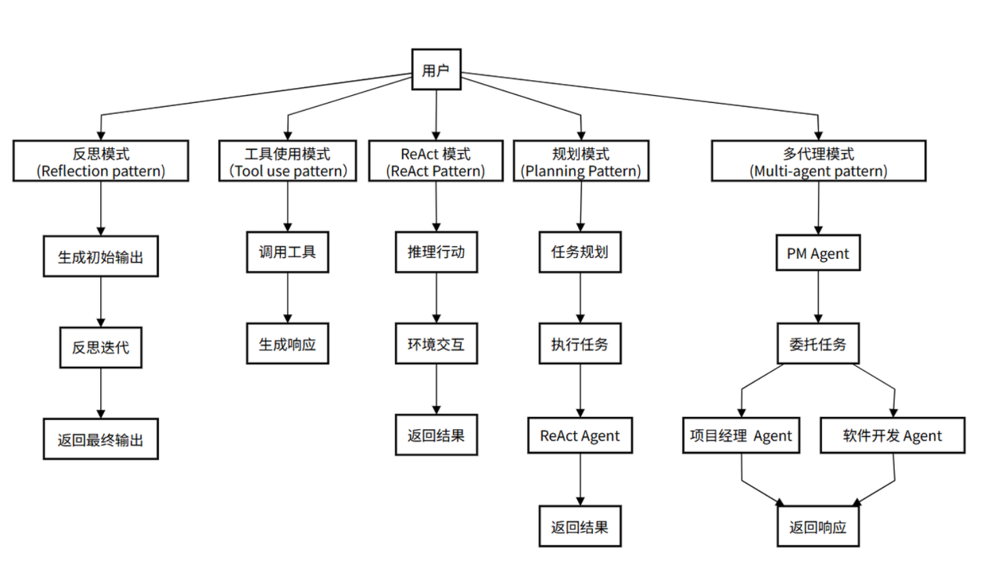
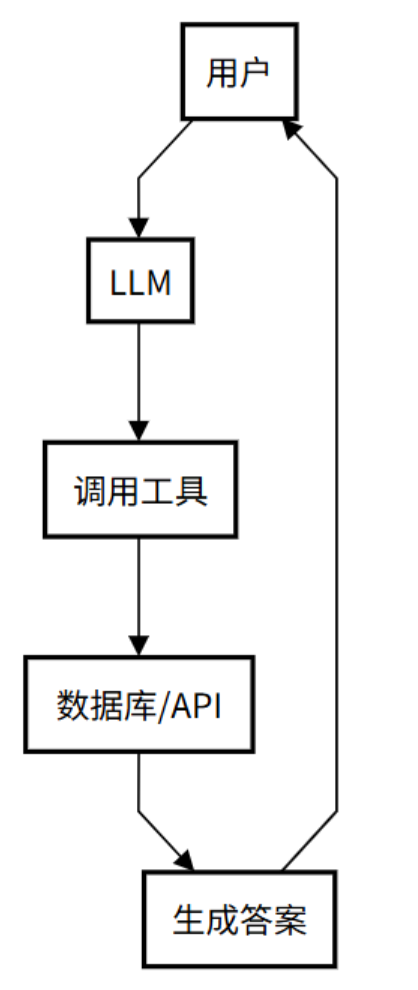
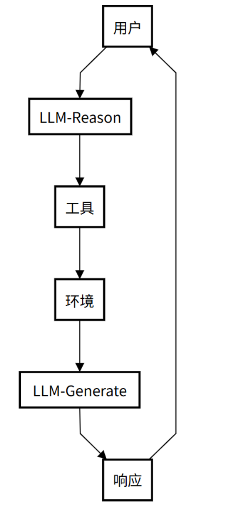
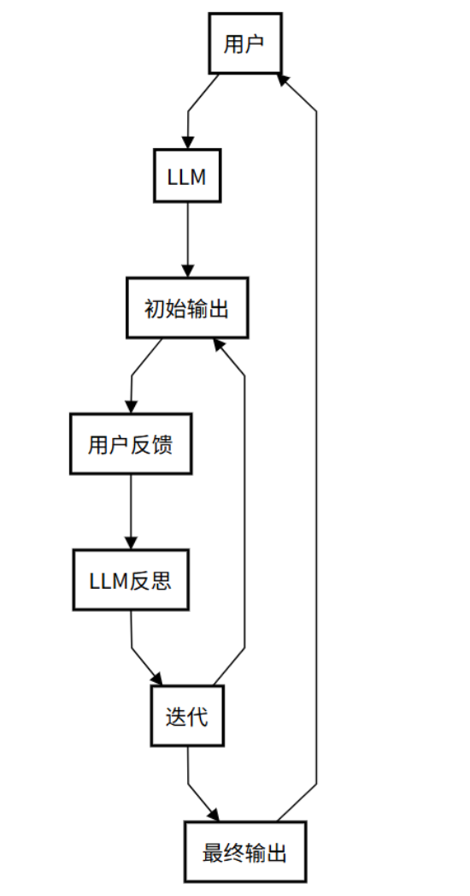
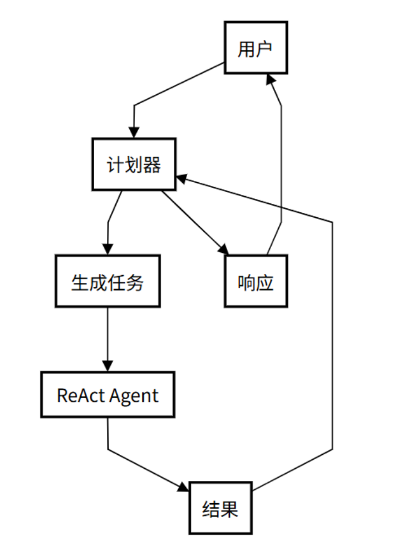
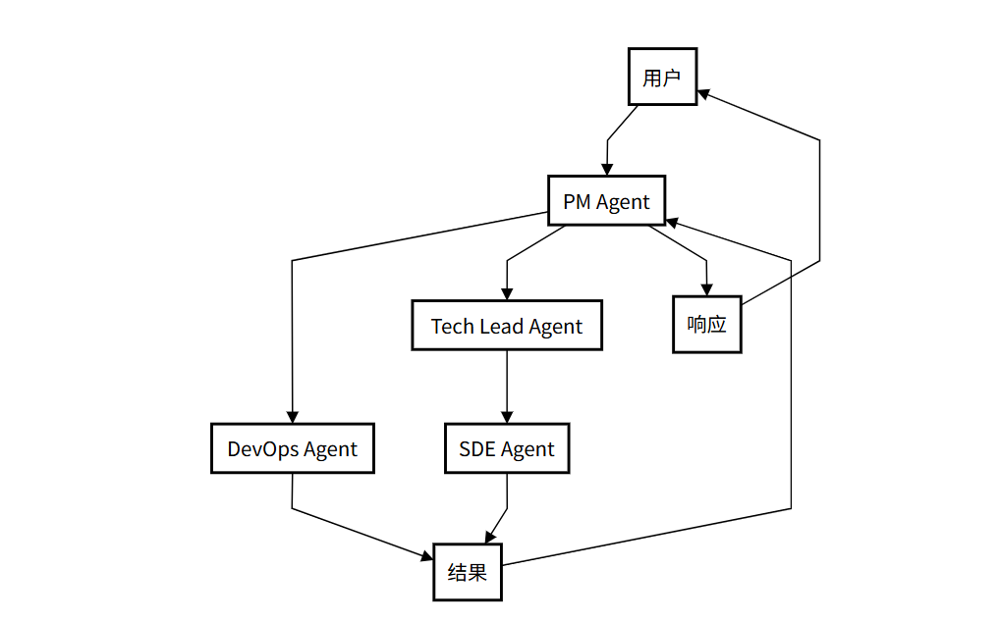

# Agent智能体

## 学习目标

- 理解什么是agent
- 理解什么是agentic
- 知道agent的五种模式

------

## 一、什么是 Agent 

一个 **Agent**，简单来说，就是一个能够**感知环境、做出决策并采取行动来完成特定目标**的“智能体”。

最基础的LLM（大型语言模型），比如deepseek、ChatGPT，在回答问题时其实就已经是一个基础的Agent。它感知你的问题（环境），做出回答的决策，并生成文本（行动）。但一个真正的Agent远不止于此。它需要更强的“能动性”，能够自主地进行反思、规划，甚至与其他Agent协作。这正是将基础LLM升级为高级Agent的关键。


## 二、什么是Agentic

Agentic 是一个形容词，它描述的是一个系统所表现出的“ **像 Agent 一样的程度** ”。
一个系统越是 Agentic，它就越表现出自主性、目标导向性和主动性。它不是一个具体的实体，而是一种行为模式或设计思想。

- **低 Agentic 系统**：一个简单的聊天机器人，只能根据预设规则回答问题。
- **高 Agentic 系统**：一个能自动调试代码、部署应用并监控其运行状态的 AI 软件工程师。

正如OpenAI的AI主管 Lilian Weng（翁丽莲） 在她那篇关于 **自主智能体（Autonomous Agents）**  的里程碑式博客文章《LLM Powered Autonomous Agents》中所强调的，具备智能体特性agentic的 AI，不会傻傻地等待下一步指令，而是会主动进行思考，

- 发现自己犯了错，然后自己去修正。
- 意识到需要外部信息，然后主动去调用工具。
- 面对复杂任务时，自己去拆解成小步骤。

所以，智能体是载体，而它拥有的、让它变得强大的核心能力，正是这篇文章系统阐述的，**规划、记忆和工具使用等关键组件** 。文章《LLM Powered Autonomous Agents》是智能体系统领域的里程碑之作，其价值在于系统化梳理了智能体的核心概念，提出ReAct 等模式，奠定了理论框架；通过案例和细节为工程实践提供了指导 ；推动了从被动响应到主动解决问题的 AI 范式转变；并以通俗语言连接了学术与工业，促进了技术普及，影响了智能体系统的研究与应用。”

**Agentic 特性并非凭空出现**，它通过多种具体的工作模式来实现。下面我们将深入探索五种最常见的Agentic模式，它们定义了Agent在不同场景下的“工作风格”。值得一提的是，这些模式的演化路径与 **ReAct** 思想有着紧密的联系，后者被视为开启了Agentic系统设计的大门。



## 三、Agent五种模式

### 1 ⼯具使⽤模式（Tool use pattern）

**核心精髓：** 工具使用模式可以看作是 **ReAct 模式的前身或简化版**。它允许 Agent 调用外部工具来弥补自身知识的不足，但通常缺乏 ReAct 模式中那种细致入微的“思考-行动-观察”循环。它的局限在于其推理能力较弱，通常只适用于单步、直接的任务，缺乏动态调整和迭代的能力。

**工作流程（像请教专家）：**

1. 用户问问题：提出一个问题。
2. LLM 想想：小助手判断需要外援。
3. 调用工具：它找来数据库或 API 查资料。
4. 给出答案：根据查到的东西，生成回复。
5. 交给你：答案回到你手里。

**应用场景示例：**

智能客服：一个客服 Agent 接到“查询我的订单状态”的请求。它不会胡乱猜测，而是思考需要查询订单信息，然后行动调用 query_order_status(order_id) 这个工具（API），最后根据返回的结果回答用户。



### 2 ReAct 模式 (ReAct Pattern)

几乎所有高级的 Agent 模式都离不开一个核心思想——**ReAct (Reason + Act)**。这是 Agent 实现“思考”与“行动”循环的基础。

**核心精髓：** ReAct（Reasoning and Acting）模式是Agentic思想的 **奠基性贡献** 。它将“思考”（Reasoning）和 “行动”（Acting）**紧密地结合在一起，形成一个动态的循环。这个模式让Agent不再是简单地调用工具，而是像人类一样“边想边做”。** ReAct 模式最早由 Yao 等人于 2022 年提出（论文《ReAct: Synergizing Reasoning and Acting in Language Models》），并在 Lilian Weng 的博客中得到系统阐述，成为Agentic系统设计的基础。

**工作流程：**

1. **思考：** Agent接收用户请求，推理任务需求并制定初步行动计划。
2. **行动：** 根据思考结果，决定并执行具体行动（如调用工具）。
3. **行动输入：** 为选定的工具提供必要参数。
4. **观察：** 接收工具执行结果，作为对环境的“观察”。
5. **循环迭代：** 将观察结果反馈给自己，再次思考并决定下一步，直到达到目标。

**应用场景示例**：

- **研究助理agent**：任务是“查找关于‘大型语言模型在教育领域的应用’的最新研究论文”。
    - **Thought**: 我需要去学术搜索引擎搜索相关论文。
    - **Action**: `search_arxiv("large language models in education")`
    - **Observation**: （返回了10篇论文的标题和摘要）
    - **Thought**: 结果太多了，我需要筛选出最近一年且被引用次数最多的论文。
    - **Action**: `filter_papers(results, min_year=2023, sort_by="citations")`
    - **Observation**: （返回了3篇最相关的论文）
    - **Thought**: 我已经找到了最相关的论文，现在可以总结并回答用户了。




### 3 反思模式（Reflection pattern）

为了提高任务完成的质量，Agent 在完成一个步骤或整个任务后，会进行 **自我评估和反思** ，并根据反思结果进行修正。

**核心精髓：** 反思模式是 **ReAct 模式中“思考”环节的深化**。它强调 Agent 在完成任务后，能够像人类一样进行自我审查和评估。这个过程让 Agent 能够从错误中学习，持续优化自己的表现。

**工作流程：**

1. 用户问问题：你给小助手提个问题。
2. LLM 给出初稿：小助手先试着回答，写个初步答案。
3. 用户反馈：用户查看答案行不行，提出意见。
4. LLM 自己反思：小助手想想哪里不对，改改答案。
5. 反复调整：可能来回改几次，直到你满意。
6. 交给你：最终答案交到你手里。

**应用场景示例**：

- **AI** **代码生成器**：任务是“写一个 Python 函数来计算斐波那契数列”。
    - **Action**: Agent 快速生成了一个使用递归实现的函数。
    - **Reflection (Self-Critique)**: Agent 开始反思生成的代码。“这个递归实现在计算较大数值时，会因为重复计算而导致性能低下。我应该优化它。”
    - **Action (Refinement)**: Agent 重新编写代码，使用了带缓存（memoization）的动态规划方法，大大提高了效率，然后将优化后的代码作为最终答案。



### 4 规划模式（Planning Pattern）

当任务非常复杂，无法通过简单的 ReAct 循环一步到位时，Agent 需要先进行 **宏观规划** 。

**核心思想**：先将一个大目标分解成一个详细的、有序的计划（Plan），然后再逐一执行计划中的每个步骤（每个步骤可能是一个 ReAct 循环）。

**应用场景示例：**

- **AI** **旅行规划师**：任务是“帮我规划一个为期五天的巴黎家庭亲子游”。
    - **Planning Phase**: Agent 首先生成一个计划：
        1. `步骤一：确定旅行日期和预算。`
        2. `步骤二：根据亲子游的特点，搜索并筛选合适的景点（如迪士尼、卢浮宫儿童区）。`
        3. `步骤三：规划每日行程，确保节奏轻松，并预订门票。`
        4. `步骤四：搜索并推荐适合家庭入住的酒店和餐厅。`
        5. `步骤五：汇总所有信息，生成一份详细的旅行计划文档。`
    - **Execution Phase**: Agent 开始按顺序执行上述步骤，每一步都可能调用搜索、预订等工具。



### 5 多智能体模式 (Multi-agent Pattern)

对于极其复杂的系统性任务，单个 Agent 可能难以胜任。这时，可以设计多个具有不同角色和能力的 Agent，让它们协同工作。

**核心精髓：** 多智能体模式是Agentic思想的 **终极体现** ，它模拟了人类团队协作的工作方式。它不再依赖一个Agent单打独斗，而是创建多个具有不同专长的Agent，让它们各司其职、相互协作，共同完成一个复杂的任务。尽管多智能体模式功能强大，但实现时需要解决Agent间的通信效率、任务冲突等问题，这对系统设计提出了更高要求。

**应用场景示例：**

- **软件开发过程**：

    -   **用户问问题**：用户提个大需求（比如开发一个软件项目）。
    -   **PM Agent**：项目经理 Agent 分析需求并分配任务（协调整个团队）。
    -   **委托任务**：任务交给 DevOps 和 Tech Lead（DevOps 负责运维，Tech Lead 负责技术领导）。
    -   **执行任务**：DevOps（处理部署和测试） 和 SDE（编写代码）干活（具体实施任务）。
    -   **结果汇总**：大家干完后，把结果汇报给 PM Agent（统一收集反馈）。
    -   **交给你**：PM Agent 整合所有结果，给用户最终答案（交付完成的项目）。

    这个流程通过多个智能体协作，模拟真实团队工作，确保复杂任务高效完成。




### 6 Agent 模式的演进关系

上述5种模式构成了一个从简单到复杂的演进阶梯：

**Tool Use (基础)** -\> **ReAct (核心循环)** -\> **Planning (宏观规划)** -\> **Reflection (质量保证)** -\> **Multi-Agent (规模化协作)**

-   **ReAct** 是 **Tool Use** 的规范化和显式化，让工具使用变得有迹可循。
-   **Planning** 是在执行多个 **ReAct** 循环之前的高层战略制定。
-   **Reflection** 是对 **ReAct** 或 **Planning** 执行结果的检查与优化。
-   **Multi-Agent** 是将多个可能使用上述所有模式的 Agent 组织起来，形成一个系统。

通过上述的agent模式的演进过程，它清晰地指明了“如何一步步构建一个更强大的 Agent”。

**TIPS:**

一个真正强大的 Agent 系统，并不会只使用其中一种模式。它会根据任务的复杂性，灵活地将这些模式组合起来。例如，一个 Agent 面对一个复杂问题时，可能会先启动 **规划模式** 来分解任务，然后将子任务交给一个使用  **ReAct 模式** 的执行者，而这个执行者在执行过程中又会调用各种 **工具** ，并在遇到困难时启动 **反思模式** 来修正自己的策略。

这种组合和嵌套的能力，正是 Agentic 系统能够处理现实世界中各种复杂任务的关键。


## 四、代码实战

### 1 工具使用模式

位置：agent_learn/agent_types/C01_ToolUsePattern.py

```python
from langchain_core.prompts import ChatPromptTemplate
from langchain_openai import ChatOpenAI
from langchain_core.tools import tool
from langchain.agents import AgentExecutor, create_tool_calling_agent, create_react_agent
from agent_learn.config import Config

conf = Config()

# 1.创建模型
llm = ChatOpenAI(base_url=conf.base_url,
                 api_key=conf.api_key,
                 model=conf.model_name,
                 temperature=0.1)

# 2.定义工具
@tool
def multiply(a: int, b: int) -> int:
    """用于计算两个整数的乘积。"""
    print(f"正在执行乘法: {a} * {b}")

    return a * b

@tool
def search_weather(city: str) -> str:
    """用于查询指定城市的实时天气。"""
    print(f"正在查询天气: {city}")
    if "北京" in city:
        return "北京今天是晴天，气温25摄氏度。"
    elif "上海" in city:
        return "上海今天是阴天，有小雨，气温22摄氏度。"
    else:
        return f"抱歉，我没有'{city}'的天气信息。"

# 将工具列表放入一个变量
tools = [multiply, search_weather]


# 3.定义一个提示模板，用于控制Agent的思考过程和工具调用
tool_use_prompt = ChatPromptTemplate.from_messages([
    ("system", "你是一个强大的AI助手，可以访问和使用各种工具来回答问题。请根据用户的问题，决定是否需要调用工具。当需要调用工具时，请使用正确的JSON格式。"),
    ("user", "{input}"),
    ("placeholder", "{agent_scratchpad}") # 这个占位符用于保存 Agent 的思考过程和工具调用历史
])

# 4.创建一个 LLM 能够识别和使用的 Agent
# 使用 create_tool_calling_agent 函数，它能让 LLM 自动判断何时以及如何调用工具
tool_calling_agent = create_tool_calling_agent(llm, tools, tool_use_prompt)

# 5.创建 Agent Executor
# AgentExecutor 负责 Agent 和工具之间的协调
tool_use_executor = AgentExecutor(
    agent=tool_calling_agent,
    tools=tools,
    verbose=True  # 开启 verbose 模式，可以打印详细的执行过程
)

# 6.通用的执行函数，用于运行agent并打印结果
def run_agent_and_print(agent_executor, query):
    """一个通用函数，用于运行Agent并打印结果。"""
    print(f"--- 运行Agent，查询: {query} ---")
    response = agent_executor.invoke({"input": query})
    print(f"\n--- Agent响应: ---")
    print(response.get("output", "没有找到输出。"))
    print("-" * 30 + "\n")


if __name__ == "__main__":
    run_agent_and_print(tool_use_executor, "上海今天的天气怎么样？")
    run_agent_and_print(tool_use_executor, "30乘以5等于多少？ 上海天气怎么样")
```


### 2 ReAct模式

位置：agent_learn/agent_types/C02_ReActPattern.py

```python
from langchain_openai import ChatOpenAI
from langchain_core.tools import tool
from langchain_core.prompts import ChatPromptTemplate
from langchain.agents import AgentExecutor, create_react_agent
from agent_learn.config import Config

conf = Config()

# 1.创建模型
llm = ChatOpenAI(base_url=conf.base_url,
                 api_key=conf.api_key,
                 model=conf.model_name,
                 temperature=0.1)

# 2.定义工具
# 关键修改：重写 multiply 工具，使其只接受一个字符串参数，并在内部解析。
@tool
def multiply(numbers_str: str) -> int:
    """用于计算两个整数的乘积。

    参数:
        numbers_str (str): 包含两个整数的字符串，用逗号分隔，例如："100,25"。
    返回:
        int: 两个整数的乘积。
    """
    print(f"正在执行乘法: {numbers_str}")
    try:
        a_str, b_str = numbers_str.split(',')
        a = int(a_str.strip())
        b = int(b_str.strip())
        return a * b
    except ValueError:
        return "输入的格式不正确，请确保是两个用逗号分隔的整数，例如：'100,25'"

@tool
def search_weather(city: str) -> str:
    """用于查询指定城市的实时天气。"""
    print(f"正在查询天气: {city}")
    if "北京" in city:
        return "北京今天是晴天，气温25摄氏度。"
    elif "上海" in city:
        return "上海今天是阴天，有小雨，气温22摄氏度。"
    else:
        return f"抱歉，我没有'{city}'的天气信息。"

# 将工具列表放入一个变量
tools = [multiply, search_weather]

# 3.自定义 ReAct 风格的 Prompt
react_prompt_template = """你是一个有用的 AI 助手，可以访问以下工具：

{tools}

请根据用户输入一步步推理，并按以下规则操作：
1. 每次输出只能包含一个动作（Action 和 Action Input）或一个最终答案（Final Answer）。
2. 如果用户输入包含多个任务，依次处理每个任务，不要一次性输出所有步骤。
3. 每次行动前，说明你的思考（Thought），并选择合适的工具或直接给出最终答案。
4. 如果需要使用工具，格式必须为：
   Thought: [你的思考]
   Action: [工具名称]
   Action Input: [工具的输入参数，例如对于multiply工具，使用'100,25'格式]
5. 如果可以直接回答或所有任务都完成，格式为：
   Thought: [你的思考]
   Final Answer: [最终答案]

可用的工具名称有: {tool_names}

用户输入: {input}
{agent_scratchpad}
"""

react_prompt = ChatPromptTemplate.from_template(react_prompt_template)

# 4.创建 ReAct 风格的 Agent
react_agent = create_react_agent(llm, tools, react_prompt)

# 5.创建 Agent Executor
react_executor = AgentExecutor(
    agent=react_agent,
    tools=tools,
    verbose=True,
    handle_parsing_errors=True  # 启用错误处理，自动重试解析错误
)

# 6: 运行并测试 Agent
if __name__ == "__main__":
    # 测试用例1: 查询天气
    print("--- 运行Agent，查询: 上海今天的天气怎么样？ ---")
    response_weather = react_executor.invoke({"input": "上海今天的天气怎么样？"})
    print(f"\n--- Agent响应: ---")
    print(response_weather.get("output", "没有找到输出。"))
    print("-" * 30 + "\n")

    # 测试用例2: 数学计算
    print("--- 运行Agent，查询: 100乘以25等于多少？ ---")
    response_math = react_executor.invoke({"input": "100乘以25等于多少？"})
    print(f"\n--- Agent响应: ---")
    print(response_math.get("output", "没有找到输出。"))
    print("-" * 30 + "\n")

    # 测试用例3: 包含多个任务
    print("--- 运行Agent，查询: 100乘以25等于多少？ 上海的天气如何？ ---")
    response_multi = react_executor.invoke({"input": "100乘以25等于多少？ 上海的天气如何？"})
    print(f"\n--- Agent响应: ---")
    print(response_multi.get("output", "没有找到输出。"))
    print("-" * 30 + "\n")
```


### 3 反思模式

位置：agent_learn/agent_types/C03_ReflectionPattern.py

```python
from langchain_openai import ChatOpenAI
from langchain_core.prompts import ChatPromptTemplate
from langchain_core.output_parsers import StrOutputParser
from agent_learn.config import Config

conf = Config()

# 1.创建模型
llm = ChatOpenAI(base_url=conf.base_url,
                 api_key=conf.api_key,
                 model=conf.model_name,
                 temperature=0.1)

# 3.初始响应 Prompt: 用于生成第一次的回答
initial_response_prompt = ChatPromptTemplate.from_template(
    "请根据以下问题给出你的初步回答: {question}"
)
initial_response_chain = initial_response_prompt | llm | StrOutputParser()

# 4.反思 Prompt: 用于接收用户反馈并优化回答
reflection_prompt = ChatPromptTemplate.from_template(
    """你是一个专业的、善于反思的AI助手。你之前给出了以下回答：
---
{previous_response}
---
现在，你收到了用户对你的回答给出的反馈：
---
{user_feedback}
---
请根据用户的反馈，认真反思你之前的回答，并生成一个更准确、更完善的新回答。
新回答:"""
)
reflection_chain = reflection_prompt | llm | StrOutputParser()


# 5.模拟反射过程
def reflect_and_refine(query: str, feedback: str):
    """模拟一个完整的反射过程，从初始响应到优化后的响应。"""

    print("--- 启动反射模式 ---")
    print(f"用户查询: {query}")

    # LLM 生成初步响应
    print("\n生成初步响应...")
    initial_response = initial_response_chain.invoke({"question": query})
    print(f"LLM 初步响应:\n{initial_response}")

    # 模拟用户反馈
    print(f"\n用户反馈:\n{feedback}")

    # LLM 进行反思，并生成新的回答
    print("\nLLM 正在反思并生成新响应...")
    refined_response = reflection_chain.invoke({
        "previous_response": initial_response,
        "user_feedback": feedback
    })

    print("\n--- LLM 经过反思后的新响应 ---")
    print(refined_response)

    return refined_response


# 6.运行并测试
if __name__ == "__main__":
    # 模拟用户查询
    initial_question = "请用一句话介绍一下 LangChain。"
    # 模拟用户反馈，指出初步回答的不足
    user_feedback_text = "你的回答太简单了，请更详细地解释一下 LangChain 的核心概念，比如 Agent 和 Chain 的区别。"
    # 运行反射过程
    reflect_and_refine(initial_question, user_feedback_text)
```

### 4 规划模式

位置：agent_learn/agent_types/C04_PlanningPattern.py

```python
from langchain_openai import ChatOpenAI
from langchain_core.tools import tool
from langchain_core.prompts import ChatPromptTemplate
from langchain_core.output_parsers import StrOutputParser
from langchain.agents import AgentExecutor, create_react_agent
from agent_learn.config import Config

conf = Config()

# 1.创建模型
llm = ChatOpenAI(base_url=conf.base_url,
                 api_key=conf.api_key,
                 model=conf.model_name,
                 temperature=0.1)


# 2.定义工具
@tool
def multiply(numbers_str: str) -> int:
    """用于计算两个整数的乘积。

    参数:
        numbers_str (str): 包含两个整数的字符串，用逗号分隔，例如："100,25"。
    返回:
        int: 两个整数的乘积。
    """
    print(f"正在执行乘法: {numbers_str}")
    try:
        a_str, b_str = numbers_str.split(',')
        a = int(a_str.strip())
        b = int(b_str.strip())
        return a * b
    except ValueError:
        return "输入的格式不正确，请确保是两个用逗号分隔的整数，例如：'100,25'"


@tool
def search_weather(city: str) -> str:
    """用于查询指定城市的实时天气。"""
    print(f"正在查询天气: {city}")
    if "北京" in city:
        return "北京今天是晴天，气温25摄氏度。"
    elif "上海" in city:
        return "上海今天是阴天，有小雨，气温22摄氏度。"
    else:
        return f"抱歉，我没有'{city}'的天气信息。"


# 将工具列表放入一个变量
tools = [multiply, search_weather]

# 3.定义规划器 (Planner) 和执行者 (Executor) 的 Prompt
# 3.1 规划器的 Prompt
# 规划器的职责是分析用户任务，并将其分解成一系列简单的、可执行的子任务。
planner_prompt = ChatPromptTemplate.from_template(
    """你是一个任务规划师，你的工作是将用户提出的一个复杂任务分解成一系列清晰、可执行的步骤。
    你的输出应该是一个简单的任务列表，每行一个任务。

    例子:
    用户任务: "请先查上海的天气，然后计算20乘以30。"
    任务列表:
    - 查找上海的天气
    - 计算20乘以30的结果

    用户任务: {user_input}
    任务列表:
    """
)
# 规划器链，它只负责生成文本化的任务列表
planner_chain = planner_prompt | llm | StrOutputParser()

# 3.2 执行者的 Prompt
# 执行者的职责是执行单个任务。在这里，我们使用 ReAct 模式作为执行者，因为它能根据任务描述选择并调用正确的工具。
# 注意：我们使用一个简化版的 ReAct Prompt，因为它只需要处理单个任务。
executor_react_prompt_template = """你是一个专业的工具执行者，可以访问以下工具：

{tools}

根据你的思考（Thought）决定下一步的行动（Action）。你的行动必须遵循以下格式：
Thought: 我需要思考如何完成任务。
Action: [工具名称]
Action Input: [工具的输入参数，对于multiply工具，请使用'100,25'这样的格式]

可用的工具名称有: {tool_names}

当你获取了所有必要信息并可以给出最终答案时，请以以下格式结束：
Thought: 我已经有了最终答案。
Final Answer: [最终答案]

请执行以下任务：
{input}
{agent_scratchpad}
"""
executor_prompt = ChatPromptTemplate.from_template(executor_react_prompt_template)

# 4.创建 ReAct Agent 作为执行者
executor_agent = create_react_agent(llm, tools, executor_prompt)
executor_executor = AgentExecutor(
    agent=executor_agent,
    tools=tools,
    verbose=True,
    handle_parsing_errors=True  # 启用错误处理，自动重试解析错误
)


# 5.定义并运行规划模式的工作流
def execute_planning_pattern(query: str):
    print("--- 启动规划模式 ---")

    # 规划器分解任务
    print("\n规划器正在分解任务...")
    plan = planner_chain.invoke({"user_input": query})
    tasks = [task.strip() for task in plan.split('\n') if task.strip()]
    print("规划器生成的任务列表:")
    for i, task in enumerate(tasks):
        print(f"  {i + 1}. {task}")

    # 执行者逐一执行任务
    print("\n执行者正在逐一执行任务...")
    for i, task in enumerate(tasks):
        print(f"\n--- 执行任务 {i + 1}: {task} ---")
        executor_executor.invoke({"input": task})

    print("\n--- 所有任务执行完毕！---")


if __name__ == "__main__":
    test_query = "请先计算 50 乘以 60 的结果，然后告诉我上海的天气怎么样？"
    execute_planning_pattern(test_query)
```


### 5 多智能体模式

位置：agent_learn/agent_types/C05_MultiAgent.py

```python
from langchain_core.prompts import ChatPromptTemplate, MessagesPlaceholder, SystemMessagePromptTemplate, \
    HumanMessagePromptTemplate  # 导入所有必需的 Prompt 类
from langchain_openai import ChatOpenAI
from langchain_core.tools import tool
from langchain.agents import AgentExecutor, create_tool_calling_agent
from langchain_core.output_parsers import StrOutputParser
from agent_learn.config import Config

conf = Config()

# 1.创建模型
llm = ChatOpenAI(base_url=conf.base_url,
                 api_key=conf.api_key,
                 model=conf.model_name,
                 temperature=0.1)


# 2.定义工具
# 2.1 计算工具
@tool
def multiply(a: int, b: int) -> int:
    """用于计算两个整数的乘积。

    参数:
        a (int): 第一个整数。
        b (int): 第二个整数。
    """
    print(f"\n[计算专家] -> 正在执行乘法: {a} * {b}")
    return a * b


@tool
def add(a: int, b: int) -> int:
    """用于计算两个整数的和。

    参数:
        a (int): 第一个整数。
        b (int): 第二个整数。
    """
    print(f"\n[计算专家] -> 正在执行加法: {a} + {b}")
    return a + b


# 2.2 信息查询工具
@tool
def search_weather(city: str) -> str:
    """用于查询指定城市的实时天气。"""
    print(f"正在查询天气: {city}")
    if "北京" in city:
        return "北京今天是晴天，气温25摄氏度。"
    elif "上海" in city:
        return "上海今天是阴天，有小雨，气温22摄氏度。"
    else:
        return f"抱歉，我没有'{city}'的天气信息。"


@tool
def get_current_date() -> str:
    """用于获取当前日期。"""
    print("\n[信息专家] -> 正在获取当前日期...")
    import datetime
    return datetime.date.today().strftime("%Y年%m月%d日")


# 3 创建两个独立的 Agent
# 3.1 创建“计算专家” Agent
math_tools = [multiply, add]
# 创建完整的 Tool Calling Prompt
# 这包括一个系统消息，一个用户消息占位符，以及一个 Agent 中间思考过程的占位符。
math_prompt = ChatPromptTemplate.from_messages([
    SystemMessagePromptTemplate.from_template("你是一个强大的数学计算专家，可以访问和使用各种数学工具。"),
    HumanMessagePromptTemplate.from_template("{input}"),
    MessagesPlaceholder(variable_name="agent_scratchpad")
])
# 创建 math_Agent
math_agent = create_tool_calling_agent(llm, math_tools, math_prompt)
# 创建 math Agent Executor
math_executor = AgentExecutor(
    agent=math_agent,
    tools=math_tools,
    verbose=True
)

# 3.2 创建“信息专家” Agent
info_tools = [search_weather, get_current_date]
# 手动创建完整的 Tool Calling Prompt
info_prompt = ChatPromptTemplate.from_messages([
    SystemMessagePromptTemplate.from_template("你是一个强大的信息查询专家，可以访问和使用各种查询工具。"),
    HumanMessagePromptTemplate.from_template("{input}"),
    MessagesPlaceholder(variable_name="agent_scratchpad")
])
# 创建 info Agent
info_agent = create_tool_calling_agent(llm, info_tools, info_prompt)
# 创建 info Agent Executor
info_executor = AgentExecutor(
    agent=info_agent,
    tools=info_tools,
    verbose=True
)

# 4.协调和总结工作流
def multi_agent_workflow(query: str, math_task: str, info_task: str):
    print("--- 启动多智能体协作流程 ---")
    print(f"\n用户原始请求: {query}")

    # 4.1 让“计算专家”执行任务
    print("\n[主程序] -> 将任务分配给计算专家...")
    math_result = math_executor.invoke({"input": math_task}).get("output")
    print(f"\n[主程序] -> 计算专家返回结果: {math_result}")

    # 4.2 让“信息专家”执行任务
    print("\n[主程序] -> 将任务分配给信息专家...")
    info_result = info_executor.invoke({"input": info_task}).get("output")
    print(f"\n[主程序] -> 信息专家返回结果: {info_result}")

    # 4.3 使用 LLM 进行最终结果总结
    print("\n[主程序] -> 使用大模型进行最终总结...")
    summarize_prompt = ChatPromptTemplate.from_messages([
        ("system", "你是一个善于总结和整合信息的助手。请根据以下信息，为用户原始请求生成一个完整的回答。"),
        ("human",
         f"用户请求: {query}\n\n计算结果: {math_result}\n\n信息查询结果: {info_result}\n\n请整合以上信息，生成一个连贯的最终回答。")
    ])
    summarize_chain = summarize_prompt | llm | StrOutputParser()
    final_answer = summarize_chain.invoke({"query": query})

    print("\n--- 协作流程已完成！---")
    print(f"最终综合回答:\n{final_answer}")
    return final_answer


if __name__ == "__main__":
    # 定义用户原始请求和分配给每个Agent的子任务
    original_query = "请先计算 25 乘以 4，然后告诉我北京今天的天气和当前日期。"
    math_task = "计算 25 乘以 4"
    info_task = "查询北京今天的天气和当前日期"

    # 启动工作流
    multi_agent_workflow(original_query, math_task, info_task)
```


## 本节小结

本部分介绍了什么是agent与agent的五种模式。