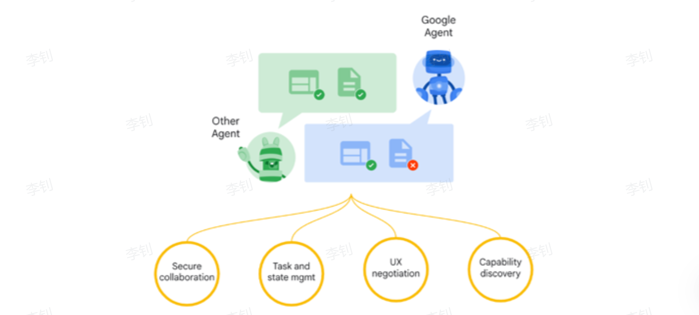
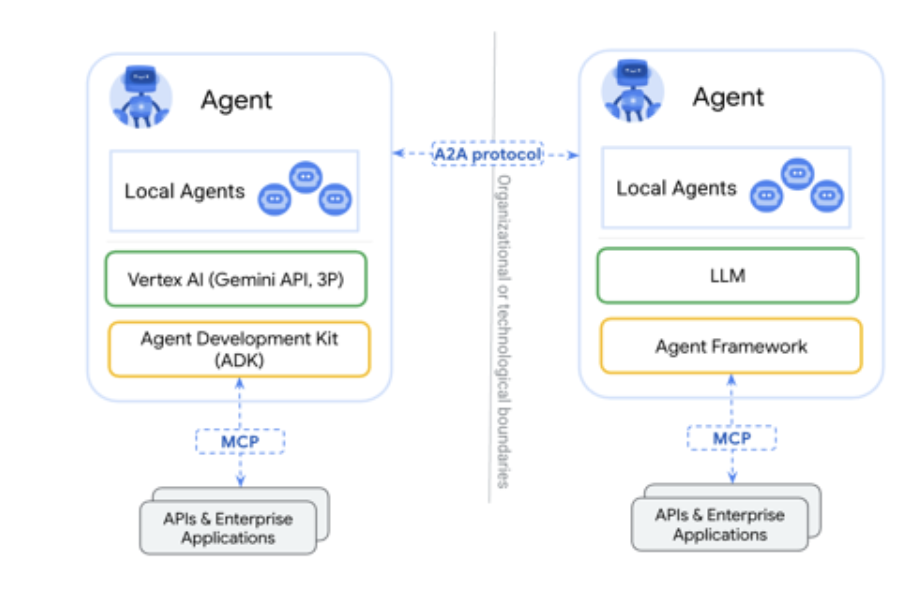
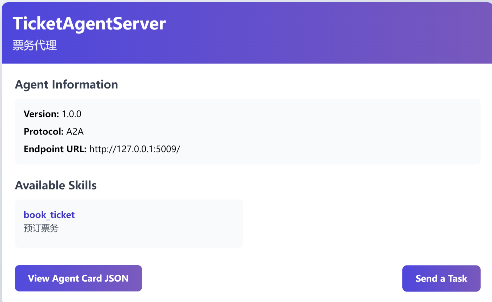
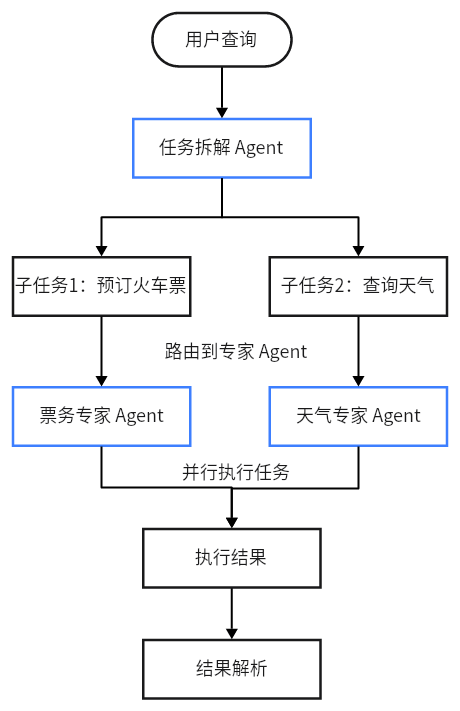

# A2A协议

## 学习目标

- 什么是A2A协议
- A2A协议核心概念
- 实现A2A协议实战


## 一、Agent2Agent Protocol

2025年4月9日，Google 正式发布了 **Agent2Agent Protocol** （以下简称 “A2A”）。该协议为不同类型的智能体之间搭建了一座高效沟通与协作的桥梁，无论是独立Agent与独立Agent、独立Agent与企业Agent，亦或是企业Agent与企业Agent，都能借助该协议实现通信交互和协作。



**（1）Secure collaboration (安全协作)**: 在整个任务处理过程中，A2A 协议确保所有智能体间的通信和数据交换都是安全的。这包括身份验证、数据加密和访问控制，以防止未经授权的访问或数据泄露。

**场景示例:**

- “旅行规划师”与“TicketAgentServer”之间的所有通信都通过安全协议进行。
- 即使在处理涉及个人信息（如你的姓名、联系方式）的火车票预订任务时，这些数据也得到了协议层面的保护，确保只有授权的智能体才能访问和处理。

**（2）Task and state mgmt (任务与状态管理)**: 这表示协议能够有效地管理任务的整个生命周期及其状态变化。例如，一个任务从提交到完成、失败或被取消，协议都能进行跟踪和管理 。

**场景示例:**

- “旅行规划师”发送一个 Task 给 “TicketAgentServer”，请求预订从北京到上海的火车票。
- “TicketAgentServer”接收到 Task，并将其状态标记SUBMITTED。
- 当它成功模拟预订后，会将 Task 状态更新为 COMPLETED，并返回包含预订结果的 artifacts。

**（3）UX negotiation (用户体验协商)**: 这项功能允许智能体之间就如何更好地为用户提供服务进行协商和调整，以优化最终的用户体验 。

**工作方式:** 这项能力允许智能体在协作过程中调整和优化用户体验。例如，一个智能体可能会在发现无法完成任务时，主动请求用户提供更多信息，而不是直接失败。

**场景示例:**

- 当你发送“帮我预订去上海的火车票”的请求时，“TicketAgentServer”发现缺少出发地信息。
- 它不会直接返回错误，而是通过 A2A 协议向“旅行规划师”发送一个包含 INPUT_REQUIRED 状态的任务更新 ，并在消息中说明“需要您提供出发地城市”，从而让“旅行规划师”可以反过来向你提问，形成一个流畅的交互，而不是僵硬的错误提示。

**（4）Capability discovery (能力发现)**: 这是指 A2A 协议使得智能体能够自动发现其他智能体的能力或功能。智能体通过类似 AgentCard 的“名片”来广播其服务，其他智能体则可以根据这些信息来选择最合适的合作伙伴 。

**场景示例:**

- “旅行规划师”找到了两个智能体：一个叫 “TicketAgentServer” 的智能体，其 AgentCard 描述它拥有“预订火车票”的能力。
- 另一个叫 “WeatherAgentServer” 的智能体，其 AgentCard 描述它拥有“查询天气”的能力。


### 1 Agent2Agent 架构剖析

A2A核心角色：

- User：用户是协议中的关键主体，主要负责进行认证和授权操作，确保交互的安全性和合法性。
- Client Agent：客户端 Agent 是任务的发起者，它代表用户提出需求或请求。
- Server Agent：服务端 Agent 是任务的执行者，它接收来自客户端 Agent 的请求，并执行相应的操作。



客户端 Client 与服务端 Client 之间的通信，本质上是基于任务的请求与响应机制。每个请求都对应一个具体任务，服务端 Agent 处理任务后返回结果。值得注意的是，一个 Agent 既可以作为客户端 Agent 发起任务，也可以作为服务端 Agent 执行任务，具有双重角色的灵活性。

------

### 2 Agent2Agent 核心概念

Client Agent 和 Server Agent 交互的过程中，会涉及到一些 Entity：AgentCard、Task 、Artifact等，下面做个介绍。

#### 2.1 AgentSkill

AgentSkill描述代理的具体能力或功能模块，例如处理特定任务的技能。它包括技能名称、描述、示例、输入/输出模式等。在A2A协议中，技能是代理卡片（AgentCard）的组成部分，用于细粒度服务发现。支持扩展标签和示例，便于代理间匹配调用。

**代码示例：**

```python
from python_a2a import  AgentSkill
# 定义一个代理技能
ticket_skill = AgentSkill(
    name="book_ticket",
    description="预订火车票的技能",
    examples=["预订从上海到北京的火车票"],
    input_modes=["text/plain"],
    output_modes=["text/plain"]
)

print(ticket_skill)
print(ticket_skill.to_dict())
```

运行结果：

```json
AgentSkill(name='book_ticket', description='预订火车票的技能', id='321ec43d-043f-4934-9046-56f730b33356', tags=[], examples=['预订从上海到北京的火车票'], input_modes=['text/plain'], output_modes=['text/plain'])
{'id': '321ec43d-043f-4934-9046-56f730b33356', 'name': 'book_ticket', 'description': '预订火车票的技能', 'tags': [], 'examples': ['预订从上海到北京的火车票'], 'inputModes': ['text/plain'], 'outputModes': ['text/plain']}
```


#### 2.2 AgentCard

AgentCard是A2A协议中Agent代理的元数据描述卡片，用于代理发现和服务注册。它包含代理的名称、描述、URL、版本、技能列表、能力（如流式传输支持）和输入/输出模式等信息。AgentCard允许其他代理或系统查询和调用该代理的服务，是A2A生态系统的入口点。在源码中，它支持序列化为JSON格式，便于网络传输。

AgentCard 是 Server Agent 的名片，它主要描述了 Server Agent 的能力、认证机制等信息。Client Agent通过获取不同 Server Agent 的 AgentCard，了解不同 Server Agent 的能力，来决断具体的任务执行应该调用哪个 Server Agent 。

**代码示例:**

```python
from python_a2a import AgentCard, AgentSkill
# 创建一个代理技能
ticket_skill = AgentSkill(
    name="book_ticket",
    description="预订火车票的技能",
    examples=["预订从上海到北京的火车票"],
    input_modes=["text/plain"],
    output_modes=["text/plain"]
)
# 创建代理卡片
agent_card = AgentCard(
    name="TicketAgent",
    description="一个可以预订票务的代理",
    url="http://127.0.0.1:5009",
    version="1.0.0",
    skills=[ticket_skill],
    capabilities={"streaming": True}
)
# 打印代理卡片的字典表示（用于序列化）
print(agent_card)
print(agent_card.to_dict())
```

**输出示例：**

```bash
AgentCard(name='TicketAgent', description='一个可以预订票务的代理', url='http://127.0.0.1:5009', version='1.0.0', authentication=None, capabilities={'streaming': True}, default_input_modes=['text/plain'], default_output_modes=['text/plain'], skills=[AgentSkill(name='book_ticket', description='预订火车票的技能', id='487e3ee8-1cbd-4567-b083-a9627a486d1c', tags=[], examples=['预订从上海到北京的火车票'], input_modes=['text/plain'], output_modes=['text/plain'])], provider=None, documentation_url=None)
{'name': 'TicketAgent', 'description': '一个可以预订票务的代理', 'url': 'http://127.0.0.1:5009', 'version': '1.0.0', 'capabilities': {'streaming': True}, 'defaultInputModes': ['text/plain'], 'defaultOutputModes': ['text/plain'], 'skills': [{'id': '487e3ee8-1cbd-4567-b083-a9627a486d1c', 'name': 'book_ticket', 'description': '预订火车票的技能', 'tags': [], 'examples': ['预订从上海到北京的火车票'], 'inputModes': ['text/plain'], 'outputModes': ['text/plain']}]}
```


#### 2.3 Task

Task 是一个具有明确状态的实体，由 Client Agent 创建并发起，其状态由 Server Agent 负责维护和更新。每个 Task 都旨在实现一个特定的目标或结果。在 Task 的执行过程中，Client Agent 和 Server Agent 通过交换 Message 进行通信，而 Server Agent 执行任务后生成的输出结果被称为 Artifact。

此外，每个 Task 都拥有一个唯一的 sessionId。多个 Task 可以共享同一个 sessionId，这表明这些 Task 属于同一个会话（Session）的一部分，便于管理和跟踪相关任务的执行流程。

**代码示例:**

```python
from python_a2a import Task, Message, MessageRole, TextContent

# 创建任务
message = Message(content=TextContent(text="查询天气"), role=MessageRole.USER)
task = Task(message=message.to_dict())
print(task)
```

运行结果：

```python
Task(id='5e63778f-a912-4f07-a757-4b47614d0d1b', session_id='7211f559-d616-4f56-82d2-c74976f86390', status=TaskStatus(state=<TaskState.SUBMITTED: 'submitted'>, message=None, timestamp='2025-10-24T23:20:44.444053'), message={'content': {'text': '查询天气', 'type': <ContentType.TEXT: 'text'>}, 'role': 'user', 'message_id': '8a3c1015-0871-4886-b70d-cf1434ad1caf'}, history=[], artifacts=[], metadata={})
```


#### 2.4 TaskState

TaskState任务状态枚举类，TaskState 是一个枚举类，定义了任务的可能状态，如提交（SUBMITTED）、完成（COMPLETED）、失败（FAILED）等。它是任务生命周期的基础，用于确保状态一致性和可读性。

**TaskState 状态表格：**

| 状态名称       | 值             | 中文描述                                   |
| -------------- | -------------- | ------------------------------------------ |
| SUBMITTED      | submitted      | 任务已提交，等待处理。                     |
| WAITING        | waiting        | 任务正在等待，例如等待外部资源或输入。     |
| INPUT_REQUIRED | input-required | 任务需要额外用户输入以继续执行。           |
| COMPLETED      | completed      | 任务已成功完成，结果可用。                 |
| CANCELED       | canceled       | 任务被取消，未完成执行。                   |
| FAILED         | failed         | 任务执行失败，可能包含错误信息。           |
| UNKNOWN        | unknown        | 未知状态，通常用于处理无效或未识别的状态。 |

> tips：
>
> 状态名称：TaskState 枚举的成员名称（例如 TaskState.SUBMITTED），用于代码中的类型安全引用。
> 值：枚举的字符串值（例如 "submitted"），用于序列化（如 JSON）或与外部系统交互。
> 中文描述：每个状态的作用和场景，帮助开发者理解其在任务生命周期中的意义。

**代码示例：**

```python
from python_a2a import TaskState  # 只需相关导入
# 检查任务状态
if TaskState.COMPLETED == "completed":
    print("任务完成")
state = TaskState.SUBMITTED
print("转换后的状态值：", state.value)
print(state)
```

运行结果：

```json
任务完成
转换后的状态值： submitted
TaskState.SUBMITTED
```


#### 2.5 TaskStatus

TaskStatus 表示 A2A 任务的当前状态对象，包括状态枚举（TaskState）、附加消息和时间戳。它用于跟踪任务进度，支持序列化和格式转换，是任务处理的动态表示。

TaskStatus 依赖 TaskState。**每个 TaskStatus 实例必须有一个 TaskState 作为其 state 字段。**

以下是TaskState 和 TaskStatus结合使用示例。

**代码示例：**

```python
from python_a2a import TaskStatus, TaskState

status_completed = TaskStatus(
    state=TaskState.COMPLETED,
    message={"info": "任务成功完成"}
)

status_failed = TaskStatus(
    state=TaskState.FAILED,
    message={"error": "无法处理请求"}
)

# 打印字典表示
print("完成状态：", status_completed.to_dict())
print("失败状态：", status_failed.to_dict())
```

**输出日志：**

```bash
完成状态： {'state': 'completed', 'timestamp': '2025-10-24T22:55:37.883274', 'message': {'info': '任务成功完成'}}
失败状态： {'state': 'failed', 'timestamp': '2025-10-24T22:55:37.883274', 'message': {'error': '无法处理请求'}}
```


#### 2.6 A2AServer

A2AServer是A2A协议的核心实现类，用于 **构建代理服务器** 。它继承自BaseA2AServer，支持 **处理任务** （handle_task）、 **消息** （handle_message）和 **路由设置** （setup_routes）。它管理任务存储、流式订阅，并支持Google A2A兼容模式。它提供了Flask路由支持、任务处理逻辑和错误处理，确保代理间通信的可靠性。

**task:**

在继承 A2AServer 的情况下，会有一个task，通常不需要手动创建 Task 对象，因为 A2AServer 的内置机制会自动处理传入的请求并将其解析为 Task 对象，传递给 handle_task 方法。

**handle_task :**
handle_task用于解析任务输入、处理查询、封装结果并返回task任务对象。

**代码示例：**

```python
from python_a2a import A2AServer, run_server, AgentCard, AgentSkill, TaskStatus, TaskState

# 定义代理卡片
ticket_card = AgentCard(
    name="TicketAgentServer",
    description="票务代理",
    url="http://127.0.0.1:5009/a2a",
    skills=[AgentSkill(name="book_ticket", description="预订票务")]
)

# 自定义 A2AServer 子类
class TicketServer(A2AServer):
    def __init__(self):
        super().__init__(agent_card=ticket_card)

    def handle_task(self, task):
        print(f"任务状态：{task.status.state}")
        return task

# 启动服务器
if __name__ == "__main__":
    server = TicketServer()
    print(f"[{server.agent_card.name}] 创建服务成功")
    run_server(server, host="127.0.0.1", port=5009, debug=False)
```

运行结果：



#### 2.7 artifacts

artifacts 是 A2A 协议中 Task 对象的核心字段之一，用于存储任务执行后的输出产物（结果）。该字段为一个列表，每个元素代表一个产物对象，通常以字典形式呈现，并包含 "parts" 键，指向由多个内容片段组成的列表。

作为任务结果的结构化容器，artifacts 支持多种类型的数据（如文本内容、函数调用结果或错误信息），从而保证客户端能够准确解析并有效利用代理生成的输出。

```python
task.artifacts = [
    {
        "parts": [
            {"type": "text", "text": "处理结果"},
            {"type": "error", "message": "错误描述"},
            {"type": "function_response", "name": "func_name", "response": {...}}
        ]
    }
]
```

**字段说明：**

- parts：一个列表，包含具体的输出内容。
    每个 part 是一个字典，包含： 
    - "type"：内容类型（如 "text"、"error"、"function_response"、"function_call"）。

**常见类型：**

- text：纯文本结果，如用户查询的响应。
- error：错误信息，包含错误描述。
- function_response：函数调用结果，包含函数名和返回数据。"name" 和 "response" 用于函数响应。
- function_call：发起的函数调用，包含函数名和参数。

**代码示例**

服务端：

```python
from python_a2a import A2AServer, run_server, AgentCard, AgentSkill, TaskStatus, TaskState

# 定义代理卡片
ticket_card = AgentCard(
    name="TicketAgentServer",
    description="票务代理",
    url="http://127.0.0.1:5010",
    skills=[AgentSkill(name="book_ticket", description="预订票务")]
)

# 自定义 A2AServer 子类
class TicketServer(A2AServer):
    def __init__(self):
        super().__init__(agent_card=ticket_card)

    def handle_task(self, task):
        print("收到A2A任务的task:=>", task)
        #默认写法：获取任务内容
        query = (task.message or {}).get("content", {}).get("text", "")
        
        if "上海" in query and "北京" in query:
        # 这里的结果可以来自于 MCP 模块，这里我们直接模拟结果
            train_result = "上海到北京的火车票已经预订成功！  G1001,10车1A "
        else:
            train_result = "请输入明确的出发地和目的地。"

        task.artifacts = [{"parts": [{"type": "text", "text": train_result}]}]
        task.status = TaskStatus(state=TaskState.COMPLETED)
        print(f"[{self.agent_card.name} 日志] 任务处理完毕")
        print(f"[{self.agent_card.name} 日志] 输出结果task: {task}")
        print(f"[{self.agent_card.name} 日志] 输出结果task.artifacts: {task.artifacts}")
        return task

# 启动服务器
if __name__ == "__main__":
    server = TicketServer()
    print(f"[{server.agent_card.name}] 启动成功，服务地址: {server.agent_card.url}")
    run_server(server, host="127.0.0.1", port=5010, debug=True)
```


客户端：

```python
import asyncio
from python_a2a import A2AClient

async def main():
    ticket_client = A2AClient("http://127.0.0.1:5010")

    #预订火车票
    ticket_query = "预订一张从北京到上海的火车票"
    print(f"[主控客户端日志]预订票务 -> '{ticket_query}'")
    ticket_result = ticket_client.ask(ticket_query)
    print(f"[主控客户端日志] 收到票务预订结果: {ticket_result}")

if __name__ == "__main__":
    asyncio.run(main())
```

 

先启动服务端，然后启动客户端，最终得到的结果如下：

```json
[主控客户端日志]预订票务 -> '预订一张从北京到上海的火车票'
[主控客户端日志] 收到票务预订结果: 上海到北京的火车票已经预订成功！  G1001,10车1A 
```


#### 2.8 AgentNetwork

AgentNetwork 是 A2A 协议中的agent网络管理类，用于集中管理和发现 A2A 兼容代理。它维护一个代理列表，支持通过 URL 或客户端实例添加代理，并缓存代理的元数据（如 AgentCard）。

**作用：**

简化多代理协作，提供代理添加、get_agent、list_agents 和 discover_agents 等方法，支持代理发现和移除。适用于构建分布式代理系统，避免手动管理多个客户端。

**核心特性：**

- 添加代理：通过 add 方法，支持 URL（自动创建 A2AClient）或现有客户端。
- 代理元数据：自动缓存 AgentCard，便于查询代理能力。
- 发现代理：通过 discover_agents 从 URL 列表自动添加有效代理。
- 扩展性：支持头信息（headers）和异常处理。

**代码示例：**

```python
from python_a2a import AgentNetwork
network = AgentNetwork(name="MyNetwork")
network.add("TicketAgent", "http://127.0.0.1:5010")

print(f"agent network-->{network.agent_cards}")
print('*'*80)

# 调用
client = network.get_agent("TicketAgent")
print(client.ask("预订一张从北京到上海的火车票"))
```

运行结果：

```json
INFO:python_a2a.client.network:Added agent 'TicketAgent' from URL: http://127.0.0.1:5010
agent network-->{'TicketAgent': AgentCard(name='TicketAgentServer', description='票务代理', url='http://127.0.0.1:5010', version='1.0.0', authentication=None, capabilities={'google_a2a_compatible': True, 'parts_array_format': True, 'pushNotifications': False, 'stateTransitionHistory': False, 'streaming': True}, default_input_modes=['text/plain'], default_output_modes=['text/plain'], skills=[AgentSkill(name='book_ticket', description='预订票务', id='65d84e15-c135-4ffd-9a60-16caf46d88e9', tags=[], examples=[], input_modes=['text/plain'], output_modes=['text/plain'])], provider=None, documentation_url=None)}
********************************************************************************
上海到北京的火车票已经预订成功！  G1001,10车1A 
```


#### 2.9 AIAgentRouter

**定义：**

AIAgentRouter 是使用 LLM 智能路由查询到合适代理的类，定义在 router.py 中。它分析查询意图和上下文，选择最佳代理。

**作用：**

在多代理网络中，路由用户查询到最匹配的代理，支持语义分析、历史上下文和缓存。响应格式为代理名称和置信度，避免手动选择代理。

**核心特性：**

- LLM 驱动：使用 LLM 客户端（如 ChatOpenAI）生成路由提示，分析查询匹配代理描述和技能。
- 上下文支持：包含对话历史（max_history_tokens 限制令牌数）。
- 缓存优化：类似查询使用缓存减少 LLM 调用。
- 回退机制：LLM 失败时，使用关键词匹配回退路由。
- 系统提示：自定义提示指导路由决策。

**代码示例：**

```python
from python_a2a import AIAgentRouter, AgentNetwork
from langchain_openai import ChatOpenAI
from agent_learn.config import Config

conf=Config()

# 创建网络
network = AgentNetwork(name="MyNetwork")
network.add("TicketAgent", "http://127.0.0.1:5010")

# 创建模型
llm = ChatOpenAI(base_url=conf.base_url,
                 api_key=conf.api_key,
                 model=conf.model_name,
                 temperature=0.1)

# 创建路由器
router = AIAgentRouter(llm_client=llm, agent_network=network)
agent_name, confidence = router.route_query("预订票")
print(agent_name, confidence)
```

输出结果：

```json
INFO:python_a2a.client.network:Added agent 'TicketAgent' from URL: http://127.0.0.1:5010
TicketAgent 0.1
```


## 二、A2AServer结合MCP Server

接下来通过一个案例，来看一下如何将A2AServer和MCP Server结合起来进行使用。

### 1 创建MCP Server

**代码位置**：agent_learn/A2A_base/a2a_mcp_collaboration/mcp_weather_tool_agent.py

```python
import uvicorn
from python_a2a.mcp import FastMCP, create_fastapi_app

mcp = FastMCP(name="WeatherTool")

@mcp.tool(name="get_weather", description="获取城市天气")
def get_weather(city: str) -> str:
    print(f"[MCP 工具 Agent 日志] 收到工具调用，查询城市: {city}")
    if city == "北京":
        return "北京今天阳光明媚，29°C"
    return f"找不到 {city} 的天气"


if __name__ == "__main__":
    app = create_fastapi_app(mcp)
    print("[MCP 工具 Agent] 已启动，在 http://127.0.0.1:6005")
    uvicorn.run(app, host="127.0.0.1", port=6005)
```


### 2 创建A2AServer

**代码位置**：agent_learn/A2A_base/a2a_mcp_collaboration/a2a_weather_agent.py

```python
from python_a2a import A2AServer, run_server, AgentCard, AgentSkill, TaskStatus, TaskState
from python_a2a.mcp import MCPClient
import asyncio

# A2A Agent 的名片
agent_card = AgentCard(
    name="WeatherServer",
    description="用来查询天气",
    url="http://127.0.0.1:8005",
    skills=[AgentSkill(name="查询天气", description="查询指定城市的天气")]
)


class WeatherServer(A2AServer):
    def __init__(self):
        super().__init__(agent_card=agent_card)
        # 在内部，它拥有一个 MCP 客户端，用于连接下游工具
        self.mcp_client = MCPClient("http://127.0.0.1:6005")

    def handle_task(self, task):
        print("收到A2A任务的task:=>", task)
        query = (task.message or {}).get("content", {}).get("text", "")
        print(f"[{self.agent_card.name} 日志] 收到 A2A 任务: '{query}'")

        # 决策：如果查询包含“天气”，就调用 MCP 工具
        if "天气" in query:
            city = "北京"  # 简单提取城市
            print(f"[{self.agent_card.name} 日志] 决策：任务需要天气数据，准备调用 MCP 工具...")

            # 异步调用 MCP 工具
            try:
                # 在同步方法中运行异步代码的标准方式
                weather_result = asyncio.run(self.mcp_client.call_tool("get_weather", city=city))
                print(f"[{self.agent_card.name} 日志] 从 MCP 工具获得结果: '{weather_result}'")
                task.artifacts = [{"parts": [{"type": "text", "text": weather_result}]}]
            except Exception as e:
                error_msg = f"调用 MCP 工具失败: {e}"
                print(f"[{self.agent_card.name} 日志] {error_msg}")
                task.artifacts = [{"parts": [{"type": "text", "text": error_msg}]}]
        else:
            task.artifacts = [{"parts": [{"type": "text", "text": "无法理解的任务"}]}]

        task.status = TaskStatus(state=TaskState.COMPLETED)
        print(f"[{self.agent_card.name} 日志] 任务完成，结果已返回给 A2A")
        print("task:=>", task)
        print("task.artifacts:=>", task.artifacts)
        return task


if __name__ == "__main__":
    server = WeatherServer()
    print(f"[{server.agent_card.name}] 已启动，在 {server.agent_card.url}")
    run_server(server, host="127.0.0.1", port=8005)
```

### 3 客户端

**代码位置**：agent_learn/A2A_base/a2a_mcp_collaboration/main_client.py

```python
import asyncio
from python_a2a import A2AClient

async def main():
    # 创建客户端
    agent_client = A2AClient("http://127.0.0.1:8005")
    print("[主客户端日志] 准备向天气 Agent 发送任务...")

    # 发起 A2A 调用
    query = "请帮我查一下北京的天气"
    result = agent_client.ask(query)
    print(f"[主客户端日志] 收到最终结果: '{result}'")

if __name__ == "__main__":
    # 请确保 mcp_weather_tool_agent.py 和 a2a_weather_agent.py 正在运行...
    asyncio.run(main())
```

运行结果：

```json
[主客户端日志] 准备向天气 Agent 发送任务...
[主客户端日志] 收到最终结果: '北京今天阳光明媚，29°C'
```


## 三、A2AServer串行

本部分主要实现A2A串行协作的场景。

### 1 weather_agent

**实现目标**：实现天气代理服务器，监听端口 5008，处理天气查询，返回模拟数据。

**核心功能**：

- 定义 AgentCard 和 AgentSkill，描述天气查询能力。
- 在 handle_task 中检查“天气”，模拟 MCP 返回数据，封装 artifacts。
- 打印日志（接收任务、决策、结果）。

**代码位置**：agent_learn/A2A_base/a2a_serial/weather_agent.py

```python
from python_a2a import A2AServer, run_server, AgentCard, AgentSkill, TaskStatus, TaskState

# A2A Agent 的名片
agent_card = AgentCard(
    name="WeatherAgentServer",
    description="一个天气预报查询的专家 Agent",
    url="http://127.0.0.1:5008",
    skills=[AgentSkill(name="query", description="接受天气查询查询",examples=["天气北京"])]
)


class WeatherAgentServer(A2AServer):
    def __init__(self):
        super().__init__(agent_card=agent_card)

    def handle_task(self, task):
        print("收到A2A任务的task:=>", task)
        query = (task.message or {}).get("content", {}).get("text", "")
        print(f"[{self.agent_card.name} 日志] 收到 A2A 任务: '{query}'")
        # 决策：如果查询包含“天气”，就调用 MCP 工具
        if "天气" in query:
            print(f"[{self.agent_card.name} 日志] 决策：任务需要天气数据，准备调用工具...")
            try:
                # 这里的结果可以来自于 MCP 模块，这里我们直接模拟结果
                weather_result = {"温度": 30, "天气": "晴天"}
                print(f"[{self.agent_card.name} 日志] 从 MCP 工具获得结果: '{weather_result}'")
                # 将结果保存为任务 artifacts,artifacts是任务的输出结果
                task.artifacts = [{"parts": [{"type": "text", "text": weather_result}]}]
            except Exception as e:
                error_msg = f"调用 工具失败: {e}"
                print(f"[{self.agent_card.name} 日志] {error_msg}")
                task.artifacts = [{"parts": [{"type": "text", "text": error_msg}]}]
        else:
            task.artifacts = [{"parts": [{"type": "text", "text": "无法理解的任务"}]}]

        task.status = TaskStatus(state=TaskState.COMPLETED)
        print(f"[{self.agent_card.name} 日志] 任务处理完毕")
        print(f"[{self.agent_card.name} 日志] 输出结果task: {task}")
        print(f"[{self.agent_card.name} 日志] 输出结果task.artifacts: {task.artifacts}")
        return task


if __name__ == "__main__":
    server = WeatherAgentServer()
    print(f"[{server.agent_card.name}] 已启动，在 {server.agent_card.url}")
    run_server(server, host="127.0.0.1", port=5008)
```

### 2 ticket_agent

**实现目标**：实现票务代理服务器，监听端口 5009，处理预订请求，返回模拟结果。

**核心功能**：

- 定义 AgentCard 和 AgentSkill，描述票务能力。
- 在 handle_task 中提取查询，检查关键词，返回 artifacts。
- 打印详细日志（接收任务、结果、任务完毕）。

**代码位置**：agent_learn/A2A_base/a2a_serial/ticket_agent.py

```python
from python_a2a import A2AServer, run_server, AgentCard, AgentSkill, TaskStatus, TaskState

ticket_card = AgentCard(
    name="TicketAgentServer",
    description="一个可以预订票务的专家 Agent。",
    url="http://127.0.0.1:5009",
    version="1.0.0",
    skills=[AgentSkill(name="book_ticket", description="预订票务")]
)

class TicketServer(A2AServer):
    def __init__(self):
        super().__init__(agent_card=ticket_card)

    def handle_task(self, task):
        print("收到A2A任务的task:=>", task)
        query = (task.message or {}).get("content", {}).get("text", "")
        print(f"[{self.agent_card.name} 日志] 收到 A2A 任务: '{query}'")

        if "上海" in query and "北京" in query:
        # 这里的结果可以来自于 MCP 模块，这里我们直接模拟结果
            train_result = "上海到北京的火车票已经预订成功！  G1001,10车1A "
        else:
            train_result = "请输入明确的出发地和目的地。"

        print(f"[{self.agent_card.name} 日志] 返回结果: {train_result}")
        task.artifacts = [{"parts": [{"type": "text", "text": train_result}]}]
        task.status = TaskStatus(state=TaskState.COMPLETED)
        print(f"[{self.agent_card.name} 日志] 任务处理完毕")
        print(f"[{self.agent_card.name} 日志] 输出结果task: {task}")
        print(f"[{self.agent_card.name} 日志] 输出结果task.artifacts: {task.artifacts}")
        return task


if __name__ == "__main__":
    server = TicketServer()
    print(f"[{server.agent_card.name}] 启动成功，服务地址: {server.agent_card.url}")
    run_server(server, host="127.0.0.1", port=5009)
```


### 3 main_orchestrator

**实现目标**：协调多个Agent完成“查天气→订票”的串行任务流。

**核心功能**：

- 初始化AgentNetwork，注册WeatherAgent（5008）和TicketAgent（5009）。
- 先调用WeatherAgent查询天气。解析返回结果，提取天气信息。
- 将天气信息作为上下文输入，调用TicketAgent预订火车票。

**代码位置**：agent_learn/A2A_base/a2a_serial/main_orchestrator.py

```python
import asyncio
from python_a2a import AgentNetwork, A2AClient, Task, Message, MessageRole, TextContent
import json
import uuid
from time import sleep


async def main():
    # 步骤1：初始化 AgentNetwork 并注册专家 Agent
    # 1.1 创建 AgentNetwork 实例，用于管理 Agent 集合
    network = AgentNetwork(name="TravelOrchestrator")
    # 1.2 添加票务 Agent
    network.add("TicketAgent", "http://127.0.0.1:5009")
    # 1.3 添加天气 Agent
    network.add("WeatherAgent", "http://127.0.0.1:5008")
    print("[主控日志] AgentNetwork 初始化完成，已添加专家代理：")
    for agent_info in network.list_agents():
        print(json.dumps(agent_info, indent=4, ensure_ascii=False))
    print("-" * 50)

    # 步骤2：执行串行任务流
    # 2.1 任务一：查询天气
    weather_query = "北京的天气怎么样"  # 用户请求
    print(f"[主控日志] 串行任务第一步：向 WeatherAgent 查询天气 -> '{weather_query}'")
    # 获取 WeatherAgent 客户端
    weather_client = network.get_agent("WeatherAgent")
    # 创建消息和任务
    message_weather = Message(content=TextContent(text=weather_query), role=MessageRole.USER)
    task_weather = Task(id="task-" + str(uuid.uuid4()), message=message_weather.to_dict())

    # 发送任务并等待结果，这是串行执行的关键
    weather_result_task = await weather_client.send_task_async(task_weather)
    sleep(1)  # 模拟处理延迟

    # 从返回的任务中解析出天气信息
    weather_info = "未知天气"
    try:
        # 获取 artifacts 中的文本部分
        weather_parts = weather_result_task.artifacts[0]["parts"]
        if weather_parts and weather_parts[0].get("type") == "text":
            weather_info = weather_parts[0].get("text")
            print(f"[主控日志] 收到 WeatherAgent 的结果: '{weather_info}'")
    except Exception as e:
        print(f"[主控日志] 解析天气结果出错: {e}")

    # 2.2 任务二：根据天气结果预订火车票
    # 这是将一个 Agent 的输出作为另一个 Agent 的输入的关键步骤
    print(f"\n[主控日志] 串行任务第二步：根据天气结果决定预订火车票")
    ticket_query = f"预订一张从北京到上海的火车票，当前天气是：{weather_info}"
    print(f"[主控日志] 传递给 TicketAgent 的查询为: '{ticket_query}'")
    # 获取 TicketAgent 客户端
    ticket_client = network.get_agent("TicketAgent")
    # 创建新的任务
    message_ticket = Message(content=TextContent(text=ticket_query), role=MessageRole.USER)
    task_ticket = Task(id="task-" + str(uuid.uuid4()), message=message_ticket.to_dict())

    # 发送任务并获取最终结果
    ticket_result_task = await ticket_client.send_task_async(task_ticket)
    sleep(1)  # 模拟处理延迟

    # 打印最终结果
    print(f"\n[主控日志] 收到 TicketAgent 的最终结果：")
    print(json.dumps(ticket_result_task.to_dict(), indent=4, ensure_ascii=False))
    print("-" * 50)

    print("[主控日志] 所有串行任务完成！")


if __name__ == "__main__":
    # 请确保 weather_agent.py 和 ticket_agent.py 正在运行...
    asyncio.run(main())
```

运行结果：

```json
INFO:python_a2a.client.network:Added agent 'TicketAgent' from URL: http://127.0.0.1:5009
[主控日志] AgentNetwork 初始化完成，已添加专家代理：
{
    "name": "TicketAgent",
    "url": "http://127.0.0.1:5009",
    "description": "一个可以预订票务的专家 Agent。",
    "version": "1.0.0",
    "skills_count": 1
}
{
    "name": "WeatherAgent",
    "url": "http://127.0.0.1:5008",
    "description": "一个天气预报查询的专家 Agent",
    "version": "1.0.0",
    "skills_count": 1
}
--------------------------------------------------
[主控日志] 串行任务第一步：向 WeatherAgent 查询天气 -> '北京的天气怎么样'
INFO:python_a2a.client.network:Added agent 'WeatherAgent' from URL: http://127.0.0.1:5008
[主控日志] 收到 WeatherAgent 的结果: '{'天气': '晴天', '温度': 30}'

[主控日志] 串行任务第二步：根据天气结果决定预订火车票
[主控日志] 传递给 TicketAgent 的查询为: '预订一张从北京到上海的火车票，当前天气是：{'天气': '晴天', '温度': 30}'

[主控日志] 收到 TicketAgent 的最终结果：
{
    "id": "task-5803b41e-201e-478a-981c-c746e1522d2a",
    "sessionId": "2dfca936-5a0b-487f-836c-78e13b7ece69",
    "status": {
        "state": "completed",
        "timestamp": "2025-10-25T01:15:33.429286"
    },
    "message": {
        "content": {
            "text": "预订一张从北京到上海的火车票，当前天气是：{'天气': '晴天', '温度': 30}",
            "type": "text"
        },
        "role": "user",
        "message_id": "50ba4e82-4922-4068-a098-29dd00c025a7"
    },
    "artifacts": [
        {
            "parts": [
                {
                    "text": "上海到北京的火车票已经预订成功！  G1001,10车1A ",
                    "type": "text"
                }
            ]
        }
    ]
}
--------------------------------------------------
[主控日志] 所有串行任务完成！
```


## 四、A2A实战案例

A2A（Agent-to-Agent）协议是一种支持代理间通信的框架，允许不同 AI 代理通过任务、消息和产物进行协作。在本实战中，我们基于四个脚本（router_A2Aagent_Server.py、weather_agent.py、ticket_agent.py 和 main.py），实现一个 LLM 驱动的路由系统：

- 路由服务器（router_A2Aagent_Server.py）：使用 LangChain 和 OpenAI LLM 作为路由决策引擎。
- 票务代理（TicketAgentServer）：处理火车票预订请求。
- 天气代理（WeatherAgentServer）：处理天气查询请求。
- 主控客户端（main.py）：使用 AgentNetwork 和 AIAgentRouter 路由查询到合适代理，获取结果。

**目标:**

通过4个脚本，基于A2A 协议的路由协作，LLM 识别意图，将查询路由到票务或天气代理，模拟旅行助手系统。

### 1 router_agent

**实现目标**：router_A2Aagent_Server主要构建 LLM 路由代理服务器进行意图识别和路由决策。使用 LangChain 转换 OpenAI LLM 为 A2A 服务器，监听端口 5555，支持异步路由决策。

**核心功能**：

- 使用 ChatOpenAI 创建 LLM。
- 通过 to_a2a_server(llm) 转换为 A2A 服务器。
- 异步启动 run_server，提供路由服务。

**代码位置**：agent_learn/A2A_base/a2a_case/router_A2Aagent_Server.py

```python
from langchain_openai import ChatOpenAI
from python_a2a import run_server
from python_a2a.langchain import to_a2a_server
import asyncio
from agent_learn.config import Config

conf = Config()

async def main():
    # 创建LangChain LLM
    llm = ChatOpenAI(base_url=conf.base_url,
                     api_key=conf.api_key,
                     model=conf.model_name,
                     temperature=0.1,
                     streaming=True)
    # 转换为A2A服务器
    llm_server = to_a2a_server(llm)
    print(llm_server.agent_card)
    # 启动服务器
    run_server(llm_server, port=5555)

if __name__ == '__main__':
    asyncio.run(main())
```


### 2 weather_agent

目标和实现同 3.1。

**代码位置**：agent_learn/A2A_base/a2a_case/weather_agent.py

```python
from python_a2a import A2AServer, run_server, AgentCard, AgentSkill, TaskStatus, TaskState

# A2A Agent 的名片
agent_card = AgentCard(
    name="WeatherAgentServer",
    description="一个天气预报查询的专家 Agent",
    url="http://127.0.0.1:5008",
    skills=[AgentSkill(name="query", description="接受天气查询查询",examples=["天气北京"])]
)


class WeatherAgentServer(A2AServer):
    def __init__(self):
        super().__init__(agent_card=agent_card)

    def handle_task(self, task):
        print("收到A2A任务的task:=>", task)
        query = (task.message or {}).get("content", {}).get("text", "")
        print(f"[{self.agent_card.name} 日志] 收到 A2A 任务: '{query}'")
        # 决策：如果查询包含“天气”，就调用 MCP 工具
        if "天气" in query:
            print(f"[{self.agent_card.name} 日志] 决策：任务需要天气数据，准备调用工具...")
            try:
                # 这里的结果可以来自于 MCP 模块，这里我们直接模拟结果
                weather_result = {"温度": 30, "天气": "晴天"}
                print(f"[{self.agent_card.name} 日志] 从 MCP 工具获得结果: '{weather_result}'")
                # 将结果保存为任务 artifacts,artifacts是任务的输出结果
                task.artifacts = [{"parts": [{"type": "text", "text": weather_result}]}]
            except Exception as e:
                error_msg = f"调用 工具失败: {e}"
                print(f"[{self.agent_card.name} 日志] {error_msg}")
                task.artifacts = [{"parts": [{"type": "text", "text": error_msg}]}]
        else:
            task.artifacts = [{"parts": [{"type": "text", "text": "无法理解的任务"}]}]

        task.status = TaskStatus(state=TaskState.COMPLETED)
        print(f"[{self.agent_card.name} 日志] 任务处理完毕")
        print(f"[{self.agent_card.name} 日志] 输出结果task: {task}")
        print(f"[{self.agent_card.name} 日志] 输出结果task.artifacts: {task.artifacts}")
        return task


if __name__ == "__main__":
    server = WeatherAgentServer()
    print(f"[{server.agent_card.name}] 已启动，在 {server.agent_card.url}")
    run_server(server, host="127.0.0.1", port=5008)
```


### 3 ticket_agent

目标和实现同 3.2。

**代码位置**：agent_learn/A2A_base/a2a_case/ticket_agent.py

```python
from python_a2a import A2AServer, run_server, AgentCard, AgentSkill, TaskStatus, TaskState

ticket_card = AgentCard(
    name="TicketAgentServer",
    description="一个可以预订票务的专家 Agent。",
    url="http://127.0.0.1:5009",
    version="1.0.0",
    skills=[AgentSkill(name="book_ticket", description="预订票务")]
)

class TicketServer(A2AServer):
    def __init__(self):
        super().__init__(agent_card=ticket_card)

    def handle_task(self, task):
        print("收到A2A任务的task:=>", task)
        query = (task.message or {}).get("content", {}).get("text", "")
        print(f"[{self.agent_card.name} 日志] 收到 A2A 任务: '{query}'")

        if "上海" in query and "北京" in query:
        # 这里的结果可以来自于 MCP 模块，这里我们直接模拟结果
            train_result = "上海到北京的火车票已经预订成功！  G1001,10车1A "
        else:
            train_result = "请输入明确的出发地和目的地。"

        print(f"[{self.agent_card.name} 日志] 返回结果: {train_result}")
        task.artifacts = [{"parts": [{"type": "text", "text": train_result}]}]
        task.status = TaskStatus(state=TaskState.COMPLETED)
        print(f"[{self.agent_card.name} 日志] 任务处理完毕")
        print(f"[{self.agent_card.name} 日志] 输出结果task: {task}")
        print(f"[{self.agent_card.name} 日志] 输出结果task.artifacts: {task.artifacts}")
        return task


if __name__ == "__main__":
    server = TicketServer()
    print(f"[{server.agent_card.name}] 启动成功，服务地址: {server.agent_card.url}")
    run_server(server, host="127.0.0.1", port=5009)

```

### 4 main

**实现目标**：作为主控客户端，使用 AgentNetwork 和 AIAgentRouter 路由查询到票务或天气代理，获取完整响应。

**核心功能：**

- 初始化 AgentNetwork，添加代理 URL。
- 使用 AIAgentRouter 路由查询，返回代理名称和置信度。
- 发送 Task 到选择的代理，解析 artifacts 中的 parts。

**代码位置**：agent_learn/A2A_base/a2a_case/main.py

```python
import asyncio
from python_a2a import AgentNetwork, AIAgentRouter, A2AClient, Task, Message, MessageRole, TextContent
import json
import uuid

from time import sleep


async def main():
    # 1. 创建 AgentNetwork
    network = AgentNetwork(name="TravelAgentNetwork")
    # 添加票务代理
    network.add("TicketAgent", "http://127.0.0.1:5009")
    # 添加天气代理
    network.add("WeatherAgent", "http://127.0.0.1:5008")
    print("[主控日志] AgentNetwork 初始化完成，已添加代理：")
    for agent_info in network.list_agents():
        print(json.dumps(agent_info, indent=4, ensure_ascii=False))
    print("-" * 50)

    # 2. 创建 AIAgentRouter
    router=AIAgentRouter(
        llm_client=A2AClient("http://localhost:5555"),  # 假设使用router_A2Aagent_Server.py的LLM服务器
        agent_network=network)

    # 3. 测试查询
    queries = [
        "帮我查下北京的天气",  # 应该路由到 WeatherAgent
        "预订一张从北京到上海的火车票"  # 应该路由到 TicketAgent
    ]
    for query in queries:
        print(f"[主控日志] 用户查询: '{query}'")
        # 使用路由器选择代理
        agent_name, confidence = router.route_query(query)
        print(f"[主控日志] 路由结果: {agent_name} (置信度: {confidence})")
        if agent_name:
            # 获取代理客户端
            agent_client = network.get_agent(agent_name)
            if agent_client:
                # 创建消息和任务
                message = Message(
                    content=TextContent(text=query),
                    role=MessageRole.USER
                )
                task = Task(
                    id="task-" + str(uuid.uuid4()),
                    message=message.to_dict())

                # 发送任务并获取响应
                try:
                    result = await agent_client.send_task_async(task)
                    sleep(5)
                    print("[主控日志] 收到完整响应：")
                    print(json.dumps(result.to_dict(), indent=4, ensure_ascii=False))
                except:
                    print("[主控日志] 错误：无法连接到代理")


if __name__ == "__main__":
    # 请确保 ticket_agent.py 和 weather_agent.py 正在运行...
    asyncio.run(main())
```

运行结果：

```json
[主控日志] AgentNetwork 初始化完成，已添加代理：
{
    "name": "TicketAgent",
    "url": "http://127.0.0.1:5009",
    "description": "一个可以预订票务的专家 Agent。",
    "version": "1.0.0",
    "skills_count": 1
}
{
    "name": "WeatherAgent",
    "url": "http://127.0.0.1:5008",
    "description": "一个天气预报查询的专家 Agent",
    "version": "1.0.0",
    "skills_count": 1
}
--------------------------------------------------
INFO:python_a2a.client.network:Added agent 'TicketAgent' from URL: http://127.0.0.1:5009
INFO:python_a2a.client.network:Added agent 'WeatherAgent' from URL: http://127.0.0.1:5008
[主控日志] 用户查询: '帮我查下北京的天气'
[主控日志] 路由结果: WeatherAgent (置信度: 0.9)
[主控日志] 收到完整响应：
{
    "id": "task-ff541dc4-0c8d-44ce-8b8b-40d89a7ff21c",
    "sessionId": "afc66436-587e-4d66-808c-b38d913cd356",
    "status": {
        "state": "completed",
        "timestamp": "2025-10-25T01:35:54.703283"
    },
    "message": {
        "content": {
            "text": "帮我查下北京的天气",
            "type": "text"
        },
        "role": "user",
        "message_id": "eca9c7d0-beda-4f5a-9cf8-a5ed485798e6"
    },
    "artifacts": [
        {
            "parts": [
                {
                    "text": {
                        "天气": "晴天",
                        "温度": 30
                    },
                    "type": "text"
                }
            ]
        }
    ]
}
[主控日志] 用户查询: '预订一张从北京到上海的火车票'
[主控日志] 路由结果: TicketAgent (置信度: 0.9)
[主控日志] 收到完整响应：
{
    "id": "task-39e51583-58ce-4b04-96a5-d85d4eea8204",
    "sessionId": "2c658006-cf20-4fba-8402-a305f0fa8b01",
    "status": {
        "state": "completed",
        "timestamp": "2025-10-25T01:36:02.606551"
    },
    "message": {
        "content": {
            "text": "预订一张从北京到上海的火车票",
            "type": "text"
        },
        "role": "user",
        "message_id": "dfc4c005-7a96-4b59-ae7a-b922521deae6"
    },
    "artifacts": [
        {
            "parts": [
                {
                    "text": "上海到北京的火车票已经预订成功！  G1001,10车1A ",
                    "type": "text"
                }
            ]
        }
    ]
}
```

------

### 5 扩展: multi_intents

**核心功能**：演示一个能够处理多意图查询的主控 Agent。

**流程**：用户查询 -> LLM分解子查询 -> 路由到不同的专家Agent -> 并行执行 -> 收集并展示结果。



**代码位置**：agent_learn/A2A_base/a2a_case/multi_intents.py

```python
# 步骤1：导入所需的库和模块
import asyncio  # 导入 asyncio 库，用于实现异步和并发操作
from python_a2a import AgentNetwork, AIAgentRouter, A2AClient, Task, Message, MessageRole, TextContent # 从 python_a2a 库导入 Agent 协作所需的核心类和对象
from langchain_openai import ChatOpenAI  # 导入 LangChain 的 ChatOpenAI，用于与大语言模型交互
from langchain_core.prompts import PromptTemplate  # 导入 LangChain 的 PromptTemplate，用于定义提示模板
from langchain_core.output_parsers import StrOutputParser  # 导入 LangChain 的 StrOutputParser，用于解析 LLM 输出为字符串
import json  # 导入 json 库，用于处理 JSON 格式的数据
import uuid  # 导入 uuid 库，用于生成唯一的任务 ID
from time import sleep  # 导入 sleep 函数，用于模拟处理延迟
from agent_learn.config import Config # 导入自定义的 Config 类，用于加载配置信息
import re  # 导入 re 模块，用于正则表达式处理

# 步骤2：初始化配置和LLM
# 2.1 从配置文件加载配置
conf = Config()

# 2.2 配置 LLM 用于分解查询
decompose_llm = ChatOpenAI(
    model=conf.model_name,
    api_key=conf.api_key,
    base_url=conf.base_url,
    temperature=0.1,
    streaming=True  #启用流式处理
)

# 2.3 定义分解查询的提示模板
decompose_prompt = PromptTemplate.from_template(""" 
将以下用户查询分解为独立的子查询，每个子查询对应一个单一意图。 
返回 JSON 格式的列表：{{"sub_queries": ["子查询1", "子查询2", ...]}}
示例：
查询: "预订票,查天气"
输出: {{"sub_queries": ["预订票", "查天气"]}}
查询: {query}
""")

# 2.4 构建分解链
decompose_chain = decompose_prompt | decompose_llm | StrOutputParser()


# 步骤3：主函数，执行多意图协作流程
async def main():
    # 3.1 创建 AgentNetwork
    network = AgentNetwork(name="TravelAgentNetwork")

    # 3.2 添加专家代理到网络中
    network.add("TicketAgent", "http://127.0.0.1:5009")  # 添加票务代理的名称和URL
    network.add("WeatherAgent", "http://127.0.0.1:5008")  # 添加天气代理的名称和URL

    # 3.3 打印网络初始化信息
    print("[主控日志] AgentNetwork 初始化完成，已添加代理：")
    for agent_info in network.list_agents():
        print(json.dumps(agent_info, indent=4, ensure_ascii=False))
    print("-" * 50)

    # 3.4 创建 AIAgentRouter
    router = AIAgentRouter(
        llm_client=A2AClient("http://localhost:5555"),
        agent_network=network  # 将 AgentNetwork 实例传递给路由器，以便它能知道有哪些 Agent 可用
    )

    # 3.5 定义测试查询列表（包括多意图）
    queries = [
        "帮我查下北京的天气",
        "预订一张从北京到上海的火车票",
        "预订一张从北京到上海的火车票,查询一下北京天气"  # 多意图查询
    ]

    # 3.6 循环处理每个查询
    for query in queries:
        print(f"[主控日志] 用户查询: '{query}'")

        # 3.7 使用 LLM 分解查询为子查询
        try:
            decompose_response = decompose_chain.invoke({"query": query})  # 调用分解链，将查询传给LLM进行分解
            print(f'decompose_response-->{decompose_response}')
            # 使用正则表达式清理LLM输出中的JSON标记
            decompose_response = re.sub(r'^```json\n|\n```$', '', decompose_response.strip())
            decompose_data = json.loads(decompose_response)
            # 从JSON中获取子查询列表，如果失败则使用原始查询
            sub_queries = decompose_data.get("sub_queries", [query])
        except Exception as e:
            print(f"[主控日志] 分解错误: {str(e)}，使用原始查询")
            sub_queries = [query]  # 发生错误时，将原始查询作为唯一的子查询
        print(f"[主控日志] query分解子任务结果: {sub_queries}")

        # 3.8 收集子查询任务
        tasks = []  # 创建一个空列表，用于存放所有要并行执行的异步任务
        agent_names = []  # 创建一个空列表，用于记录每个任务对应的Agent名称
        confidences = []  # 创建一个空列表，用于记录路由的置信度
        for sub_query in sub_queries:  # 遍历所有分解出的子查询
            agent_name, sub_confidence = router.route_query(sub_query)  # 调用路由器，为每个子查询选择最合适的Agent
            print(f"[主控日志] 子查询 '{sub_query}' 路由结果: {agent_name} (置信度: {sub_confidence})")
            if agent_name and sub_confidence >= 0.5:  # 如果找到合适的Agent且置信度足够高
                agent_client = network.get_agent(agent_name)  # 从网络中获取该Agent的客户端实例
                if agent_client:
                    message = Message(  # 创建一个A2A消息对象
                        content=TextContent(text=sub_query),
                        role=MessageRole.USER
                    )
                    task = Task(  # 创建一个A2A任务对象
                        id="task-" + str(uuid.uuid4()),
                        message=message.to_dict()
                    )
                    # 记录所有task：因为没有使用 await，那么这个异步函数不会被执行，会返回一个未被处理的协程对象，但里面的代码不会运行
                    tasks.append(agent_client.send_task_async(task))
                    agent_names.append(agent_name)
                    confidences.append(sub_confidence)

        # 3.9 计算整体置信度
        confidence = sum(confidences) / len(confidences) if confidences else 0.1
        print("===========所有子查询置信度的平均值==============")
        print(confidence)

        # 3.10 并行执行任务
        if tasks:
            # 使用 asyncio.gather 并行执行所有任务，并收集结果
            results = await asyncio.gather(*tasks, return_exceptions=True)
            print("[主控日志]检查query拆解任务之后的所有 任务结果:")
            print(results)

            # 3.11 处理和打印任务结果
            for i, result in enumerate(results):
                if isinstance(result, Exception):  # 检查结果是否是异常（任务执行失败）
                    print(f"[主控日志] {agent_names[i]} 处理错误: {str(result)}")
                else:  # 任务成功完成
                    print(f"[主控日志] {agent_names[i]} 收到完整响应：")
                    print(json.dumps(result.to_dict(), indent=4, ensure_ascii=False)) # 格式化打印完整的A2A任务响应

                    # 3.12 解析 artifacts 中的 parts
                    print(f"\n[主控日志] {agent_names[i]} 解析 artifacts 中的 parts：")
                    for artifact in result.artifacts:
                        if "parts" in artifact:  # 检查是否存在 parts 字段
                            for part in artifact["parts"]:
                                part_type = part.get("type")  # 获取 part 的类型
                                if part_type == "text":
                                    print(f"Text 结果: {part.get('text')}")
                                elif part_type == "error":
                                    print(f"Error 消息: {part.get('message')}")
                                elif part_type == "function_response":  # 如果类型是函数响应
                                    print(f"Function Response: name={part.get('name')}, response={part.get('response')}")
                                else:  # 其他未知类型
                                    print(f"未知类型: {part}")
        else:  # 如果任务列表为空
            print("[主控日志] 未找到合适代理")

        print("-" * 50)
        sleep(1)  # 暂停1秒，避免请求过快


# 步骤4：程序入口
if __name__ == "__main__":
    # 请确保 ticket_agent.py 和 weather_agent.py 正在运行...
    asyncio.run(main())
```

运行结果：

```json
INFO:python_a2a.client.network:Added agent 'TicketAgent' from URL: http://127.0.0.1:5009
INFO:python_a2a.client.network:Added agent 'WeatherAgent' from URL: http://127.0.0.1:5008
[主控日志] AgentNetwork 初始化完成，已添加代理：
{
    "name": "TicketAgent",
    "url": "http://127.0.0.1:5009",
    "description": "一个可以预订票务的专家 Agent。",
    "version": "1.0.0",
    "skills_count": 1
}
{
    "name": "WeatherAgent",
    "url": "http://127.0.0.1:5008",
    "description": "一个天气预报查询的专家 Agent",
    "version": "1.0.0",
    "skills_count": 1
}
--------------------------------------------------
[主控日志] 用户查询: '帮我查下北京的天气'
INFO:httpx:HTTP Request: POST https://dashscope.aliyuncs.com/compatible-mode/v1/chat/completions "HTTP/1.1 200 OK"
decompose_response-->{"sub_queries": ["帮我查下北京的天气"]}
[主控日志] query分解子任务结果: ['帮我查下北京的天气']
[主控日志] 子查询 '帮我查下北京的天气' 路由结果: WeatherAgent (置信度: 0.9)
===========所有子查询置信度的平均值==============
0.9
[主控日志]检查query拆解任务之后的所有 任务结果:
[Task(id='task-f14fe0da-c2c2-4fe6-95fb-9cb0d01f5b15', session_id='bc5ff543-9e1f-48fd-8291-a8a6c57df6a1', status=TaskStatus(state=<TaskState.COMPLETED: 'completed'>, message=None, timestamp='2025-10-25T21:40:41.555520'), message={'content': {'text': '帮我查下北京的天气', 'type': <ContentType.TEXT: 'text'>}, 'role': 'user', 'message_id': '5e5a3fe9-c8c7-43b5-8567-ac4547d4401e'}, history=[], artifacts=[{'parts': [{'text': {'天气': '晴天', '温度': 30}, 'type': 'text'}]}], metadata={})]
[主控日志] WeatherAgent 收到完整响应：
{
    "id": "task-f14fe0da-c2c2-4fe6-95fb-9cb0d01f5b15",
    "sessionId": "bc5ff543-9e1f-48fd-8291-a8a6c57df6a1",
    "status": {
        "state": "completed",
        "timestamp": "2025-10-25T21:40:41.555520"
    },
    "message": {
        "content": {
            "text": "帮我查下北京的天气",
            "type": "text"
        },
        "role": "user",
        "message_id": "5e5a3fe9-c8c7-43b5-8567-ac4547d4401e"
    },
    "artifacts": [
        {
            "parts": [
                {
                    "text": {
                        "天气": "晴天",
                        "温度": 30
                    },
                    "type": "text"
                }
            ]
        }
    ]
}

[主控日志] WeatherAgent 解析 artifacts 中的 parts：
Text 结果: {'天气': '晴天', '温度': 30}
--------------------------------------------------
[主控日志] 用户查询: '预订一张从北京到上海的火车票'
INFO:httpx:HTTP Request: POST https://dashscope.aliyuncs.com/compatible-mode/v1/chat/completions "HTTP/1.1 200 OK"
decompose_response-->{"sub_queries": ["预订一张从北京到上海的火车票"]}
[主控日志] query分解子任务结果: ['预订一张从北京到上海的火车票']
[主控日志] 子查询 '预订一张从北京到上海的火车票' 路由结果: TicketAgent (置信度: 0.9)
===========所有子查询置信度的平均值==============
0.9
[主控日志]检查query拆解任务之后的所有 任务结果:
[Task(id='task-14a01c6e-9cfe-476a-8f70-6e0f2f8a5d98', session_id='06a381d5-5663-492e-88b2-331618991913', status=TaskStatus(state=<TaskState.COMPLETED: 'completed'>, message=None, timestamp='2025-10-25T21:40:46.142182'), message={'content': {'text': '预订一张从北京到上海的火车票', 'type': <ContentType.TEXT: 'text'>}, 'role': 'user', 'message_id': '0c883493-69d2-4882-bb06-eeecc9482d11'}, history=[], artifacts=[{'parts': [{'text': '上海到北京的火车票已经预订成功！  G1001,10车1A ', 'type': 'text'}]}], metadata={})]
[主控日志] TicketAgent 收到完整响应：
{
    "id": "task-14a01c6e-9cfe-476a-8f70-6e0f2f8a5d98",
    "sessionId": "06a381d5-5663-492e-88b2-331618991913",
    "status": {
        "state": "completed",
        "timestamp": "2025-10-25T21:40:46.142182"
    },
    "message": {
        "content": {
            "text": "预订一张从北京到上海的火车票",
            "type": "text"
        },
        "role": "user",
        "message_id": "0c883493-69d2-4882-bb06-eeecc9482d11"
    },
    "artifacts": [
        {
            "parts": [
                {
                    "text": "上海到北京的火车票已经预订成功！  G1001,10车1A ",
                    "type": "text"
                }
            ]
        }
    ]
}

[主控日志] TicketAgent 解析 artifacts 中的 parts：
Text 结果: 上海到北京的火车票已经预订成功！  G1001,10车1A 
--------------------------------------------------
[主控日志] 用户查询: '预订一张从北京到上海的火车票,查询一下北京天气'
INFO:httpx:HTTP Request: POST https://dashscope.aliyuncs.com/compatible-mode/v1/chat/completions "HTTP/1.1 200 OK"
decompose_response-->{"sub_queries": ["预订一张从北京到上海的火车票", "查询一下北京天气"]}
[主控日志] query分解子任务结果: ['预订一张从北京到上海的火车票', '查询一下北京天气']
[主控日志] 子查询 '预订一张从北京到上海的火车票' 路由结果: TicketAgent (置信度: 0.9)
[主控日志] 子查询 '查询一下北京天气' 路由结果: WeatherAgent (置信度: 0.9)
===========所有子查询置信度的平均值==============
0.9
[主控日志]检查query拆解任务之后的所有 任务结果:
[Task(id='task-e1a19b13-c568-418a-86e8-057ac4fb0fa2', session_id='60641445-0185-4271-aef3-8c9570258330', status=TaskStatus(state=<TaskState.COMPLETED: 'completed'>, message=None, timestamp='2025-10-25T21:40:50.704845'), message={'content': {'text': '预订一张从北京到上海的火车票', 'type': <ContentType.TEXT: 'text'>}, 'role': 'user', 'message_id': '8a5016b5-56cc-4ffc-9c6e-3570b9f310c8'}, history=[], artifacts=[{'parts': [{'text': '上海到北京的火车票已经预订成功！  G1001,10车1A ', 'type': 'text'}]}], metadata={}), Task(id='task-08e98e22-6819-4b31-a202-69acaac52046', session_id='5adf3820-4f51-4f45-bc92-32724d3698f8', status=TaskStatus(state=<TaskState.COMPLETED: 'completed'>, message=None, timestamp='2025-10-25T21:40:50.704845'), message={'content': {'text': '查询一下北京天气', 'type': <ContentType.TEXT: 'text'>}, 'role': 'user', 'message_id': '2f536e95-ef79-4331-a4a6-88d2a82bbd1a'}, history=[], artifacts=[{'parts': [{'text': {'天气': '晴天', '温度': 30}, 'type': 'text'}]}], metadata={})]
[主控日志] TicketAgent 收到完整响应：
{
    "id": "task-e1a19b13-c568-418a-86e8-057ac4fb0fa2",
    "sessionId": "60641445-0185-4271-aef3-8c9570258330",
    "status": {
        "state": "completed",
        "timestamp": "2025-10-25T21:40:50.704845"
    },
    "message": {
        "content": {
            "text": "预订一张从北京到上海的火车票",
            "type": "text"
        },
        "role": "user",
        "message_id": "8a5016b5-56cc-4ffc-9c6e-3570b9f310c8"
    },
    "artifacts": [
        {
            "parts": [
                {
                    "text": "上海到北京的火车票已经预订成功！  G1001,10车1A ",
                    "type": "text"
                }
            ]
        }
    ]
}

[主控日志] TicketAgent 解析 artifacts 中的 parts：
Text 结果: 上海到北京的火车票已经预订成功！  G1001,10车1A 
[主控日志] WeatherAgent 收到完整响应：
{
    "id": "task-08e98e22-6819-4b31-a202-69acaac52046",
    "sessionId": "5adf3820-4f51-4f45-bc92-32724d3698f8",
    "status": {
        "state": "completed",
        "timestamp": "2025-10-25T21:40:50.704845"
    },
    "message": {
        "content": {
            "text": "查询一下北京天气",
            "type": "text"
        },
        "role": "user",
        "message_id": "2f536e95-ef79-4331-a4a6-88d2a82bbd1a"
    },
    "artifacts": [
        {
            "parts": [
                {
                    "text": {
                        "天气": "晴天",
                        "温度": 30
                    },
                    "type": "text"
                }
            ]
        }
    ]
}

[主控日志] WeatherAgent 解析 artifacts 中的 parts：
Text 结果: {'天气': '晴天', '温度': 30}
--------------------------------------------------
```


## 本节小结

本小节主要介绍了A2A协议及相关核心概念，并通过A2A实战完成了多Agent的路由与调用。

